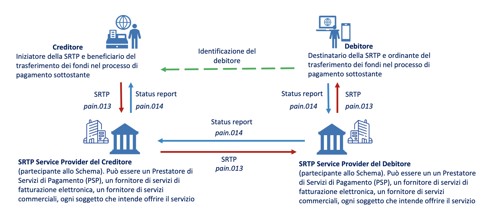

# Schema RTP

Lo **Schema SRTP** (SEPA Request-to-Pay) è un protocollo standard europeo sviluppato dall'European Payment Council per inviare **richieste** di pagamento elettronico in modo sicuro e tracciabile tra debitori e creditori. Consente di inviare notifiche di pagamento prima della transazione effettiva, facilitando la gestione e il controllo dei pagamenti digitali.

Non è uno strumento di pagamento ma ne integra le caratteristiche, potendo fungere da facilitatore per la realizzazione di soluzioni di pagamento digitali.

Il sistema è basato su un  modello "four-corner": \

<figure><figcaption>
Modello SRTP  ( fonte Linee guida CPI [2]) 
</figcaption></figure>

le specifiche del servizio SRTP (Sepa Request To Pay) sono emanate da EPC (European Payment Council) e le presenti linee guida costituiscono un particolare caso d’uso costruito su queste ultime.

\
