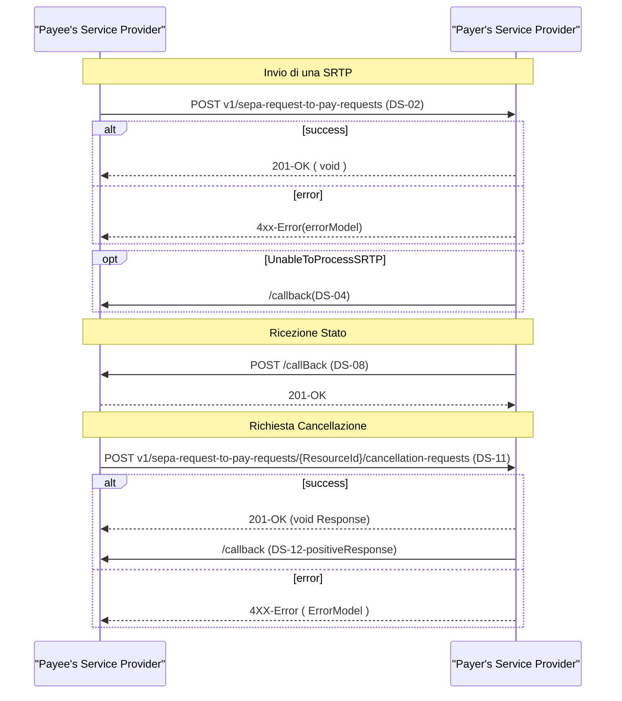

# Messaggi SRTP

Di seguito viene fornito l’elenco completo dei messaggi utilizzati  per la gestione dello schema SRTP nel contesto pagoPA. \

Tutte le risposte alle chiamate sono asincrone. Il Service Provider ricevere prende in carico il messaggio e successivamente invia l'esito della chiamata all'endpoint di _callback_ indicata all'interno del messaggio inviato.

| SEPA Request-to-Pay (SRTP) Rulebook                                      | ISO 20022 XML Message Standards                                          |
| ------------------------------------------------------------------------ | ------------------------------------------------------------------------ |
| DS-02 Inter-RTP Service Provider RTP Dataset                             | Creditor Payment Activation Request V10 (pain.013.001.10)                |
| DS-04 Reject of RTP Dataset                                              | Creditor Payment Activation Request Status  Report V07 (pain.014.001.07) |
| DS-08 Inter-RTP Service Provider response to  the RTP Dataset            | Creditor Payment Activation Request Status  Report V07 (pain.014.001.07) |
| DS-11 Inter-RTP Service Provider RfC of the  RTP Dataset                 | Customer Payment Cancellation Request V08  (camt.055.001.08)             |
| DS-12 Inter-RTP Service Provider response to  the RfC of the RTP Dataset | 
Resolution 0f Investigation v09  

(camt.029.001.09)
         |



