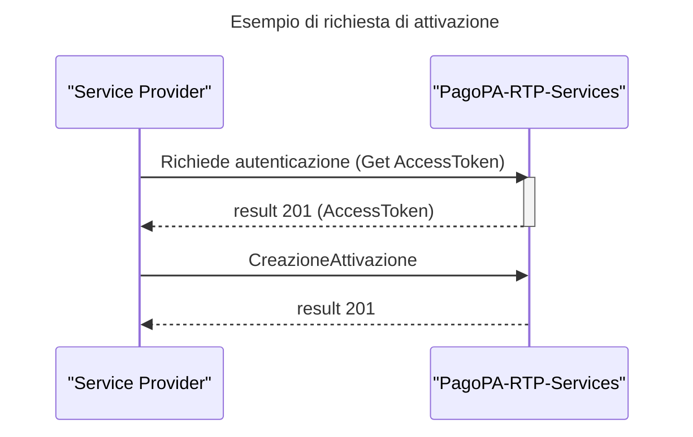

# Attivazione

Tale sezione descrive la richiesta di attivazione al servizio SRTP per uno specifico soggetto debitore utilizzando il Service Provider indicato nella richiesta.

_Pre-Requisito_ :  autenticazione al servizio tramite schema oAuth2-Client Credential Grant Type , utilizzando **client\_secret e secret\_id** ottenuti in fase di adesione

### API richieste per questo flusso&#x20;

* [Creazione Attivazione](../../../api-specifiche-tecniche/creazione-attivazione.md)
* [Get AccessToken](../../../api-specifiche-tecniche/get-accesstoken.md)

## Sequence Diagram

