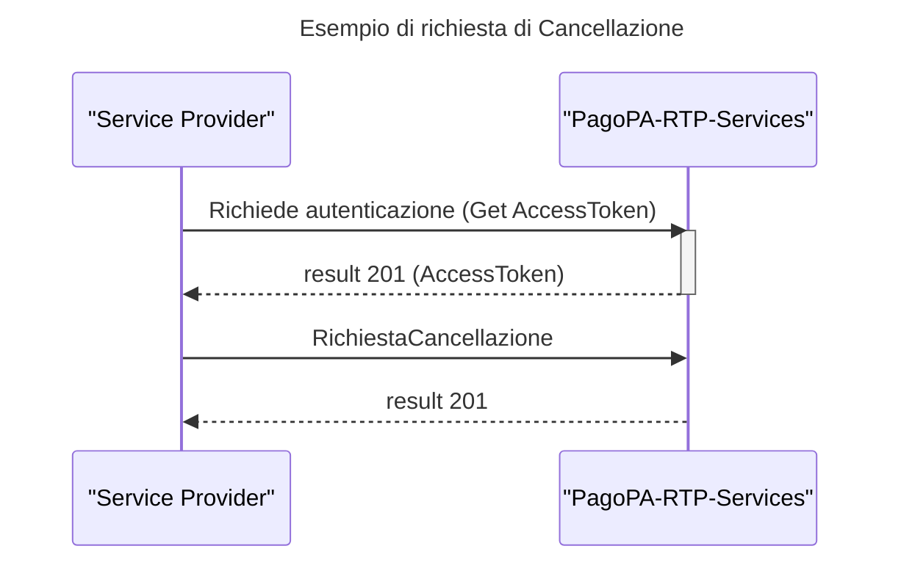

# Cancellazione

Tale sezione descrive la richiesta di cancellazione di una precedente attivazione identificata per mezzo del campo _**AuthorizationLocation**_ ( contenuto nell'Header Parameter Location della risposta di [CreazioneAttivazione](../../../api-specifiche-tecniche/creazione-attivazione.md) )

### API richieste per questo flusso&#x20;

* [Cancella Attivazione](../../../api-specifiche-tecniche/cancella-attivazione.md)
* [Get AccessToken](../../../api-specifiche-tecniche/get-accesstoken.md)

## Sequence DiagramWork

