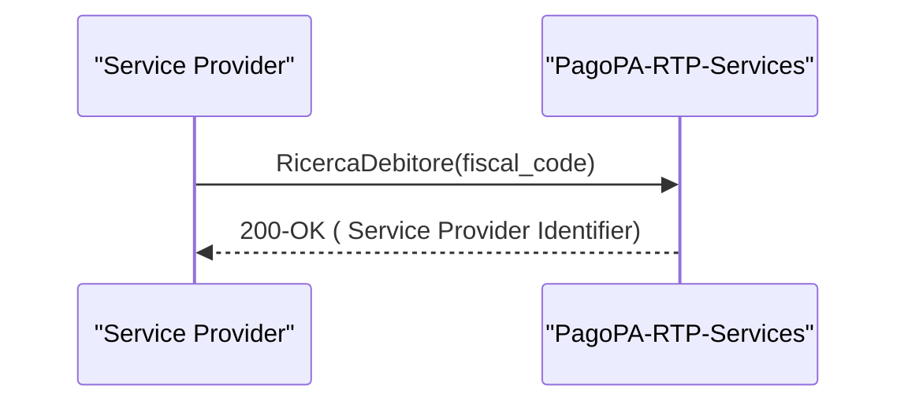

# Ricerca Debitore

In questo scenario, attraverso il servizio di Attivazione, il Service Provider del Creditore verifica l'attivazione del debitore presso un Service Provider

### API richieste per questo flusso&#x20;

* [Creazione Attivazione](../../../api-specifiche-tecniche/creazione-attivazione.md)
* [Get AccessToken](../../../api-specifiche-tecniche/get-accesstoken.md)
* [ricercadebitore.md](../../../api-specifiche-tecniche/ricercadebitore.md "mention")

## Sequence Diagram

