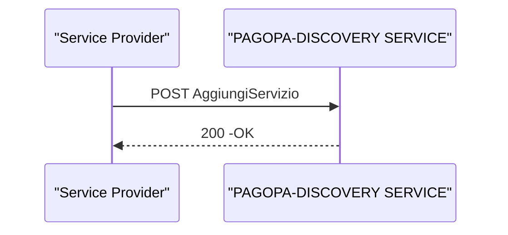

# Aggiunta di un Service Provider

Tale sezione descrive lo scenario, nel quale un Service Provider inserisce  i propri parametri di configurazione all'interno del registro.

## API richieste in questo flusso

## Sequence Diagram

Al termine dell'opeazione, il Servizio è disp
