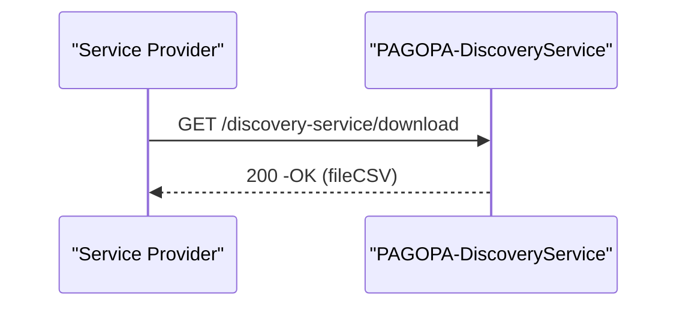

# Download Archivio dei Service Provider

Tale sezione descrive la richiesta di scarimento dell'archivio dei Service. L'archivio è disponibile in formato CSV.

_Pre-Requisito_ :  autenticazione al servizio tramite schema oAuth2-Client Credential Grant Type , utilizzando **client\_secret e secret\_id** ottenuti in fase di adesione

### API richieste per questo flusso&#x20;

* [Creazione Attivazione](../../../api-specifiche-tecniche/creazione-attivazione.md)
* [Get AccessToken](../../../api-specifiche-tecniche/get-accesstoken.md)

## Sequence Diagram

## Formato Archivio CSV

<table><thead><tr><th width="106">Id</th><th>role</th><th>Name</th><th>url</th><th>IPs</th><th>Certificate Serial Number</th><th>canale pagoPA</th></tr></thead><tbody><tr><td></td><td></td><td></td><td></td><td></td><td></td><td></td></tr><tr><td></td><td></td><td></td><td></td><td></td><td></td><td></td></tr><tr><td></td><td></td><td></td><td></td><td></td><td></td><td></td></tr></tbody></table>

