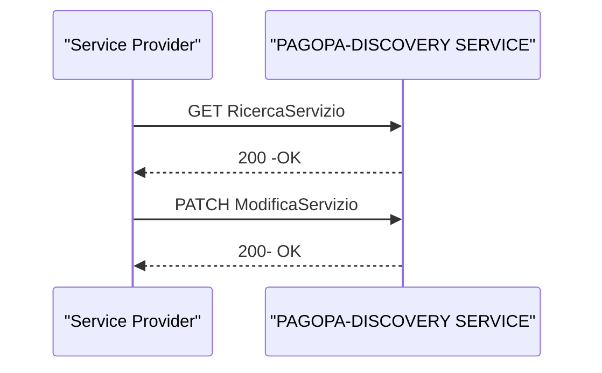

# Modifica di un Servizio

Tale sezione descrive lo scenario, nel quale un Service Provider ricerca e/o modifica  i propri parametri di configurazione all'interno del registro.

## API richieste in questo flusso

## Sequence Diagram

