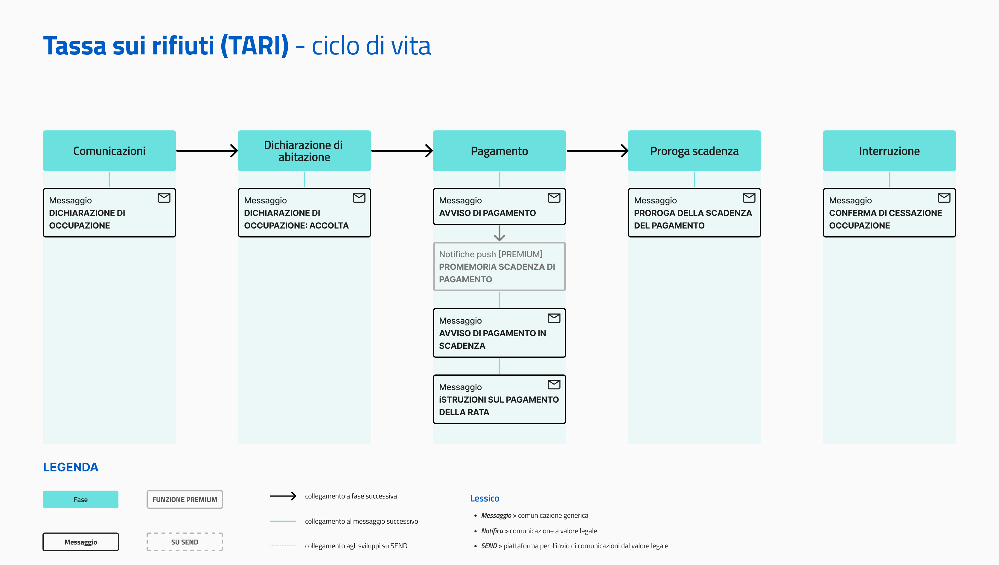

# Tassa sui rifiuti (TARI)

Erogare il servizio tramite l'app IO permette agli enti di:

* fornire ai cittadini comunicazioni puntuali sullo stato della TARI, coprendo l’intero ciclo di vita del servizio;
* rappresentare per i cittadini un riferimento per la ricezione delle comunicazioni riguardanti la TARI su uno o più immobili, situati in diversi Comuni.

[**Scopri tutti i benefici di integrarsi con IO →** ](https://docs.pagopa.it/manuale-servizi/lapp-io/cose-io-e-qual-e-il-suo-obiettivo)

| **Nome servizio**            | Tassa sui rifiuti (TARI)                                                                                                                                                                                                                                                                                                                                                                                                                                                                                            |
| ---------------------------- | ------------------------------------------------------------------------------------------------------------------------------------------------------------------------------------------------------------------------------------------------------------------------------------------------------------------------------------------------------------------------------------------------------------------------------------------------------------------------------------------------------------------- |
| **Argomento**                | Casa e utenze                                                                                                                                                                                                                                                                                                                                                                                                                                                                                                       |
| **Descrizione del servizio** | 
Il servizio riguarda la Tassa sui rifiuti (TARI). 

Tramite IO potrai:
<ul><li>ricevere conferma della dichiarazione di occupazione di un immobile domestico e non domestico al fine della TARI;</li><li>ricevere avvisi di pagamento relativi alla TARI e pagarli in app;</li><li>ricevere aggiornamenti su eventuali proroghe alla data di scadenza;</li><li>ricevere conferma della dichiarazione di cessazione di occupazione di un immobile;</li><li>ricevere altre comunicazioni.</li></ul> |

## **Ciclo di vita del servizio**

<figure><figcaption>
<strong>Ciclo di vita ed eventi del servizio TARI</strong>
</figcaption></figure>

## **Messaggi del servizio**


**Il servizio ideale**

L'insieme di tutti i messaggi rappresenta il servizio ideale. L'ente che intende erogare questo servizio, può valutare quali e quanti messaggi inviare, in base alle proprie possibilità di integrazione. L'obiettivo finale rimane quello di inviarli tutti, rilasciando versioni del servizio sempre più complete.


### Comunicazioni

Dichiarazione di occupazione 

**🖋 Titolo del messaggio:** Dichiarazione di \<inizio/variazione> occupazione immobile

🗒 **Testo del messaggio**: Ti diamo il benvenuto nel Comune di \<Comune>.&#x20;

Ricevi questo messaggio perché potresti avere recentemente cambiato residenza, acquistato un immobile o sottoscritto un contratto di affitto.&#x20;

Se non lo hai già fatto, effettua o aggiorna la tua dichiarazione di occupazione ai fini TARI (Tassa sui Rifiuti). Per farlo, \[visita questo sito]\(URL).

Inoltre, se vuoi conoscere meglio il servizio offerto \[visita questo sito]\(URL).&#x20;

**🪄  Pulsante**: n/a

***

**Destinatari**: I cittadini che hanno recentemente cambiato residenza, acquistato un immobile o completato un contratto di affitto superiore a sei mesi.&#x20;

**Quando inviarlo**: Quando l'ente riscontra aggiornamenti su cambi residenza, acquisto immobili o contratti d'affitto.&#x20;

**User story**: Come cittadino voglio ricevere informazioni su come funziona la TARI nel Comune.

### Dichiarazione nuova abitazione

Dichiarazione di occupazione: accolta

**🖋 Titolo del messaggio:** La tua dichiarazione è stata accolta

🗒 **Testo del messaggio**: Abbiamo ricevuto la tua dichiarazione di \<inizio/variazione> occupazione di un immobile. Ecco i dettagli:

**Indirizzo**: \<indirizzo> - \<piano ed interno immobile> \
**Occupato da**: \<nome cognome>\
**A partire dal**: \<gg/mm/aa>

\[A questo sito]\(URL) trovi maggiori informazioni su come funziona il calcolo TARI e sulle eventuali esenzioni di cui puoi beneficiare.

**🪄  Pulsante**: n/a

***

**Destinatari**: I cittadini che hanno completato la dichiarazione di inizio o variazione occupazione di un immobile.&#x20;

**Quando inviarlo**: Alla conclusione della registrazione della dichiarazione.

**User story**: Come cittadino voglio ricevere conferma che la dichiarazione di occupazione è stata processata correttamente.

### Pagamento a rate con avviso di pagamento

Quando il pagamento è suddiviso per rate e l'ente vuole permettere al cittadino di pagare la rata direttamente su IO, potrà inviare un messaggio con l'avviso di pagamento per ogni rata prevista [come consigliato sul manuale dei servizi. ](https://docs.pagopa.it/manuale-servizi/che-cosa-puo-fare-un-servizio-su-io/inviare-messaggi/messaggi-che-veicolano-un-pagamento/soluzioni-per-pagamenti-a-rate)

Avviso di pagamento TARI 

**🖋 Titolo del messaggio:** Nuovo avviso di pagamento

🗒 **Testo del messaggio**: C'è un avviso da pagare intestato a \<nome cognome> e relativo alla \<rata unica/prima rata/seconda rata> della Tassa sui rifiuti (TARI) per l'immobile situato in \<indirizzo> - \<piano ed interno immobile>.

**Devi pagare**: <00,00> €

**Entro il**: \<gg/mm/aaaa>

Puoi pagare direttamente in app premendo “Vedi Avviso”, oppure tramite tutti i canali di pagamento della piattaforma pagoPA e le altre modalità di pagamento offerte dell'ente creditore.

Per maggiori informazioni o per richiedere assistenza, contattaci tramite i canali che trovi nella scheda servizio.

In fase di pagamento, se previsto dall'ente, l'importo riportato nel messaggio potrebbe subire variazioni.

**🪄  Pulsante**: Vedi Avviso

***

**Destinatari**: Tutti i cittadini residenti nell’area geografica di azione del servizio che devono pagare la TARI.

**Quando inviarlo**: Al momento in cui l'avviso è pagabile da parte del cittadino.

**User story**: Come cittadino voglio essere avvisato quando devo pagare la TARI.


**Promemoria automatici — **<mark style="color:blue;">**Messaggi Premium**</mark>

Impostando il messaggio di _Avviso di pagamento_ come Messaggio Premium, disponibile a seconda della tipologia di contratto sottoscritto dall’ente, non è necessario inviare il seguente messaggio di promemoria.

Gli utenti che hanno dato il loro consenso, infatti, riceveranno automaticamente una notifica push sui loro dispositivi all’avvicinarsi della scadenza.


Avviso di pagamento TARI: in scadenza

**🖋 Titolo del messaggio:** Hai un pagamento in scadenza

🗒 **Testo del messaggio:**

Il tuo pagamento per \<causale> sta per scadere.

Se hai già provveduto a pagare l’avviso, ignora questo messaggio.

**🪄 Pulsante:** Vedi Avviso

***

**Destinatari**: Tutti i cittadini residenti nell’area geografica di azione del servizio che devono pagare la TARI.

**Quando inviarlo**: Quando il pagamento è prossimo alla scadenza.

**User story**: Come cittadino voglio ricevere un promemoria per i pagamenti in scadenza.

### Pagamento a rate con allegato

Quando il pagamento è suddiviso per rate e l'ente vuole comunicare al cittadino tutti i pagamenti in un unico messaggio su IO, potrà inviare un messaggio con un documento allegato che riassume tutte le rate e i relativi avvisi da pagare.&#x20;

Istruzioni sul pagamento della rata 

:sparkles: <mark style="color:blue;">**Allegati Premium**</mark> — Tramite questa funzionalità Premium, disponibile a seconda della tipologia di contratto sottoscritto dall’ente, puoi allegare documenti all'interno del messaggio.

Questo messaggio è da utilizzare sia per messaggi Premium, sia per messaggi standard. In caso di messaggio standard, **ricorda di eliminare ogni riferimento agli allegati dal corpo del messaggio.**

***

**🖋 Titolo del messaggio:** Nuovo pagamento

🗒 **Testo del messaggio**:&#x20;

Dal \<gg/mm/aaaa> sarà possibile pagare la Tassa sui rifiuti (TARI)  intestato a \<nome cognome> per l'immobile situato in \<indirizzo> - \<piano ed interno immobile>.

\[Solo per messaggi Premium con allegato] Trovi i pagamenti previsti in allegato a questo messaggio.

Per avere maggiori informazioni sul pagamento, \[visita il sito]\(URL).

**🪄  Pulsante**: n/a

**📎 **<mark style="color:blue;">**Allegato Premium:**</mark> \<documento con gli avvisi di pagamento delle rate previste>

***

**Destinatari**: Tutti i cittadini residenti nell’area geografica di azione del servizio che devono pagare la TARI.

**Quando inviarlo**: Al momento in cui l'avviso è pagabile da parte del cittadino.

**User story**: Come cittadino voglio essere avvisato quando devo pagare la TARI.

***

<mark style="color:purple;">ℹ️</mark> In caso di pagamenti su più rate, [consultare questa sezione del manuale dei servizi dedicata.](https://docs.pagopa.it/manuale-servizi/che-cosa-puo-fare-un-servizio-su-io/inviare-messaggi/messaggi-che-veicolano-un-pagamento/soluzioni-per-pagamenti-a-rate)

### Proroga scadenza

Proroga scadenza del pagamento

**🖋 Titolo del messaggio:** Proroga scadenza del pagamento

🗒 **Testo del messaggio**: È stata prorogata la data di scadenza dell'avviso intestato a \<nome cognome> e relativo a \<casuale>.

**Devi pagare**: <00,00> €&#x20;

**Entro il**: \<gg/mm/aaaa>

Puoi pagare direttamente in app premendo “Vedi Avviso”, oppure tramite tutti i canali di pagamento della piattaforma pagoPA e le altre modalità di pagamento offerte dell'ente creditore.

Per maggiori informazioni o per richiedere assistenza, contattaci tramite i canali che trovi nella scheda servizio.

In fase di pagamento, se previsto dall'ente, l'importo riportato nel messaggio potrebbe subire variazioni.

**🪄  Pulsante**: Vedi Avviso

***

**Destinatari:** Tutti i cittadini residenti nell’area geografica di azione del servizio che devono pagare la TARI.

**Quando inviarlo:** Se la scadenza del pagamento viene prorogata.

**User story:** Come cittadino voglio essere avvisato se la scadenza del pagamento è stata prorogata.

### Interruzione

Conferma di avvenuta cessazione di occupazione immobile

**🖋 Titolo del messaggio:** Conferma di avvenuta cessazione di occupazione immobile

🗒 **Testo del messaggio**: Abbiamo ricevuto la tua dichiarazione di cessazione occupazione immobile.&#x20;

Per maggiori informazioni o per richiedere assistenza, contattaci tramite i canali che trovi nella scheda servizio.

**🪄  Pulsante**: n/a

***

**Destinatari:** I cittadini che dichiarano la cessazione di occupazione di un immobile.

**Quando inviarlo:** Al ricevimento della dichiarazione di cessazione.

**User story:** Come cittadino voglio sapere se la mia dichiarazione di cessazione occupazione immobile è stata ricevuta.

## Qualche suggerimento

Al fine di arricchire le comunicazioni con informazioni che abbiano valore per il cittadino, consigliamo di:

* inserire nelle comunicazioni uno o più dati di **riferimento dell’immobile** per permettere all’utente di identificare l’oggetto del messaggio e differenziarlo nel caso di più proprietà.
* inserire uno o più link che riportino alle **informazioni sulla gestione dello smaltimento rifiuti** e su come operare una corretta raccolta differenziata.

***


**Lo sapevi?**\
IO è integrata con SEND - Servizio Notifiche Digitale, per l'invio di comunicazioni a valore legale.

[**Scopri di più su SEND**](https://notifichedigitali.pagopa.it/) [**-->**](https://www.pagopa.it/it/prodotti-e-servizi/piattaforma-notifiche-digitali)



**Un modello da personalizzare**

Le procedure di questo servizio variano molto da ente a ente. Consigliamo di utilizzare i testi dei messaggi come un punto di partenza e di aggiungere o modificare il contenuto a seconda delle esigenze.&#x20;

Il modello è uno esempio che non ha carattere vincolante per l’ente e sul quale la Società declina qualsiasi responsabilità, avendo valore esemplificativo.

Gli enti che desiderino utilizzarli devono, quindi, modificarli a seconda delle loro esigenze. Gli enti mittenti sono i soli responsabili del contenuto dei messaggi che inviano. La scelta di una soluzione di pagamento a rate e la conseguente gestione degli avvisi di pagamento rimane di esclusiva competenza e responsabilità dell’ente.

Puoi copiare i testi dei messaggi da personalizzare da questo documento:



