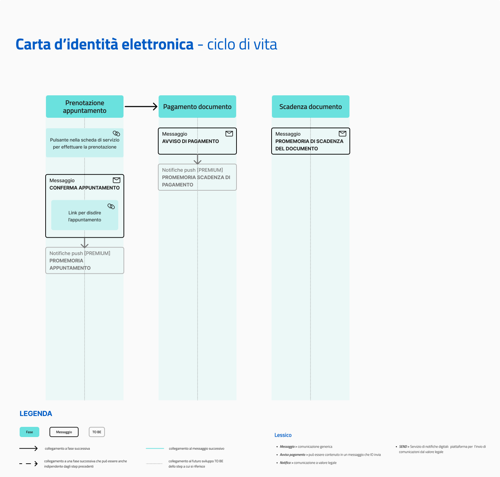

# Carta d'Identità Elettronica

Erogare il servizio tramite l'app IO permette agli enti di:

* fornire ai cittadini comunicazioni sulla Carta d'Identità Elettronica (CIE), coprendo **l’intero ciclo di vita del servizio**, dall’inizio alla fine;
* integrare le comunicazioni, evitando una duplicazione delle comunicazioni relative allo stato di scadenza della CIE, gestite da ANPR.

[**Scopri tutti i benefici di integrarsi con IO →**](https://docs.pagopa.it/manuale-servizi/lapp-io/cose-io-e-qual-e-il-suo-obiettivo)

| **Nome servizio**            | Carta d'Identità Elettronica                                                                                                                                                                                                                                                                                                                                                                                                                                                                                                                                                                                                                                        |
| ---------------------------- | ------------------------------------------------------------------------------------------------------------------------------------------------------------------------------------------------------------------------------------------------------------------------------------------------------------------------------------------------------------------------------------------------------------------------------------------------------------------------------------------------------------------------------------------------------------------------------------------------------------------------------------------------------------------- |
| **Argomento**                | Servizi anagrafici e civici                                                                                                                                                                                                                                                                                                                                                                                                                                                                                                                                                                                                                                         |
| **Descrizione del servizio** | 
Il servizio riguarda la richiesta, l'emissione e la scadenza della tua Carta d'Identità Elettronica.

Tramite IO, potrai:
<ul><li>richiedere un appuntamento per l'erogazione o la sostituzione della tua Carta d'Identità;</li><li>ricevere un promemoria che ti ricorda dell'appuntamento;</li><li>ricevere avvisi di pagamento per l'emissione della Carta e pagarli in app;</li><li>ricevere un messaggio che ti informa della scadenza della Carta;</li><li>ricevere altre comunicazioni.</li></ul>
Per maggiori informazioni sulla Carta d'Identità Elettronica, visita <a href="https://www.cartaidentita.interno.gov.it/">questo sito</a>.
 |
| **Pulsante**                 | Richiedi appuntamento                                                                                                                                                                                                                                                                                                                                                                                                                                                                                                                                                                                                                                               |

## **Ciclo di vita del servizio**

<figure><figcaption>
<strong>Ciclo di vita ed eventi del servizio Carta d'Identità Elettronica</strong>
</figcaption></figure>

## **Messaggi del servizio**


**Il servizio ideale**

L'insieme di tutti i messaggi rappresenta il servizio ideale. L'ente che intende erogare questo servizio può valutare quali e quanti messaggi inviare, in base alle proprie possibilità di integrazione. L'obiettivo finale rimane quello di inviarli tutti, rilasciando in maniera iterativa versioni del servizio sempre più complete.


### Prenotazione appuntamento

Conferma prenotazione appuntamento

:sparkles:<mark style="color:blue;">**Messaggio Premium**</mark> — Se hai un contratto Premium, ti consigliamo di configurare questo messaggio con promemoria Premium: i destinatari verranno avvisati dell‘avvicinarsi dell'appuntamento tramite notifica push.

***

**🖋 Titolo del messaggio:** Il tuo appuntamento

🗒 **Testo del messaggio**:

Hai prenotato un appuntamento presso `<sportello>`.

**Dove:** `<indirizzo>`

**Quando:** il `<gg/mm/aaaa>` alle `<hh:mm>`

Ti invitiamo a presentarti con almeno 15 minuti di anticipo e di portare con te tutti i documenti necessari. Per maggiori informazioni su quali documenti ti serviranno, visita il sito di [CIE](https://www.cartaidentita.interno.gov.it/cittadini/rilascio-e-rinnovo-in-italia/).

Per ulteriori informazioni, \[visita questo sito]\(URL).

**🪄 Pulsante**: Disdici appuntamento

***

**Destinatari**: I cittadini residenti nell’area di azione del servizio che hanno prenotato un appuntamento per la Carta d'Identità Elettronica.

**Quando inviarlo**: Quando l’appuntamento è confermato.

**User story**: Come cittadino voglio ricevere conferma dei miei appuntamenti.

### Pagamento documento

Avviso di pagamento Carta d'Identità

:sparkles: <mark style="color:blue;">**Messaggio Premium**</mark> — Se hai un contratto Premium, ti consigliamo di configurare questo messaggio con promemoria Premium: i destinatari verranno avvisati dell‘avvicinarsi della scadenza tramite notifica push.

***

**🖋 Titolo del messaggio:** Hai un nuovo avviso di pagamento

🗒 **Testo del messaggio**:

C'è un avviso da pagare intestato a `<nome cognome>` e relativo a `<causale>`.

**Devi pagare:** <00,00> €

**Entro il:** `<gg/mm/aaaa>`

Puoi pagare direttamente in app premendo “Paga”, oppure tramite tutti i canali di pagamento della piattaforma pagoPA e le altre modalità di pagamento offerte dell'ente creditore.

Se hai già provveduto a pagare l'avviso, ignora questo messaggio.

Per maggiori informazioni o per richiedere assistenza, contattaci tramite i canali che trovi nella scheda servizio.

In fase di pagamento, se previsto dall'ente, l'importo riportato nel messaggio potrebbe subire variazioni.

**🪄 Pulsante:** Paga (inserito automaticamente dall'app se il messaggio prevede un avviso di pagamento pagoPA)

***

**Destinatari**: Tutti i cittadini che devono pagare il documento

**Quando inviarlo**: Quando è stato fissato un appuntamento in Comune e dopo che è stata aperta la posizione debitoria

**User story**: Come cittadino voglio ricevere comunicazione quando è possibile effettuare il pagamento per la mia Carta d'Identità


**Promemoria automatici —&#x20;**<mark style="color:blue;">**Messaggi Premium**</mark>

Impostando il messaggio di _Avviso di pagamento_ come Messaggio Premium, disponibile a seconda della tipologia di contratto sottoscritto dall’ente, non è necessario inviare il seguente messaggio di promemoria.

Gli utenti che hanno dato il loro consenso, infatti, riceveranno automaticamente una notifica push sui loro dispositivi all’avvicinarsi della scadenza.


Avviso di pagamento Carta d'Identità: in scadenza

**🖋 Titolo del messaggio:** Hai un pagamento in scadenza

🗒 **Testo del messaggio:**

Il tuo pagamento per `<causale>` sta per scadere.

Se hai già provveduto a pagare l'avviso, ignora questo messaggio.

**🪄 Pulsante:** Paga (inserito automaticamente dall'app se il messaggio prevede un avviso di pagamento pagoPA)

***

**Destinatari:** Tutti i cittadini che devono pagare il documento

**Quando inviarlo:** Quando il pagamento del documento è prossimo alla scadenza.

**User story:** Come cittadino voglio ricevere un promemoria per i pagamenti in scadenza.

### Scadenza documento

Promemoria di scadenza Carta d'Identità

**🖋 Titolo del messaggio:** Scadenza Carta d'Identità

🗒 **Testo del messaggio**:

Oggi `<gg/mm/aaaa>` è scaduta la tua Carta d'Identità `<numero>`.

Se non l'hai ancora fatto, puoi prenotare un nuovo appuntamento online utilizzando \[il servizio di prenotazione]\(URL) del tuo Comune o recarti all'ufficio Anagrafe più comodo per le tue esigenze.

**🪄 Pulsante**: n/a

***

**Destinatari**: Tutti i cittadini in possesso di una Carta d'Identità

**Quando inviarlo**: Il giorno della scadenza del documento

**User story**: Come cittadino voglio essere avvisato quando scadrà il mio documento

***

<mark style="color:purple;">ℹ️</mark> <mark style="background-color:yellow;">Il messaggio di preavviso della scadenza (a 180, 90 e 30 giorni) viene mandato al cittadino dal servizio nazionale di ANPR tramite IO. Si sconsiglia di duplicare l'invio da questo servizio con le stesse informazioni.</mark>

***


**Lo sapevi?**\
IO è integrata con SEND - Servizio Notifiche Digitale, per l'invio di comunicazioni a valore legale.

[**Scopri di più su SEND**](https://notifichedigitali.pagopa.it/) [**-->**](https://www.pagopa.it/it/prodotti-e-servizi/piattaforma-notifiche-digitali)



**Un modello da personalizzare**

Le procedure di questo servizio variano molto da ente a ente. Consigliamo di utilizzare i testi dei messaggi come un punto di partenza e di aggiungere ulteriori informazioni.

Il modello è un esempio che non ha carattere vincolante per l’ente e sul quale la Società declina qualsiasi responsabilità, avendo valore esemplificativo.

Puoi copiare i testi dei messaggi da personalizzare da questo documento:

