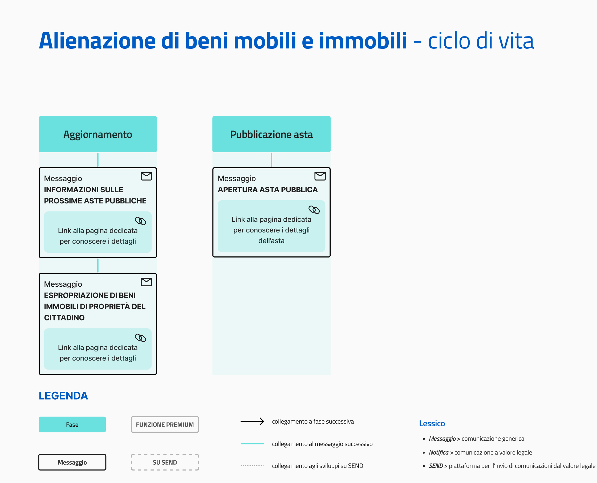

# Alienazione beni mobili e immobili

Erogare il servizio tramite l'app IO permette agli enti di:

* fornire alle cittadine e ai cittadini un riferimento per la ricezione delle comunicazioni riguardanti l’alienazione dei beni mobili e immobili del Comune;
* monitorare e gestire tempestivamente le richieste, le comunicazioni e i pagamenti per il servizio.

[**Scopri tutti i benefici di integrarsi con IO →**](https://app.gitbook.com/s/xWONfJmawghGo2ekuaKh/lapp-io/cose-io-e-qual-e-il-suo-obiettivo#perche-integrarsi-con-io)

## Scheda servizio 

<table data-header-hidden><thead><tr><th width="373"></th><th></th></tr></thead><tbody><tr><td><strong>Nome servizio</strong></td><td>Alienazione beni mobili e immobili</td></tr><tr><td><strong>Argomento</strong></td><td>Suolo, spazi e beni pubblici</td></tr><tr><td><strong>Descrizione del servizio</strong></td><td>
Il servizio riguarda l’alienazione di beni mobili e immobili di proprietà del Comune.

Tramite IO potrai:
<ul><li>ricevere comunicazioni e aggiornamenti sulle richieste presentate;</li><li>ricevere avvisi di pagamento e pagarli in app;</li><li>ricevere altre comunicazioni.</li></ul></td></tr></tbody></table>

## Ciclo di vita del servizio

<figure><figcaption>
<strong>Ciclo di vita ed eventi del servizio Alienazione beni mobili e immobili</strong>
</figcaption></figure>

## Messaggi del servizio


**Il servizio ideale**

L'insieme di tutti i messaggi rappresenta il servizio ideale. L'ente che intende erogare questo servizio può valutare quali e quanti messaggi inviare, in base alle proprie possibilità di integrazione. L'obiettivo finale rimane quello di inviarli tutti, rilasciando in maniera iterativa versioni del servizio sempre più complete.


### Aggiornamento

Informazioni sulle prossime aste pubbliche

**🖋 Titolo del messaggio:** Le prossime aste pubbliche

🗒 **Testo del messaggio**:

Dal `<gg/mm/aaaa>` saranno aperte le aste pubbliche per la vendita di beni mobili e immobili comunali.

Per ulteriori informazioni, \[visita questa pagina]\(URL).

**🪄 Pulsante**: n/a

***

**Destinatari**: Tutti i cittadini residenti nel Comune e che hanno mostrato interesse verso il servizio.

**Quando inviarlo**: Nei mesi precedenti l’apertura delle aste pubbliche.

**User story**: Come cittadino voglio ricevere aggiornamenti sull’apertura delle aste pubbliche.

### Pubblicazione asta

Apertura asta pubblica

**🖋 Titolo del messaggio:** È aperta l'asta pubblica

🗒 **Testo del messaggio**:

Dal `<gg/mm/aaaa>` è aperta l'asta pubblica per la vendita di beni mobili e immobili comunali.

Hai tempo fino al `<gg/mm/aaaa>` per manifestare interesse verso un bene in elenco.

Per ulteriori informazioni, \[visita questa pagina]\(URL).

**🪄 Pulsante**: n/a

***

**Destinatari**: Tutti i cittadini residenti dell’area di azione geografica del servizio che hanno comprovato interesse verso il servizio.

**Quando inviarlo**: Quando l’ente apre le aste pubbliche per l'alienazione dei propri beni

**User story**: Come cittadino voglio ricevere aggiornamenti sull’apertura delle aste pubbliche

***


**Lo sapevi?**\
IO è integrata con SEND - Servizio Notifiche Digitale, per l'invio di comunicazioni a valore legale.

[**Scopri di più su SEND**](https://notifichedigitali.pagopa.it/) [**-->**](https://www.pagopa.it/it/prodotti-e-servizi/piattaforma-notifiche-digitali)



**Un modello da personalizzare**

Le procedure di questo servizio variano molto da ente a ente. Consigliamo di utilizzare i testi dei messaggi come un punto di partenza e di aggiungere ulteriori informazioni.

Il modello è un esempio che non ha carattere vincolante per l’ente e sul quale la Società declina qualsiasi responsabilità, avendo valore esemplificativo.

Puoi copiare i testi dei messaggi da personalizzare da questo documento:



