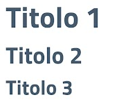

# test\_tab\&img

<table><thead><tr><th>testo</th><th>img</th><th data-hidden></th></tr></thead><tbody><tr><td>testo di prova</td><td></td><td></td></tr><tr><td></td><td>testo di prova</td><td></td></tr><tr><td></td><td></td><td></td></tr></tbody></table>
