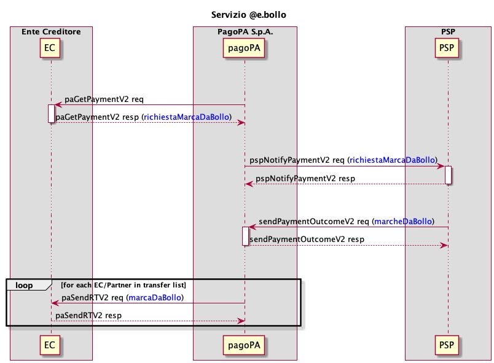

# Come richiedere pagamenti che contengono marca da bollo digitale

Tramite la piattaforma pagoPA è possibile richiedere pagamenti di posizioni debitorie che contengano una marca da bollo digitale (@e.bollo).

Tale funzionalità è disponibile solo per il caso d'uso [**Pagamento presso frontend dell'EC**](http://127.0.0.1:5000/s/PJuzswk8l2kp9Wm5PwAW/casi-duso/pagamento-presso-frontend-dellec).

<figure><figcaption></figcaption></figure>

Per poter richiedere l'attivazione di un _pagamento atteso_ di una marca da bollo è necessario che l'EC compili il tag _richiestaMarcaDaBollo_ all’interno della response alla [paGetPaymentV2](https://docs.pagopa.it/sanp/appendici/primitive#pagetpayment-versione-2) avendo cura di inserire:

* _tipoBollo_: tipologia del bollo;
* _hashDocumento_: contiene l’impronta informatica (digest), nel formato base64, del documento informatico o della segnatura di protocollo cui è associata la marca da bollo digitale;
* _provinciaResidenza_: sigla della provincia di residenza del soggetto pagatore.

Il tag _richiestaMarcaDaBollo_ deve essere usato in alternativa al tag _IBAN_ in ogni _transfer_, nel tag _transferAmount_ deve essere inserito l'importo della marca da bollo, non viene effettuato nessun tipo di validazione da parte del Nodo dei Pagamenti sulla cifra inserita, mentre nel tag _transferCategory_ deve essere inserito un codice tassonomico riconducibile alla marca da bollo digitale ([**Tassonomia dei servizi di incasso**](https://docs.pagopa.it/sanp/ente-creditore/tassonomia-dei-servizi-di-incasso)).

Una volta conclusa la transazione di pagamento il PSP deve compilare il tag _marcheDaBollo_ all'interno della request della [sendPaymentOutcomeV2](https://docs.pagopa.it/sanp/appendici/primitive#sendpaymentoutcome-versione-2) avendo cura di inserire per ogni marca da bollo digitale (tag _marcaDaBollo_):

* _paymentToken_: il paymentToken con cui è arrivata la richiesta di marca da bollo digitale;
* _idTransfer_: l'identificativo del transfer che contiene il dato _richiestaMarcaDaBollo;_
* _MBDAttachment_: il documento XML che contiene la marca da bollo digitale, nel formato base64.

Come indicato nelle linee guida pubblicate da Agenzia delle Entrate _"Le Pubbliche Amministrazioni che ricevono dal cittadino, direttamente o indirettamente, la marca da bollo digitale ed il certificato cui è associata effettuano il controllo di validità utilizzando un software di controllo locale..."_, quindi la validazione del documento XML che contiene la marca da bollo digitale è responsabilità dell'EC che lo riceve tramite la [paSendRTV2](https://docs.pagopa.it/sanp/appendici/primitive#pasendrt-versione-2).

Gli importi relativi alle marche da bollo digitali non vengono inseriti nei [Flussi di Rendicontazione](https://docs.pagopa.it/sanp/specifiche-attuative-del-nodo-dei-pagamenti-spc/funzionamento-generale/rendicontazione-e-cashflow) inviati dai PSP.

Per maggiori dettagli sul servizio @e.bollo, validità e relativi casi d’uso, fare riferimento all'apposita sezione sul [sito dell’Agenzia delle Entrate](https://www.agenziaentrate.gov.it/portale/web/guest/schede/pagamenti/imposta-di-bollo-per-le-istanze-trasmesse-alla-pa-ebollo-cittadini/che-cose-cittadini).
