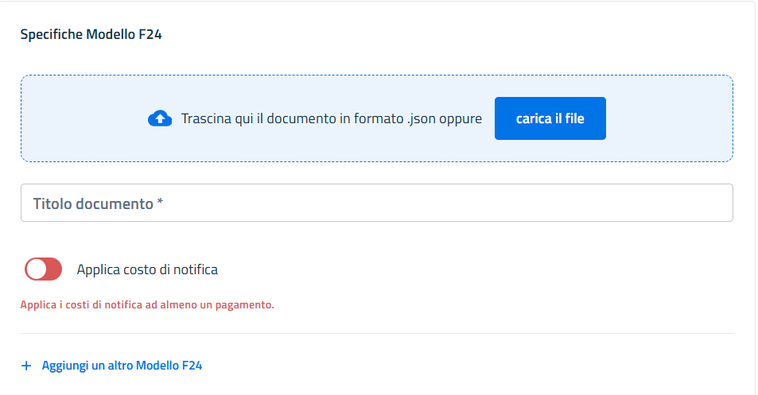
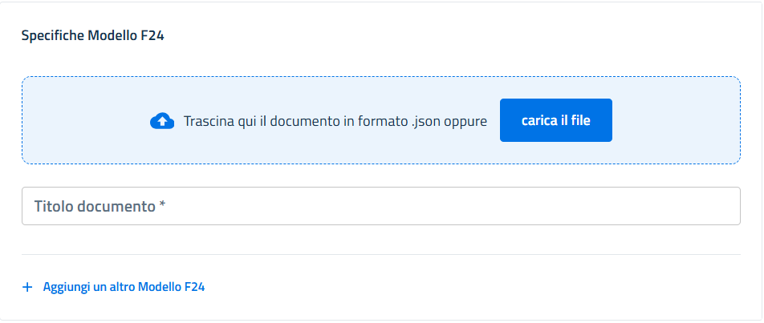

# Pagamenti F24

SEND permette di inserire notifiche con allegati pagamenti tramite modello F24.

Poiché le spese di notifica non sono note a priori e sono variabili nel tempo non è possibile inserire nella notifica il file PDF del modello F24 che è per sua natura statico. Per questo motivo il PDF del modello F24 viene generato dalla piattaforma partendo da un file json contenente i metadati delle sue componenti alle quali viene aggiunto il costo di notifica al momento della generazione.

Per facilitare il controllo del file metadati per la generazione del file json è stato pubblicato il link [https://raw.githubusercontent.com/pagopa/pn-f24/main/docs/openapi/json-schema-from-deref-mod.json](https://raw.githubusercontent.com/pagopa/pn-f24/main/docs/openapi/json-schema-from-deref-mod.json) con lo schema Json di validazione.

### Applicazione dei costi della notifica ai pagamenti F24

Il costo della notifica sarà aggiunto in fase di generazione del modello F24 sui pagamenti che riportano l'indicazione **`applyCost=true`** e nella riga del riquadro degli addebiti che riporta l'indicazione **`applyCost=true`**

Il campo **`applyCost`** valorizzato a **`true`** indica che sull'F24 devono essere aggiunto l'importo del costo della notifica.

#### Modalità puntuale

\
Nell’ambito del modello F24 collegato a notifiche SEND, **solo una riga deve avere `applyCost=true`**: sarà quella su cui la piattaforma aggiunge l’importo relativo alle spese di notifica a carico del destinatario. Tutte le altre righe devono avere `applyCost=false`.\
L’importo relativo ai costi di notifica è già presente nel file JSON di metadati e verrà utilizzato per generare il PDF F24 finale con i costi correttamente applicati.

<pre class="language-json"><code class="lang-json">{
  "treasury": {
    "records": [
      {
        "applyCost": false,
        "taxType": "1234",
        "year": "2025",
        "debit": 5000,
        "credit": 0
      },
      {
<strong>        "applyCost": true,
</strong>        "taxType": "6789",
        "year": "2025",
        "debit": 100,
        "credit": 0
      },
      {
        "applyCost": false,
        "taxType": "4321",
        "year": "2025",
        "debit": 2500,
        "credit": 0
      }
    ]
  }
}

</code></pre>

La riga **con `applyCost: true`** indica che su quel particolare tributo (codice `6789`) **viene aggiunto il costo di notifica**.

In questa modalità è importante anche valorizzare correttamente i campi `paFee` (componente a copertura dei costi del mittente, espresso in centesimi si euro) e `vat` (iva da applicare ai costo dell'invio cartaceo, espressa in percentuale).

Nell'esempio sottostante la notifica è creata con modalità puntuale (`notificationFeePolicy:"DELIVERY_MODE"`) e con l'applicazione del costo di €1 per la componente a copertura dei costi del mittente, espresso in centesimi si euro (`"paFee": "100"`) e IVA al 22% ("vat": "22").\
Sull'F24 caricato è indicato che devono essere applicati i costi di notifica.

<pre class="language-json"><code class="lang-json"><strong>"notificationFeePolicy": "DELIVERY_MODE",
</strong>"vat": "22",
"paFee": "100",
...
"recipients": [
    "payments": [
        "f24": {    
          "title": "&#x3C;titoloF24>",
          "applyCost": true,
        ...
        }
    ]    
]
</code></pre>

Se la notifica viene depositata tramite il portale mittente con l’invio manuale, l’indicazione dell'applicazione dei costi di notifica può essere configurata selezionando la checkbox **“Non incluso nell’atto”**.

<figure><figcaption></figcaption></figure>

Quando viene selezionata questa modalità appaiono i campi per l'indicazione della componente a copertura dei costi sostenuti dal mittenti e l'IVA da applicare al costo degli invii cartacei. Inoltre, nel pannello "Posizione debitoria" sottostante, viene attivato il pulsante **“Applica costo di notifica”**, per indicare che al pagamento deve essere aggiunto l'importo del costo della notifica.

<figure><figcaption></figcaption></figure>

#### Modalità forfettaria

Nel caso in cui la notifica sia inviata in modalità **forfettaria**, ovvero con: `notificationFeePolicy=FLAT_RATE` il campo **`applyCost`** **non deve essere valorizzato** (oppure deve essere impostato a `false`), poiché i costi di notifica **non devono essere inclusi nei pagamenti**.

```json
"notificationFeePolicy": "FLAT_RATE",
"vat": "22",
"paFee": "100",
...
"recipients": [
    "payments": [
        "f24": {
        "title": "<titoloF24>",
        "applyCost": true,
        ...
        }
    ]    
]
```

Nel portale **Self Care**, selezionando il pagamento in modalità **forfettaria**, la checkbox **“Incluso nell’atto”** non abilita il pulsante **“Applica costo di notifica”**, in quanto il costo è già incluso nell'atto stesso indipendente dai costi effettivi di notifica del mittente.

<div><figure><figcaption></figcaption></figure> <figure><figcaption></figcaption></figure></div>
