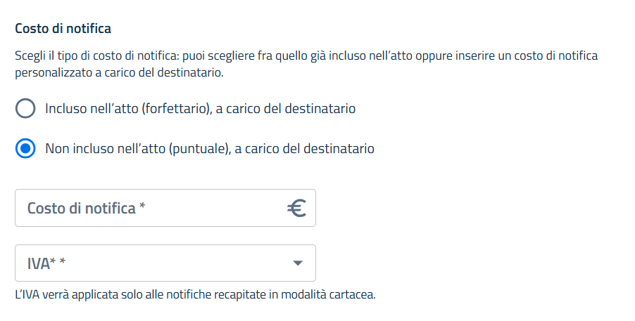
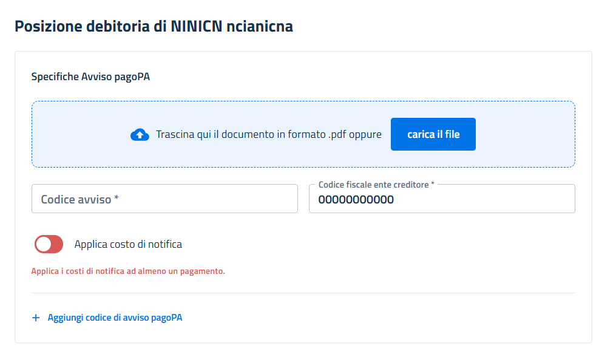
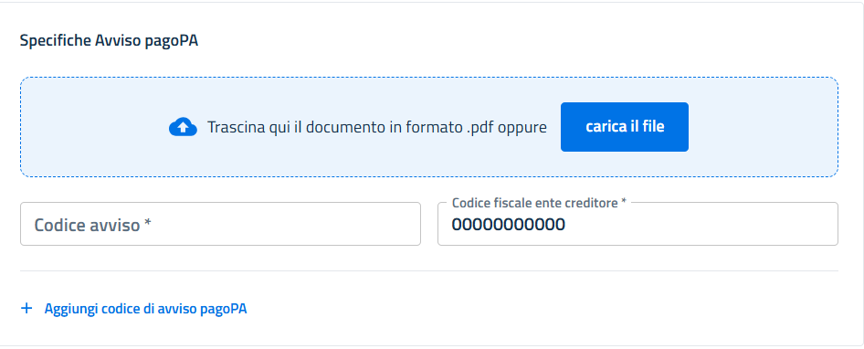

# Pagamenti pagoPA

L'attualizzazione della posizione debitoria è un'operazione che permette di integrare le spese di notifica sostenute da Piattaforma Notifiche per la spedizione, al costo richiesto dall'atto spedito dalla PA Mittente verso il destinatario.\\

L'integrazione con il sistema di pagamento pagoPA può avvenire in due modalità:

* Sincrona
* Asincrona

## Modalità Sincrona

Nella modalità sincrona **la gestione della posizione debitoria è in carico all'Ente Creditore** (EC), nella maggior parte dei casi coincide con l'ente mittente della notifica, ma potrebbe essere anche un altro ente.

Il partner tecnologico di SEND che realizza l'integrazione deve dare disponibilità di questo servizio al partner tecnologico che implementa l'integrazione con il nodo pagoPA.

Le spese di notifica variano in base al processo di spedizione eseguito per una notifica e possono subire variazioni nel tempo (es: a seguito di un secondo invio cartaceo); pertanto sarà necessario attualizzare il costo del pagamento richiamando l'API [**notificationPrice**](https://developer.pagopa.it/it/send/api/send-api-external-b2b-pa-bundle#get-/delivery/v2.3/price/-paTaxId-/-noticeCode-) **all'atto del pagamento**.&#x20;

L'API restituisce il costo sostenuto per il singolo destinatario a cui è associato l'avviso **aggiornato all'istante in cui viene chiamata**. Per facilitare l'integrazione con il sistema che dialoga con il nodo pagoPA gli unici parametri necessari sono quelli che identificano la posizione debitoria: `paTaxId` (codice fiscale ente creditore) e `noticeCode` (numero avviso).

**NOTA**: l'importo del costo di notifica da aggiungere al costo dell'atto è quello indicato nell'elemento `totalPrice`. Tale importo è calcolato in base agli elementi `paFee` e `vat` indicati all'atto della chiamata dell'API di richiesta di notifica secondo il seguente algoritmo.

`totalPrice = paFee + sendFee + somma(<costi invii catacei>) * (1 + vat/100)`&#x20;

**Esempio notifica digitale**: Ipotizzando il caso un cui la notifica abbia intrappreso il flusso di comunicazione digitale, perchè ha individuato un domicilio digitale o perché il destinatario ha fatto accesso alla notifica entro 120 ore dall'invio di un messaggio di cortesia, il costo è calcolato come:

```
Costo a copertura del mittente paFee = 100 eurocent
Percentuale iva da applicare ai costi dell'invio cartaceo vat = 22 %

totalPrice = 100 + 100 + 0 * 1,22 = 200 eurocent = € 2,00 
```

**Esempio notifica con workflow analogico**: Ipotizzando il caso più complesso di una notifica con workflow analogico e 2 invii cartacei il calcolo potrebbe essere così composto:

```
Primo invio di 890 del costo di € 9.69 
Secondo invio 890 del costo di € 9.63
Costo a copertura del mittente paFee = 100 eurocent
Percentuale iva da applicare ai costi dell'invio cartaceo vat = 22 %

totalPrice = 100 + 100 + (969 + 963) * 1.22 = 2557 eurocent = € 25,57 
```

I componenti che compongono il costo della notifica vengono specificati una volta chiamata l'api notificationPrice e sono i seguenti:

* `partialPrice`: indica il costo totale di notifica in eurocent che non include la componente a rimborso della PA (indicata nell'elemento paFee della notifica) e non include l'iva sul costo degli invii cartacei (calcolata sulla percentuale nell'elemento vat della notifica);
* **`totalPrice`**: è il valore da prendere in considerazione nell'attualizzazione. Indica il costo totale di notifica in eurocent che include la componente a rimborso della PA (indicata nell'elemento `paFee` della notifica), l'iva sul costo degli invii cartacei (calcolata sulla percentuale nell'elemento `vat` della notifica) e il costo del servizio SEND.&#x20;
* `sendFee`: costo base di SEND per notificazione (100 eurocent).
* `analogCost`: costo totale dei prodotti postali.
* `vat`: costo IVA applicata ai costi di invio cartaceo, inserita in fase di invio di notifica.
* `paFee`: quota del costo di notifica a favore del mittente.
* `refinementDate`: data di perfezionamento per decorrenza termini (se conosciuta).
* `notificationViewDate`: data di visualizzazione della notifica da parte di un destinatario (se conosciuta).

### Descrizione del processo step-by-step

<figure><figcaption><p>Diagramma del processo di attualizzazione delle spese di Notifica</p></figcaption></figure>

1. **Accesso Notifica**: il destinatario/delegato accede al dettaglio della notifica e clicca sul pulsante “Paga”
2. **Pagamento**: il destinatario/delegato clicca su pulsante paga e passa sul sito checkout di pagoPA. SEND invia i dati Codice Ente Creditore e Numero Avviso, per cui l'utente non deve digitarli manualmente.
3. **Attualizzazione**: pagoPA nella fase di verifica e nella fase di attivazione del pagamento chiama l'api esposta dall’ente creditore di attualizzare l’importo
4. **Richiesta costo notifica**: il sistema dell’ente creditore chiama l'integrazione di SEND per recuperare il costo della notifica, aggiungerlo all’importo dell’atto e restituire l'importo da pagare al nodo pagoPA.

#### Ottimizzazione del processo limitando le chiamate al servizio **notificationPrice** tramite analisi degli eventi da stream di timeline <a href="#ottimizzazioni" id="ottimizzazioni"></a>

E' possibile limitare le richieste di attualizzazione delle spese di notifica, utilizzando lo stream degli eventi di timeline per intercettare il momento nel quale il costo non subirà più variazioni, eseguendo l'operazione di attualizzazione in anticipo.

Di seguito delle linee guida per eseguire questa ottimizzazione:

* **il costo della notifica non varia** dopo il perfezionamento della notifica (per presa visione o per decorrenza termini) a seguito degli eventi **REFINEMENT** e **NOTIFICATION\_VIEWED**, cioè dopo che la notifica è transitata in stato **EFFECTIVE\_DATE** o **VIEWED**.\
  **NOTA:** si evidenza che l'evento **NOTIFICATION\_VIEWED** non corrisponde automaticamente al Perfezionamento per presa visione, ma rappresenta solamente l'atto di presa visione della notifica da parte del destinatario. Il Perfezionamento per presa visione può essere attribuito **solamente** quando la presa visione dell'atto avviene **prima** del Perfezionamento per decorrenza termini.
* **il costo della notifica può variare**:
  * Nel **workflow digitale** solo in caso di fallimento di tutti gli invii su domicilio digitale e viene inviata una raccomanda semplice.
  * Nel **workflow cartaceo** viene attribuito un primo costo per la spedizione associato al primo tentativo di invio della raccomandata AR/890. In caso di fallimento del primo tentativo potrebbe essere attribuito un altro costo, legato al secondo tentativo di invio a seguito del reperimento di un altro indirizzo attraverso l'indagine del postino o dal recupero dai registri nazionali.

E' possibile quindi ottimizzare il processo descritto al punto "**4 Richiesta costo notifica**", eseguendo l’attualizzazione delle spese di notifica chiamando il servizio **noificationPrice** al verificarsi di uno degli eventi descritto sopra (**REFINEMENT,NOTIFICATION\_VIEWED**) ed anticipare quindi questa operazione a prima che il destinatario effettui il tentativo di pagamento.\
**NOTA:** Il Partner pagoPA in questo caso però deve essere avvisato del fatto che è stata completata in anticipo l'operazione di attualizzazione delle spese di notifica, per allineare i propri terminali.

### Modalità Asincrona

Nella modalità asincrona di integrazione con pagoPA le posizione debitorie sono caricate preventivamente dall'EC sul sistema Gestione Posizioni Debitorie (GPD) di pagoPA.\
All'atto del pagamento pagoPA chiamerà GPD per recuperare l'importo dell'atto collegato al numero avviso e il costo di notifica che viene continuamente aggiornato da SEND nel momento stesso in cui di verifica l'evento che genera una variazione del costo di notifica.

Questa soluzione presenta una maggior robustezza perché le chiamate per recuperare i dettagli della posizione debitoria avvengono su sistemi in gestione PagoPA senza interagire con i sistemi remoti dell'EC e non necessità da parte dell'EC di attualizzare le spese di notifica implementando la chiamata alle API di SEND.

### Applicazione dei costi della notifica ai pagamenti pagoPa

Per la gestione dei costi di notifica sui pagamenti il campo **`applyCost`**, presente nell’array **`payments`** per i pagamenti **pagoPa**, indica su quali pagamenti devono essere applicati.

Il campo **`applyCost`** valorizzato a **`true`** indica che sull'avviso pagoPA devono essere aggiunto l'importo del costo della notifica.

#### Modalità puntuale

Nel caso in cui la notifica sia inviata in modalità **puntuale**, ovvero con `notificationFeePolicy = DELIVERY_MODE` il campo **`applyCost`** è **obbligatorio** per **almeno un pagamento pagoPA** associato alla notifica.

In questa modalità è importante anche valorizzare correttamente i campi `paFee` (componente a copertura dei costi del mittente, espresso in centesimi si euro) e `vat` (iva da applicare ai costo dell'invio cartaceo, espressa in percentuale).

Nell'esempio sottostante la notifica è creata con modalità puntuale (`notificationFeePolicy:"DELIVERY_MODE"`) e con l'applicazione del costo di €1 per la componente a copertura dei costi del mittente, espresso in centesimi si euro (`"paFee": "100"`) e IVA al 22% ("vat": "22").\
Sull'avviso pagoPA con numero `302011777777777777` è indicato che devono essere applicati i costi di notifica.

<pre class="language-json"><code class="lang-json"><strong>"notificationFeePolicy": "DELIVERY_MODE",
</strong><strong>"vat": "22",
</strong><strong>"paFee": "100",
</strong><strong>...
</strong><strong>"recipients": [
</strong>    "payments": [
<strong>        "pagoPa": {    
</strong>        "noticeCode": "77777777777",
        "creditorTaxId": "302011777777777777",
<strong>        "applyCost": true
</strong><strong>        ...
</strong>        }
    ]    
]
</code></pre>

Se la notifica viene depositata tramite il portale mittente con l’invio manuale, l’indicazione dell'applicazione dei costi di notifica può essere configurata selezionando la checkbox **“Non incluso nell’atto”**.

<figure><figcaption></figcaption></figure>

Quando viene selezionata questa modalità appaiono i campi per l'indicazione della componente a copertura dei costi sostenuti dal mittenti e l'IVA da applicare al costo degli invii cartacei. Inoltre, nel pannello "Posizione debitoria" sottostante, viene attivato il pulsante **“Applica costo di notifica”**, per indicare che al pagamento deve essere aggiunto l'importo del costo della notifica.

<figure><figcaption></figcaption></figure>

#### Modalità forfettaria

Nel caso in cui la notifica sia inviata in modalità **forfettaria**, ovvero con: `notificationFeePolicy=FLAT_RATE` il campo `applyCost` **non deve essere valorizzato** (oppure deve essere impostato a `false`), poiché i costi di notifica **non devono essere inclusi nei pagamenti**.

Nella modalità forfettaria l'API di costo della nofica restituirà sempre `totalCost = 0` e non applichera alcun costo di notifica alla posizione debitoria caricata su GPD.

<pre class="language-json"><code class="lang-json"><strong>"notificationFeePolicy": "FLAT_RATE",
</strong>"vat": "22",
"paFee": "100",
...
"recipients": [
    "payments": [
        "pagoPa": {    
        "noticeCode": "77777777777",
        "creditorTaxId": "302011777777777777",
        "applyCost": true
        ...
        }
    ]    
]
</code></pre>

Nel portale **Self Care**, selezionando il pagamento in modalità **forfettaria**, la checkbox **“Incluso nell’atto”** non abilita il pulsante **“Applica costo di notifica”**, in quanto il costo è già incluso nell'atto stesso indipendentemente dai costi effettivi di notifica del mittente.

<div><figure><figcaption></figcaption></figure> <figure><figcaption></figcaption></figure></div>
