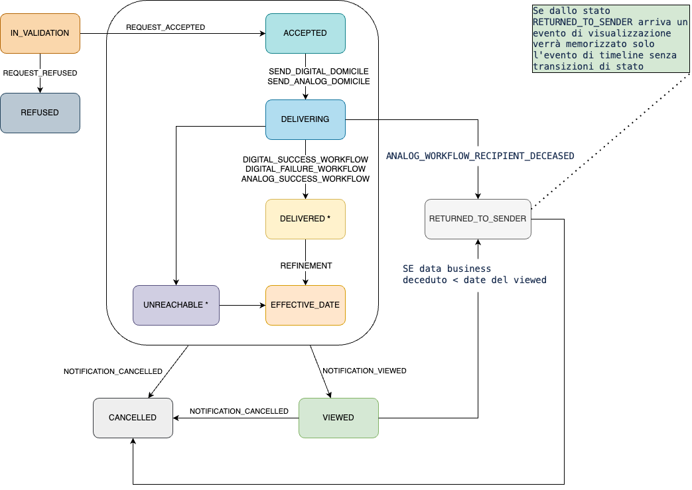

# Workflow di Notifica

Diagramma degli stati

<figure><figcaption></figcaption></figure>

#### Spiegazione visualizzazione della notifica in caso di passaggio di stato a RETURN\_TO\_SENDER 

in caso la notifica venga visualizzata quando è in stato `RETURN_TO_SENDER`, quest'ultima non cambierà di stato e non andrà in `VIEWED` , cambierà solo l'evento di timeline associato ad esso che passerò a `NOTIFICATION_VIEWED`

#### **Descrizione di stato sintetica della notifica nei casi di invio Multi-destinatario**: 

* La descrizione di stato sintetica della notifica passa a `DELIVERED` quando si concludono tutti i tentativi di invio della notifica per tutti i destinatari ed almeno un destinatario è stato raggiunto (per via digitale o per via cartacea).
* La descrizione di stato sintetica della notifica passa a `UNREACHABLE` quando tutti i destinatari non sono raggiungibili.
* La descrizione di stato sintetica della notifica passa a `EFFECTIVE_DATE` se la notifica è stata consegnata ad almeno uno dei destinatari (`DELIVERED`) oppure quando tutti i destinatari non sono raggiungibili (`UNREACHABLE`) ed è trascorso il tempo necessario al perfezionamento per decorrenza termini per almeno uno di questi. **NOTA**: _Si evidenzia che il passaggio della descrizione a_ `EFFECTIVE_DATE` _NON influenza in alcun modo il grado di perfezionamento degli altri destinatari. Infatti il Perfezionamento è una caratteristica tipica del destinatario e non è impattata in alcun modo da come viene descritto lo stato sintetico della notifica._
* La descrizione di stato sintetica della notifica passa a `VIEWED` quando almeno uno dei destinatari ha fatto accesso alla notifica. **NOTA**: _destinatari differenti possono, entrando sul dettaglio della notifica, vedere descrizioni diverse (Perfezionata per presa visione/Visualizzata) in dipendenza del momento di prima visualizzazione sia precedente o successivo alla decorrenza termini._
* Lo stato **RETURNED\_TO\_SENDER** viene applicato esclusivamente qualora sia stato ricevuto l’evento di decesso per la totalità dei destinatari associati alla notifica. In uno scenario con due destinatari, se il Destinatario A effettua l'accesso alla notifica portandola in stato `VIEWED`, mentre per il Destinatario B viene ricevuto l'evento di decesso (`RETURNED_TO_SENDER`), la notifica si perfeziona globalmente come VIEWED

#### Stati della notifica 

| **Stato**                  | **Label Stato UI**                             | **Descrizione**                                                                                 |
| -------------------------- | ---------------------------------------------- | ----------------------------------------------------------------------------------------------- |
| `IN_VALIDATION`            | \*                                             | notifica depositata in attesa di validazione.                                                   |
| `ACCEPTED`                 | **Depositata**                                 | L'ente ha depositato la notifica con successo                                                   |
| `REFUSED`                  | \*                                             | Notifica rifiutata a seguito della fallita validazione                                          |
| `DELIVERING`               | **Invio in corso**                             | L'invio della notifica è in corso                                                               |
| `DELIVERED`                | **Consegnata**                                 | L'invio della notifica è terminato in quanto almeno un recapito \[Analogico/Digitale] è valido. |
| `VIEWED`                   | **Avvenuto accesso**                           | Il destinatario ha letto la notifica.                                                           |
| `EFFECTIVE_DATE`           | **Perfezionata per decorrenza termini**        | Il destinatario non ha letto la notifica entro il termine stabilito                             |
| `UNREACHABLE`              | **Destinatario irreperibile**                  | Il destinatario non è reperibile                                                                |
| `CANCELLED`\*\*            | **Notifica annullata**                         | L'ente ha annullato l'invio della notifica.                                                     |
| `RETURNED_TO_SENDER`\*\*\* | **La notifica è stata restituita al mittente** | Il destinatario risulta deceduto.                                                               |

\* la notifica non è visibile fino a validazione completata

\*\* disponibile dalla versione GA2.0

\*\*\*disponibile dalla versione GA2.5

### Eventi di Timeline 

| **Evento**                                                                                                                                | **Descrizione evento / EventId**                                                                                                                                                                                                                                                                                                                                                                                                                                                                                                                   |
| ----------------------------------------------------------------------------------------------------------------------------------------- | -------------------------------------------------------------------------------------------------------------------------------------------------------------------------------------------------------------------------------------------------------------------------------------------------------------------------------------------------------------------------------------------------------------------------------------------------------------------------------------------------------------------------------------------------- |
| VALIDATE\_NORMALIZE\_ADDRESSES\_REQUEST                                                                                                   | 
Invio della richiesta di validazione e normalizzazione indirizzi fisici presenti nella richiesta di notifica

<code>VALIDATE_NORMALIZE_ADDRESSES_REQUEST.IUN_KWKU-JHXN-HJXM-202304-U-1</code>
                                                                                                                                                                                                                                                                                                                                          |
| NORMALIZED\_ADDRESS                                                                                                                       | 
Ricezione esito normalizzazione indirizzo

<code>NORMALIZED_ADDRESS.IUN_KWKU-JHXN-HJXM-202304-U-1.RECINDEX_0</code>
                                                                                                                                                                                                                                                                                                                                                                                                                    |
| SENDER\_ACK\_CREATION\_REQUEST                                                                                                            | 
Invio della richiesta di creazione dell'atto opponibile a terzi di presa in carico per il mittente a safe storage

<code>SENDERACK_LEGALFACT_CREATION_REQUEST.IUN_KWKU-JHXN-HJXM-202304-U-1</code>
                                                                                                                                                                                                                                                                                                                                     |
| **REQUEST\_REFUSED**                                                                                                                      | Richiesta di notifica rifiutata per fallimento di validazione                                                                                                                                                                                                                                                                                                                                                                                                                                                                                      |
|                                                                                                                                           | `REQUEST_REFUSED.IUN_KWKU-JHXN-HJXM-202304-U-1`                                                                                                                                                                                                                                                                                                                                                                                                                                                                                                    |
| **REQUEST\_ACCEPTED**                                                                                                                     | Richiesta di notifica accettata a seguito dei controlli di validazione                                                                                                                                                                                                                                                                                                                                                                                                                                                                             |
|                                                                                                                                           | `REQUEST_ACCEPTED.IUN_KWKU-JHXN-HJXM-202304-U-1`                                                                                                                                                                                                                                                                                                                                                                                                                                                                                                   |
| AAR\_CREATION\_REQUEST                                                                                                                    | 
Invio della richiesta di creazione dell'AAR (Avviso di Avvenuta Ricezione) a safe storage

<code>AAR_CREATION_REQUEST.IUN_KWKU-JHXN-HJXM-202304-U-1.RECINDEX_0</code>
                                                                                                                                                                                                                                                                                                                                                                  |
| AAR\_GENERATION                                                                                                                           | 
Generazione dell’AAR (Avviso di Avvenuta Ricezione) <code>AAR_GEN.IUN_KWKU-JHXN-HJXM-202304-U-1.RECINDEX_0</code>
                                                                                                                                                                                                                                                                                                                                                                                                                        |
| SEND\_COURTESY\_MESSAGE                                                                                                                   | 
<strong>Invio di un messaggio di cortesia</strong>

È in corso l'invio del messaggio di cortesia tramite [SMS/APPIO/EMAIL]. <code>SEND_COURTESY_MESSAGE.IUN_KWKU-JHXN-HJXM-202304-U-1.RECINDEX_0.COURTESYADDRESSTYPE_SMS</code>
                                                                                                                                                                                                                                                                                                     |
| PROBABLE\_SCHEDULING\_ANALOG\_DATE                                                                                                        | 
Rappresenta la data in cui si presume che abbia inizio il processo di notificazione cartecea. L’evento è specifico per il destinatario a seguito del primo invio di un messaggio di cortesia, non sarà generato in caso di assenza del messaggio di cortesia. Se la notifica viene letta dal destinatario prima di questa data, l’invio cartaceo sarà sicuramente non avviato. <code>PROBABLE_SCHEDULING_ANALOG_DATE.IUN_MZQR-VKDM-MJEN-202305-M-1.RECINDEX_0</code>
                                                                     |
| GET\_ADDRESS                                                                                                                              | Disponibilità dell’indirizzo specifico (domicilio digitale di piattaforma, domicilio digitale speciale, domicilio digitale generale, indirizzo fisico sulla notifica o sui registri nazionali)                                                                                                                                                                                                                                                                                                                                                     |
|                                                                                                                                           | `GET_ADDRESS.IUN_KWKU-JHXN-HJXM-202304-U-1.RECINDEX_0.SOURCE_PLATFORM.ATTEMPT_1`                                                                                                                                                                                                                                                                                                                                                                                                                                                                   |
| PUBLIC\_REGISTRY\_CALL                                                                                                                    | Richiesta ai registri pubblici per ottenere domicilio digitale generale o per ottenere indirizzo fisico da ANPR, da registro della imprese, da anagrafe tributaria.                                                                                                                                                                                                                                                                                                                                                                                |
|                                                                                                                                           | `NATIONAL_REGISTRY_CALL.IUN_KWKU-JHXN-HJXM-202304-U-1.RECINDEX_0.DELIVERYMODE_DIGITAL.CONTACTPHASE_CHOOSE_DELIVERY.ATTEMPT_1`                                                                                                                                                                                                                                                                                                                                                                                                                      |
| PUBLIC\_REGISTRY\_RESPONSE                                                                                                                | Ricevuta la risposta dei registri pubblici                                                                                                                                                                                                                                                                                                                                                                                                                                                                                                         |
|                                                                                                                                           | `NATIONAL_REGISTRY_RESPONSE.CORRELATIONID_corr12345`                                                                                                                                                                                                                                                                                                                                                                                                                                                                                               |
| SCHEDULE\_ANALOG\_WORKFLOW                                                                                                                | Pianificazione del workflow per invio cartaceo                                                                                                                                                                                                                                                                                                                                                                                                                                                                                                     |
|                                                                                                                                           | `SCHEDULE_ANALOG_WORKFLOW.IUN_KWKU-JHXN-HJXM-202304-U-1.RECINDEX_0.ATTEMPT_1`                                                                                                                                                                                                                                                                                                                                                                                                                                                                      |
| SCHEDULE\_DIGITAL\_WORKFLOW                                                                                                               | 
<strong>Ulteriore invio per via digitale</strong> È iniziato un ulteriore tentativo di invio della notifica per via digitale.
                                                                                                                                                                                                                                                                                                                                                                                                            |
|                                                                                                                                           | `SCHEDULE_DIGITAL_WORKFLOW.IUN_KWKU-JHXN-HJXM-202304-U-1.RECINDEX_0.SOURCE_PLATFORM.ATTEMPT_1`                                                                                                                                                                                                                                                                                                                                                                                                                                                     |
| PREPARE\_DIGITAL\_DOMICILE                                                                                                                | 
Preparazione per l’invio dell’avviso digitale.

Va a valutare la timeline per capire quale sarà il prossimo indirizzo da usare.
                                                                                                                                                                                                                                                                                                                                                                                                        |
|                                                                                                                                           | `PREPARE_DIGITAL_DOMICILE.IUN_KWKU-JHXN-HJXM-202304-U-1.RECINDEX_0.SOURCE_PLATFORM.ATTEMPT_0.CORRELATIONID_1234`                                                                                                                                                                                                                                                                                                                                                                                                                                   |
| **SEND\_DIGITAL\_DOMICILE**                                                                                                               | 
<strong>Invio via PEC/SERCQ</strong> È in corso l'invio della notifica all'indirizzo [PEC/Domicilio Digitale] 
                                                                                                                                                                                                                                                                                                                                                                                                                        |
|                                                                                                                                           | `SEND_DIGITAL.IUN_KWKU-JHXN-HJXM-202304-U-1.RECINDEX_0.SOURCE_PLATFORM.REPEAT_false.ATTEMPT_0`                                                                                                                                                                                                                                                                                                                                                                                                                                                     |
| SEND\_DIGITAL\_PROGRESS                                                                                                                   | 
<strong>Invio via PEC preso in carico</strong> L'invio della notifica all'indirizzo PEC è/non è stato preso in carico.
                                                                                                                                                                                                                                                                                                                                                                                                                   |
|                                                                                                                                           | `DIGITAL_PROG.IUN_KWKU-JHXN-HJXM-202304-U-1.RECINDEX_0.SOURCE_PLATFORM.REPEAT_false.ATTEMPT_0.IDX_1`                                                                                                                                                                                                                                                                                                                                                                                                                                               |
| SEND\_DIGITAL\_FEEDBACK                                                                                                                   | 
<strong>Invio via PEC riuscito</strong>
<ul><li><strong>OK</strong>: L'invio della notifica all'indirizzo PEC è riuscito.</li><li><strong>KO:</strong>L'invio della notifica all'indirizzo PEC è fallito perché la casella è satura, non valida o inattiva.</li></ul>                                                                                                                                                                                                                                                                        |
|                                                                                                                                           | `SEND_DIGITAL_FEEDBACK.IUN_KWKU-JHXN-HJXM-202304-U-1.RECINDEX_0.SOURCE_PLATFORM.ATTEMPT_1`                                                                                                                                                                                                                                                                                                                                                                                                                                                         |
| SCHEDULE\_REFINEMENT                                                                                                                      | Pianificato il perfezionamento per decorrenza termini                                                                                                                                                                                                                                                                                                                                                                                                                                                                                              |
|                                                                                                                                           | `SCHEDULE_REFINEMENT_WORKFLOW.IUN_KWKU-JHXN-HJXM-202304-U-1.RECINDEX_0`                                                                                                                                                                                                                                                                                                                                                                                                                                                                            |
| **REFINEMENT**                                                                                                                            | Perfezionamento per decorrenza termini                                                                                                                                                                                                                                                                                                                                                                                                                                                                                                             |
|                                                                                                                                           | `REFINEMENT.IUN_KWKU-JHXN-HJXM-202304-U-1.RECINDEX_0`                                                                                                                                                                                                                                                                                                                                                                                                                                                                                              |
| DIGITAL\_DELIVERY\_CREATION\_REQUEST                                                                                                      | 
Invio della richiesta di creazione dell'atto opponibile a terzi di chiusura del workflow digitale a safe storage

<code>DIGITAL_DELIVERY_CREATION_REQUEST.IUN_KWKU-JHXN-HJXM-202304-U-1.RECINDEX_0</code>
                                                                                                                                                                                                                                                                                                                              |
| **DIGITAL\_SUCCESS\_WORKFLOW**                                                                                                            | Completato con successo il workflow di invio digitale.                                                                                                                                                                                                                                                                                                                                                                                                                                                                                             |
|                                                                                                                                           | `DIGITAL_SUCCESS_WORKFLOW.IUN_KWKU-JHXN-HJXM-202304-U-1.RECINDEX_0`                                                                                                                                                                                                                                                                                                                                                                                                                                                                                |
| **DIGITAL\_FAILURE\_WORKFLOW**                                                                                                            | 
Completato con fallimento il workflow di invio digitale: <strong>tutti i tentativi di invio ai domicili digitali sono falliti</strong>

NOTA: in caso di DIGITAL_FAILURE_WORKFLOW piattaforma notifiche:
<ul><li>genera AMR (Avviso di mancato recapito)</li><li>invia la AAR (Avviso di Avvenuta Ricezione) tramite raccomandata semplice e la notifica si considera consegnata.</li></ul>                                                                                                                                             |
|                                                                                                                                           | `DIGITAL_FAILURE_WORKFLOW.IUN_KWKU-JHXN-HJXM-202304-U-1.RECINDEX_0`                                                                                                                                                                                                                                                                                                                                                                                                                                                                                |
| **ANALOG\_SUCCESS\_WORKFLOW**                                                                                                             | Completato con successo il workflow di invio cartaceo.                                                                                                                                                                                                                                                                                                                                                                                                                                                                                             |
|                                                                                                                                           | `ANALOG_SUCCESS_WORKFLOW.IUN_KWKU-JHXN-HJXM-202304-U-1.RECINDEX_0`                                                                                                                                                                                                                                                                                                                                                                                                                                                                                 |
| **ANALOG\_FAILURE\_WORKFLOW**                                                                                                             | 
<strong>Aggiornamento sull'invio cartaceo</strong>

Il destinatario è risultato irreperibile assoluto. Si deposita e mette a disposizione l'avviso di avvenuta ricezione.

NOTA: se per tutti i destinatari si conclude il workflow con fallimento la notifica transita nello stato COMPLETELY_UNREACHABLE
                                                                                                                                                                                                                        |
|                                                                                                                                           | `ANALOG_FAILURE_WORKFLOW.IUN_123-456-789.RECINDEX_0`                                                                                                                                                                                                                                                                                                                                                                                                                                                                                               |
| COMPLETELY\_UNREACHABLE\_CREATION\_REQUEST                                                                                                | Invio della richiesta di creazione dell'atto (simile a opponibile a terzi) di completamento con fallimento del workflow di invio cartaceo                                                                                                                                                                                                                                                                                                                                                                                                          |
|                                                                                                                                           | `COMPLETELY_UNREACHABLE_CREATION_REQUEST.IUN_KWKU-JHXN-HJXM-202304-U-1.RECINDEX_0`                                                                                                                                                                                                                                                                                                                                                                                                                                                                 |
| PREPARE\_SIMPLE\_REGISTERED\_LETTER                                                                                                       | Invio richiesta di prepare (preparazione ad invio) raccomandata semplice a paperChannel                                                                                                                                                                                                                                                                                                                                                                                                                                                            |
|                                                                                                                                           | `PREPARE_SIMPLE_REGISTERED_LETTER.IUN_KWKU-JHXN-HJXM-202304-U-1.RECINDEX_0`                                                                                                                                                                                                                                                                                                                                                                                                                                                                        |
| SEND\_SIMPLE\_REGISTERED\_LETTER                                                                                                          | 
<strong>Invio di raccomandata semplice</strong> È in corso l'invio della notifica all'indirizzo tramite raccomandata semplice.
                                                                                                                                                                                                                                                                                                                                                                                                           |
|                                                                                                                                           | `SEND_SIMPLE_REGISTERED_LETTER.IUN_KWKU-JHXN-HJXM-202304-U-1.RECINDEX_0`                                                                                                                                                                                                                                                                                                                                                                                                                                                                           |
|                                                                                                                                           | Valorizzato `details.analogCost` con il costo dell’invio cartaceo                                                                                                                                                                                                                                                                                                                                                                                                                                                                                  |
| SEND\_SIMPLE\_REGISTERED\_LETTER\_PROGRESS                                                                                                | Ricezione informazioni intermedia relative ad una notificazione cartacea semplice                                                                                                                                                                                                                                                                                                                                                                                                                                                                  |
|                                                                                                                                           | `SIMPLE_REGISTERED_LETTER_PROGRESS.IUN_KWKU-JHXN-HJXM-202304-U-1.RECINDEX_0.ATTEMPT_1.IDX_1`                                                                                                                                                                                                                                                                                                                                                                                                                                                       |
|                                                                                                                                           | Possono essere presenti più elementi di send\_Analog\_progress. Per preservarne l’unicità, si utilizza la tabella di appoggio TimelineCounters, in cui per ogni timeline di SEND\_SIMPLE\_REGISTERED\_LETTER c'è un contatore incrementato in maniera atomica da utilizzare come indice nella costruzione del timelineId di SIMPLE\_REGISTERED\_LETTER\_PROGRESS.                                                                                                                                                                                  |
| NOTIFICATION\_VIEWED\_CREATION\_REQUEST                                                                                                   | 
Invio della richiesta di creazione dell'atto opponibile a terzi di presa visione a safe storage

<code>NOTIFICATION_VIEWED_CREATION_REQUEST.IUN_KWKU-JHXN-HJXM-202304-U-1.RECINDEX_0</code>
                                                                                                                                                                                                                                                                                                                                            |
| **NOTIFICATION\_VIEWED**                                                                                                                  | 
Visualizzazione della notifica (perfeziona la notifica se non già perfezionata per decorrenza termini o da altro destinatario)

NOTA: <em>il campo</em> <code>timestamp</code> <em>NON riporta la data di inserimento in timeline ma l'ìstante in cui è stata visualizzata la notifica. Quindi questo elemento risulta con un timestamp precedente l'evento NOTIFICATION_VIEWED_CREATION_REQUEST anche se avviene successivamente. Per questo motivo nello stream questo evento appare dopo NOTIFICATION_VIEWED_CREATION_REQUEST.</em>
 |
|                                                                                                                                           | `NOTIFICATION_VIEWED.IUN_KWKU-JHXN-HJXM-202304-U-1.RECINDEX_0`                                                                                                                                                                                                                                                                                                                                                                                                                                                                                     |
| PREPARE\_ANALOG\_DOMICILE                                                                                                                 | Invio richiesta di prepare (preparazione ad invio) cartaceo a paperChannel                                                                                                                                                                                                                                                                                                                                                                                                                                                                         |
|                                                                                                                                           | `PREPARE_ANALOG_DOMICILE.IUN_KWKU-JHXN-HJXM-202304-U-1.RECINDEX_0.ATTEMPT_1`                                                                                                                                                                                                                                                                                                                                                                                                                                                                       |
| PREPARE\_ANALOG\_DOMICILE\_FAILURE                                                                                                        | 
<strong>Aggiornamento sull'invio cartaceo</strong> non è stato trovato nessun indirizzo valido per predisporre il tentativo. NOTA: disponibile dalla versione GA2.
                                                                                                                                                                                                                                                                                                                                                                    |
|                                                                                                                                           | `PREPARE_ANALOG_DOMICILE_FAILURE.IUN_KWKU-JHXN-HJXM-202304-U-1.RECINDEX_0.ATTEMPT_1`                                                                                                                                                                                                                                                                                                                                                                                                                                                               |
| [SEND\_ANALOG\_PROGRESS](creazione-e-gestione-degli-stream/stream-di-timeline/decodifiche-send_analog.md#decodifica-deliverydetailcode)   | 
<strong>Aggiornamento sull'invio cartaceo</strong>

Ricezione informazioni intermedia relative ad una notificazione cartacea
                                                                                                                                                                                                                                                                                                                                                                                                           |
|                                                                                                                                           | `SEND_ANALOG_PROGRESS.IUN_KWKU-JHXN-HJXM-202304-U-1.RECINDEX_0.ATTEMPT_1.IDX_1`                                                                                                                                                                                                                                                                                                                                                                                                                                                                    |
|                                                                                                                                           | 
Ogni istanza di questo evento rappresenta un aggiornamento riguardante il processo di recapito. Possono essere presenti più elementi di send_Analog_progress. Per preservarne l’unicità, si utilizza la tabella di appoggio TimelineCounters, in cui per ogni timeline di SEND_ANALOG c'è un contatore incrementato in maniera atomica da utilizzare come indice nella costruzione del timelineId di SEND_ANALOG_PROGRESS.
                                                                                                               |
| SEND\_ANALOG\_DOMICILE                                                                                                                    | 
<strong>Invio via raccomandata [890/AR/INTERNAZIONALE]</strong> È iniziato l'invio della notifica all'indirizzo tramite raccomandata
                                                                                                                                                                                                                                                                                                                                                                                                     |
|                                                                                                                                           | `SEND_ANALOG_DOMICILE.IUN_KWKU-JHXN-HJXM-202304-U-1.RECINDEX_0.ATTEMPT_1`                                                                                                                                                                                                                                                                                                                                                                                                                                                                          |
|                                                                                                                                           | Valorizzato `details.analogCost` con il costo dell’invio cartaceo                                                                                                                                                                                                                                                                                                                                                                                                                                                                                  |
| [SEND\_ANALOG\_FEEDBACK](creazione-e-gestione-degli-stream/stream-di-timeline/decodifiche-send_analog.md#decodifica-deliverydetailcode-1) | 
<strong>OK</strong>: <strong>Invio per via cartacea andato a buon fine</strong> <strong>KO: L'invio per via cartacea non ha determinato la consegna</strong> Ricezione esito dell'invio cartaceo
                                                                                                                                                                                                                                                                                                                                      |
|                                                                                                                                           | 
Il valore del campo <code>details.responseStatus</code> contiene l’esito della notifica digitale. Può assumere i valori di <code>OK</code> o <code>KO</code> .
                                                                                                                                                                                                                                                                                                                                                                           |
|                                                                                                                                           | `SEND_ANALOG_FEEDBACK.IUN_KWKU-JHXN-HJXM-202304-U-1.RECINDEX_0.ATTEMPT_1`                                                                                                                                                                                                                                                                                                                                                                                                                                                                          |
| **COMPLETELY\_UNREACHABLE**                                                                                                               | 
Il destinatario è risultato irraggiungibile.

A questo evento è collegato il documento di deposito di avventuta ricezione avente come <em>legalFactType</em>: <strong>ANALOG_FAILURE_DELIVERY.</strong>
                                                                                                                                                                                                                                                                                                                                |
|                                                                                                                                           | `COMPLETELY_UNREACHABLE.IUN_KWKU-JHXN-HJXM-202304-U-1.RECINDEX_0`                                                                                                                                                                                                                                                                                                                                                                                                                                                                                  |
| NOTIFICATION\_CANCELLATION\_REQUEST                                                                                                       | 
Evento di richiesta di cancellazione della notifica dal parte del mittente.

NOTA: disponibile dalla versione GA2.0
                                                                                                                                                                                                                                                                                                                                                                                                                    |
| **NOTIFICATION\_CANCELLED**                                                                                                               | 
Evento di fine della cancellazione della notifica dal parte del mittente. Questo evento fa passare la notifica in stato <code>CANCELLED</code>

NOTA: disponibile dalla versione GA2.0
                                                                                                                                                                                                                                                                                                                                              |
| NOTIFICATION\_RADD\_RETRIEVED                                                                                                             | Evento di accesso alla notifica tramite RADD                                                                                                                                                                                                                                                                                                                                                                                                                                                                                                       |
| NOTIFICATION\_PAID                                                                                                                        | 
Evento di comunicazione di pagamento. Questo evento viene inserito in timeline quando la PA mittente comunica di aver ricevuto il pagamento tramite l’API paymentEventsRequestPagoPa. NOTA: questo evento non ha effetto sulla workflow della notifica, ma serve per comunicare al destinatario che la PA ha segnalato il pagamento
                                                                                                                                                                                                      |
| **ANALOG\_WORKFLOW\_RECIPIENT\_DECEASED**                                                                                                 | Evento per destinatario deceduto                                                                                                                                                                                                                                                                                                                                                                                                                                                                                                                   |

### Note ulteriori

#### Stati ed eventi

Non esiste una correlazione 1:1 tra evento di timeline e transizione di stato.\
Non tutti gli eventi danno luogo ad una transizione di stato; gli eventi che possono provocare un cambiamento di stato della notifica sono evidenziati in **grassetto**.\
Gli eventi di timeline non sono un dettaglio dello stato della notifica, ma sono eventi collegati alla notifica, al mittente o ai suoi destinatari.

#### Workflow digitale e retry 

In presenza di domicilio digitale ed indipendentemente dalla presenza o meno di recapiti di cortesia (SMS, email, AppIO), il flusso digitale prevede il tentativo di invio della notifica al domicilio digitale del destinatario in base ad una sequenza predefinita (domicilio digitale: di piattaforma, speciale, generale), che si interrompe non appena il server del destinatario ha accettato la comunicazione (e non quando il destinatario ha letto la PEC).\
PN effettua 2 cicli di invio a distanza di 7 o 9 giorni ed in caso di fallimento di entrambi i cicli, è generato l’AMR con lo specifico elemento di timeline **DIGITAL\_FAILURE\_WORKFLOW**.\
PN invia AAR (Avviso di Avvenuta Ricezione) tramite raccomandata semplice e la notifica si considera consegnata.

#### Workflow cartaceo 

In assenza di domicilio digitale ed in assenza di recapiti di cortesia (SMS, email, AppIO) è eseguita la consegna dell’AAR in modalità cartacea attraverso 890 o Raccomandata A/R (è in capo alla PA stabilire quale dei due canali utilizzare). PN riceve dall’operatore postale gli aggiornamenti sullo stato della consegna e la copia digitale conforme di ogni documento generato durante la notificazione.

* **Ricevute XML dell’esito relativo all’invio PEC** - generate dagli eventi **SEND\_DIGITAL\_PROGRESS** e **SEND\_DIGITAL\_FEEDBACK**, ed aventi come _legalFactType: **PEC\_RECEIPT**_
* **Ricevuta di accettazione raccomandata** - generato dall’evento **SEND\_ANALOG\_PROGRESS** ed avente come _legalFactType: **ANALOG\_DELIVERY**_
  * Possono essere presenti più elementi di send\_Analog\_progress. Per preservarne l’unicità, si utilizza la tabella di appoggio TimelineCounters, in cui per ogni timeline di SEND\_ANALOG c'è un contatore incrementato in maniera atomica da utilizzare come indice nella costruzione del timelineId di SEND\_ANALOG\_PROGRESS.
* **Ricevuta di consegna raccomandata** e **Ricevuta di mancata consegna raccomandata** – generato dall’evento **SEND\_ANALOG\_FEEDBACK** ed avente come _legalFactType: **ANALOG\_DELIVERY**_

#### Perfezionamento per decorrenza termini della notifica 

**Invio Digitale**

Nel caso di flusso digitale, il perfezionamento della notifica avviene nelle seguenti modalità:

* la notifica si perfeziona per il destinatario dopo **7 giorni dalla consegna dell’AAR** attraverso PEC o SERCQ
* la notifica si perfeziona per il destinatario dopo **15 giorni dalla generazione dell’AMR**, che avviene in seguito al fallimento della consegna digitale.

**Invio Cartaceo**

Nel caso di flusso analogico, il perfezionamento della notifica avviene nelle seguenti modalità:

* la notifica si perfeziona per il destinatario dopo **10 giorni dalla consegna dell’AAR** in modalità cartacea.
* la notifica si perfeziona per il destinatario dopo **10 giorni dalla mancata consegna dell’AAR** in modalità cartacea.

#### Irreperibilità del destinatario 

Nel caso in cui la notifica analogica dovesse terminare con un evento di irreperibilità del destinatario la piattaforma metterà a disposizione il documento di “DEPOSITO AVVISO DI AVVENUTA RICEZIONE”

Il documento di “**Deposito di avvenuta ricezione”** è generato e collegato all’evento di timeline **COMPLETELY\_UNREACHABLE** con l’identificativo _legalFactType_: **ANALOG\_FAILURE\_DELIVERY.**
