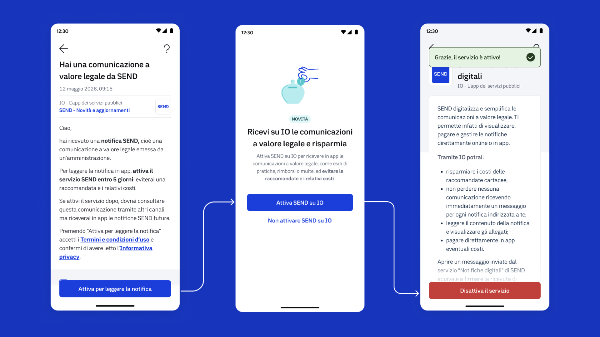
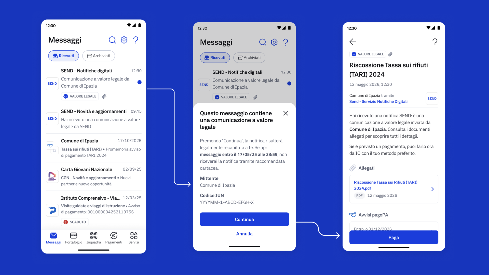

---
metaLinks:
  alternates:
    - >-
      https://app.gitbook.com/s/Y7k2HeXaC1tCaS4VWENZ/prenotazione-dellappuntamento
---

# 2️⃣ Consegna e perfezionamento della notifica

**Lucia riceve un messaggio di adesione su IO, che la informa dell’esistenza di una notifica**: per leggerla deve attivare il servizio “Notifiche Digitali" (se non lo ha già fatto in precedenza).

### Cosa fa SEND

* **Invia un messaggio di cortesia ai recapiti digitali:** Se Lucia ha espresso interesse in questi canali, il messaggio la inviterà a collegarsi sulla piattaforma per visualizzare la notifica.
* **Cerca il domicilio digitale e, se presente, invia lì la notifica:** Inserito da Lucia nella piattaforma oppure presente sui registri pubblici. Se presente, invia lì l’avviso di avvenuta ricezione, perfezionando la notifica.

### Cosa fa il cittadino&#x20;

* **Riceve il messaggio di adesione a SEND:** Un messaggio tramite app IO, email o SMS lo informa dell'esistenza della notifica.
* **Attiva il servizio su IO:** Se non lo ha ancora fatto, Lucia attiva il servizio "Notifiche Digitali" su IO. Riceverà d'ora in poi il messaggio di cortesia per la notifica a valore legale direttamente sull'app.

<figure><figcaption></figcaption></figure>

* **Riceve il messaggio di cortesia**: Il servizio SEND comunica un messaggio di cortesia a Lucia che la informa dell'emissione di una notifica a valore legale.
* **Perfezionamento della notifica:** Aprendo la notifica entro 120 ore (5 giorni) dall'invio del messaggio di cortesia, la notifica si perfeziona digitalmente, assumendo pieno valore legale.

<figure><figcaption></figcaption></figure>

### Migliora l'esperienza dall'inizio alla fine 💡

* **Informa i cittadini che l'ente usa SEND**: non tutte le persone conoscono il servizio e se l'ente lo utilizza per quale tipologie di notifiche
* **Promuovi i canali di cortesia:** Invita i cittadini ad aggiungere i canali di cortesia per la notifica, evitando così la raccomandata cartacea.
* **Monitoraggio:** L'ente può verificare tramite API l’accettazione o il rifiuto da parte di SEND del deposito della notifica. Una volta accettato il deposito, monitora anche i diversi stati della notifica.

### Benefici per l'ente e per il cittadino ✅

* **Il cittadino sceglie come ricevere le notifiche:** SEND Si adatta al contesto del destinatario, raggiungendo il cittadino dove preferisce.
* **Risparmio:** La notifica digitale garantisce un risparmio di tempo e di costi rispetto alla raccomandata tradizionale.
