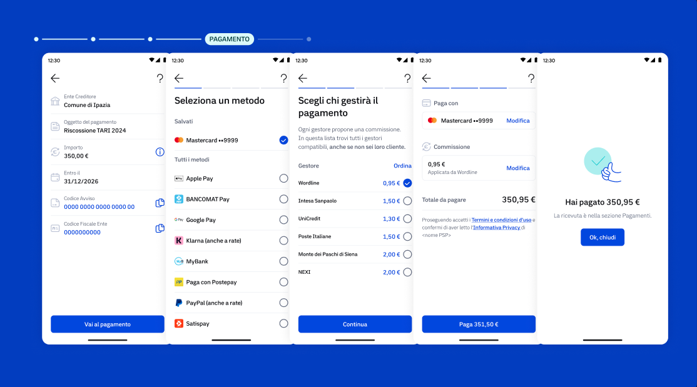

---
metaLinks:
  alternates:
    - https://app.gitbook.com/s/Y7k2HeXaC1tCaS4VWENZ/conferma-dellappuntamento
---

# 3️⃣ Pagamento tramite pagoPA

Con pochi tap su app IO, Lucia paga l'importo dovuto in modo sicuro e riceve immediatamente la ricevuta, senza dover copiare codici o fare file allo sportello.

<figure><figcaption></figcaption></figure>

### Cosa fa l'ente

* **Permette a Lucia di pagare online:** Se l'ente vuole collegare uno o più avvisi alla notifica deve utilizzare il campo pagoPA all'interno dell'oggetto "Payments", fornendo i seguenti dati:
  * codice avviso pagoPA;
  * identificativo fiscale dell’ente creditore;
  * attribuzione dei costi di notifica;
  * riferimento al PDF contenente l’avviso pagoPA.

### Cosa fa il cittadino&#x20;

* **Paga l'avviso tramite IO:** Seleziona il metodo di pagamento preferito salvato su IO e conferma l'operazione.
* **Scarica la ricevuta:** Dopo il pagamento, può trovare e scaricare la ricevuta PDF nella sezione "Pagamenti" di IO, utile come prova dell'avvenuto saldo.

### Migliora l'esperienza dall'inizio alla fine 💡

* **Gestione post-pagamento:** Se l'avviso è già stato pagato, l'ente deve aggiornare lo stato della posizione debitoria affinché l'utente su IO veda che il debito risulta estinto.
* **Accuratezza:**  verifica che tutti i dati richiesti nell'oggetto Payments siano forniti, permettendo a Lucia di pagare online.

### Benefici per l'ente e per il cittadino ✅

* **Riconciliazione automatica:** pagoPA permette all'ente il monitoraggio in tempo reale degli incassi e la riconciliazione automatica del pagamento rispetto alla relativa posizione debitoria
* **I tuoi metodi di pagamento preferiti:** Con pagoPA i cittadini possono pagare direttamente su IO o su SEND in modo semplice e trasparente

