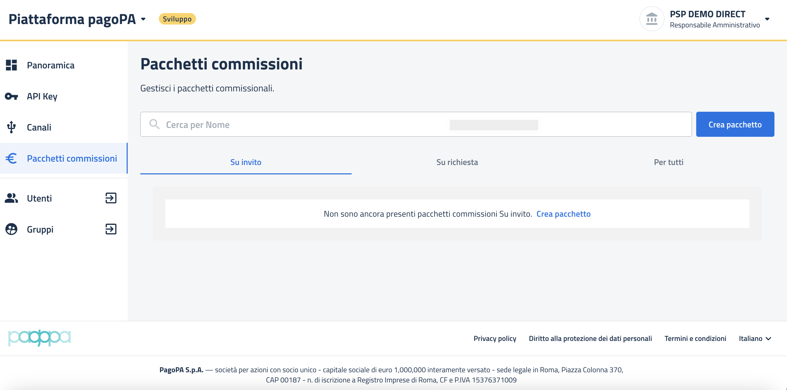

# Accesso

Per **attivare** e **gestire** il **prodotto pagoPA** è necessario prima accedere all'**Area Riservata** nella sezione **Panoramica** in cui è presente la sezione dedicata ai **prodotti disponibili.**

Questa sezione ospita la lista dei prodotti a cui il PSP ha aderito e da cui è possibile effettuare l'**accesso al portale dedicato al singolo prodotto**.

<figure><figcaption>
<em>Area Riservata - Panoramica</em>
</figcaption></figure>

Nei 3 paragrafi seguenti andremo ad illustrare le azioni e le informazioni che consentono all'utente di accedere e operare nella sezione **Panoramica - Area riservata**, in dettaglio:&#x20;

* il **punto di accesso** e le **modalità di accesso** all'**Area Riservata;**
* le **sezioni principali** in cui la suddetta Area è strutturata;&#x20;
* ed infine l'ultimo paragrafo è dedicato alla sezione **Panoramica - Area Riservata** da cui è possibile **accedere** al portale del **prodotto pagoPA**.

### Accesso Area Riservata 

Per poter accedere all’Area Riservata, è necessario aver **completato l’adesione ad un prodotto** (vedi [Manuale onboarding: sezione Processo di adesione](http://127.0.0.1:5000/s/axttcUGV65V2IVRggmvR/area-riservata-enti/processo-di-adesione)) e che l’**utente** sia stato censito come **Amministratore o Operatore sul prodotto** stesso.

E' possibile accedere all'Are Riservata recandosi sul sito [https://www.pagopa.it](https://www.pagopa.it/) e cliccare in alto a destra su "AREA RISERVATA ENTI".

<figure><figcaption>
<em>Punto di accesso all'Area Riservata: sito pagopa</em>
</figcaption></figure>

Da qui, l’accesso all’Area Riservata di PagoPA può essere effettuato tramite:

* Autenticazione mediante **SPID** (Sistema Pubblico di Identità Digitale);
* Autenticazione mediante **CIE** (Carta d’Identità Elettronica).&#x20;

All’interno della pagina di accesso sono disponibili i link per visualizzare i _**Termini e condizioni d’uso**_ della piattaforma e l’_**Informativa Privacy**_, come da immagine seguente. &#x20;

<figure><figcaption>
<em>Pagina di accesso all'Area Riservata di PagoPA</em>
</figcaption></figure>

Una volta effettuato l’accesso mediante una delle modalità disponibili, in base al numero di aderenti a cui si è associati, si incorre in uno sei seguenti scenari:

#### 1. Utente con profilo non associato a nessun soggetto aderente

Se si tenta di effettuare l’accesso senza avere un soggetto aderente associato, non è permesso l'accesso all’Area Riservata:

<figure><figcaption>
<em>Messaggio informativo visualizzato dall'utente non ancora associato ad almeno un Aderente/Prodotto</em>
</figcaption></figure>

In questo caso non è permesso l'accesso all’Area Riservata fino a che l'utente non sia stato abilitato.\
Da qui sarà solo possibile tornare alla schermata di login tramite il tasto "Chiudi", effettuare il log-out oppure contattare l'Assistenza.

#### 2. Utente associato ad un unico soggetto aderente e ad un prodotto per cui non è ancora stata completata l'adesione

<figure><figcaption>
Pagina di selezione dell' utente(accesso all'Area riservata) con un Aderente associato e adesione al prodotto non ancora completata
</figcaption></figure>

Se l'unico aderente a cui si è associati non ha ancora portato a termine l'adesione al primo prodotto, in pagina sarà mostrata l'etichetta dell'ente con le seguenti informazioni:

* **Nome del soggetto aderente** con richiesta di adesione in corso;
* Indicazione del proprio **ruolo** per quel soggetto aderente (Amministratore/ Operatore);
* **Tag “Da Completare”** che indica una richiesta inviata ma per cui non è ancora stato caricato l’Accordo di adesione firmato.

In questo caso **non è possibile accedere** all’Area Riservata **fino a quando l’adesione** al prodotto non **sarà stata completata** (vedi [Prerequisiti per accesso al portale](prerequisiti-per-accesso-al-portale.md)).

Da qui è solo possibile effettuare il log-out oppure tornare alla pagina di accesso tramite tasto “Torna alla home”.&#x20;

Nel momento in cui l’**adesione al prodotto viene portata a termine**, il tag “Da completare” non è più visibile e si può accedere al portale cliccando su “Accedi”.

#### 3. Utente associato a più soggetti aderenti di cui almeno uno ha correttamente terminato l’adesione ad un prodotto 

Nel caso in cui si sia **associati a più soggetti aderenti**, all’interno della pagina “Seleziona il tuo ente” viene esposta la relativa lista.

<figure><figcaption>
<em>Pagina di selezione dell' aderente (accesso all'Area Riservata) per utente con un soggetto aderente associato che ha completato l'adesione ad almeno un prodotto</em>
</figcaption></figure>

Per ogni aderente sono disponibili le seguenti informazioni:

* **Nome** soggetto aderente;
* Indicazione del proprio **ruolo** per quel soggetto aderente(Amministratore/ Operatore);
* Eventuale **tag “Da completare”** nel caso di **richiesta** ancora **in corso**; **nessun tag** in caso di **adesione** già **completata**.

Per facilitare la ricerca all’interno della lista, è disponibile un **campo di ricerca** in cui poter digitare manualmente il nome dell'aderente. Nel caso in cui si ricerchi un ente a cui non si è associati, viene visualizzato il messaggio "Nessun risultato".

È possibile selezionare l'ente di interesse ed accedere alla relativa Area Riservata se quest'ultimo ha concluso almeno un’adesione.&#x20;

### Area Riservata 

L’Area Riservata di PagoPA è accessibile agli utenti che possiedono un **ruolo attivo da Amministratore o Operatore** su **almeno uno dei prodotti** che sono stati **attivati** dal proprio aderente ed è composta da tre sezioni principali:&#x20;

* **Panoramica,** pagina principale che riporta:
  1. Dati anagrafici dell'aderente;
  2. Prodotti attivi, ovvero i prodotti a cui l’ aderente ha già aderito;
  3. Prodotti disponibili, ovvero i prodotti per cui non è ancora stata effettuata una richiesta di adesione;
* **Utenti**: sezione dedicata alla gestione delle utenze collegate all’aderente per ogni specifico prodotto;
* **Gruppi**: sezione dedicata alla gestione dei gruppi nei quali sono suddivisi i vari utenti abilitati sui prodotti.

La **visualizzazione** e l’**operatività** all’interno delle diverse sezioni dipenderà dal **ruolo attribuito all'utente per quel determinato prodotto**.

<figure><figcaption>
<em>Area Riservata - Panoramica - vista Amministratore</em>
</figcaption></figure>

All’interno della piattaforma sono sempre disponibili le seguenti funzioni:

* **Assistenza**: da cui è possibile inviare un messaggio all’Assistenza;
* **Esci**: per effettuare il logout dalla piattaforma;
* **Cambio utente:** menu da cui è possibile accedere all’Area Riservata di altri Enti associati all’utente loggato (menù di destra). Qui per ogni Ente associato saranno visibili:
  * **Logo** dell'aderente;
  * **Nome** dell’ aderente;
  * **Il proprio ruolo** sull’Area Riservata dell'aderente in questione

### **Area riservata - Panoramica**

All’interno della Panoramica è presente una sezione dedicata ai prodotti attivi che ospita **la lista dei prodotti a cui l’Ente ha aderito**.

Per ogni prodotto sono presenti il **Logo**, il **Nome** e il **pulsante di accesso** al portale specifico dei prodotti. Tuttavia, se non si è abilitati come Amministratori, al posto del pulsante si visualizza un **messaggio** che invita a contattare uno dei referenti amministrativi del prodotto (_"Per gestire questo prodotto, chiedi a uno dei suoi Amministratori"_), ed un link che reindirizza all’interno della sezione “**Utenti**”.

Inoltre, per esigenza specifica di alcuni prodotti, cliccando sul pulsante si potrebbe avere la possibilità di scegliere l'**ambiente target** a cui si intende accedere (es. Ambiente di Collaudo, Ambiente di produzione).

<figure><figcaption>
<em>Pop up di selezione ambiente target</em>
</figcaption></figure>

Inoltre è possibile **accedere** al **portale** del **prodotto pagoPA** anche dall’apposito menù a tendina situato al lato sinistro dell’intestazione. Anche da qui sarà possibile selezionare l’ambiente target.

<figure><figcaption>
<em>Menu a tendina per ingresso al prodotto</em>
</figcaption></figure>

