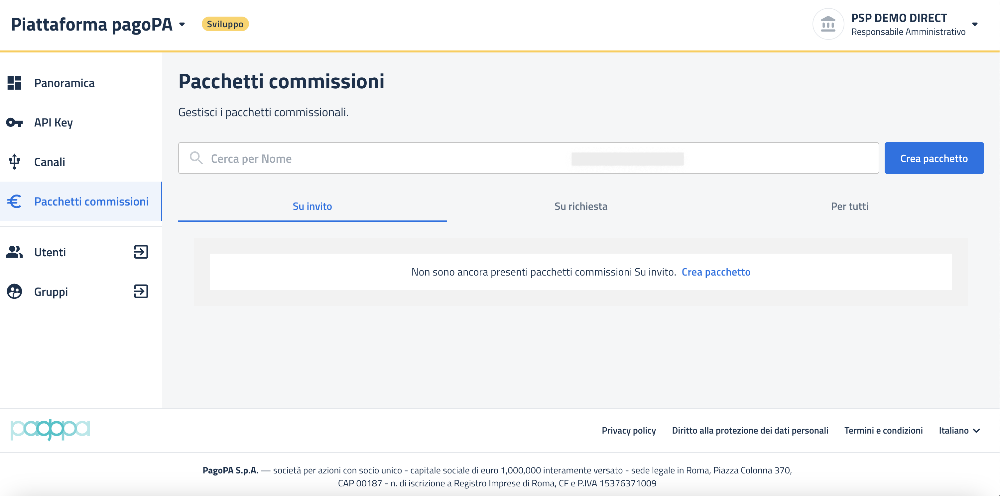

# Creazione pacchetto "Su invito"

Questa sezione descrive nel dettaglio le modalità per creare un pacchetto "Su invito".


Si ricorda che un pacchetto "Su invito" è un pacchetto definito dal PSP e ha validità per uno o più specifici EC a fronte di un accordo commerciale stabilito tra le controparti.


Accedendo alla funzionalità `"Pacchetti commissioni"` dal menu laterale di sinistra e spostandosi nel tab `"Su invito"` è possibile accedere alla funzione di creazione del pacchetto.

<figure><figcaption></figcaption></figure>

Una volta cliccato il tasto "`Crea pacchetto` " il sistema mostrerà la seguente interfaccia per poter inserire tutte le informazioni necessarie alla creazione del pacchetto.

<figure><figcaption></figcaption></figure>

Le informazioni da inserire sono le seguenti:

* Nome del pacchetto
* Descrizione del pacchetto
* Tipo di pagamento (menu a tendina) (per maggiori info [https://docs.pagopa.it/dizionario-dei-metadata/dati-canale-pagamento](https://docs.pagopa.it/dizionario-dei-metadata/dati-canale-pagamento))
  * Carta di debito / credito
  * Apple Pay
  * Bancomat Pay
  * Conto Banca Popolare di Sondrio
  * Conto Banco Posta&#x20;
  * Conto Banco PostaImpresa
  * Conto Intesa Sanpaolo
  * MyBank
  * Paga con PostePay
  * Paypal
* Touchpoint (menu a tendina)
  * &#x20;IO
  * pagoPA Checkout
  * ATM
  * POS
  * Canale PSP
  * WISP
* Fascia Importo&#x20;
  * Minimo&#x20;
  * Massimo
* Commissioni
  * Importo applicato dal PSP
* Dati di connessione
  * Codice Broker -> codice fiscale del PSP&#x20;
  * Codice Canale -> codice del canale del PSP su cui far valere il pacchetto
* Marca da bollo digitale (le due opzioni sono esclusive)
  * Pagamento con marca da bollo
  * Pagamento solo con marca da bollo
* Periodo di validità del pacchetto&#x20;
  * Data inizio validità&#x20;
  * Data fine validità

Compilate le informazioni di cui sopra è necessario proseguire cliccando il tasto "`Continua`" , il quale attiverà il passaggio alla seconda fase di configurazione del pacchetto, ovvero la possibilità di inserire delle tassonomie specifiche per quel determinato pacchetto. (Per maggiori informazioni sulle tassonomie consultare [https://docs.pagopa.it/sanp/ente-creditore/tassonomia-dei-servizi-di-incasso](https://docs.pagopa.it/sanp/ente-creditore/tassonomia-dei-servizi-di-incasso)).

<figure><figcaption></figcaption></figure>

Cliccando il tasto `"Sfoglia catalogo"` è possibile accedere all'elenco delle tassonomie disponibili raggruppate per tipologia di Ente Creditore, di Area e di specifico servizio.&#x20;

<figure><figcaption>
Vista tassonomia per ente ereditore
</figcaption></figure>

<figure><figcaption>
Vista tassonomia per area
</figcaption></figure>

<figure><figcaption>
Vista tassonomia per servizio di incasso
</figcaption></figure>

E' possibile indicare un singolo servizio oppure più di uno.

<figure><figcaption>
Seleziona singolo servizio
</figcaption></figure>

<figure><figcaption>
Seleziona più servizi
</figcaption></figure>

Una volta selezionato il servizio (o i servizi) è necessario cliccare il tasto `"Aggiungi"` che porta ad una pagina di riepilogo dalla quale è possibile vedere i servizi associati al pacchetto. Dalla stessa pagina è possibile eseguire modifiche ai servizi scelti.

<figure><figcaption>
Vista riepilogo servizi di incasso
</figcaption></figure>

Cliccando il tasto `"Sfoglia catalogo"` si torna alla possibilità di scelta di ulteriori servizi come specificato nelle sezioni precedenti.&#x20;

Cliccando invece il tasto `"Rimuovi"` è possibile rimuovere l'intera categoria di servizi.

<figure><figcaption>
Rimozione categoria
</figcaption></figure>

Cliccando invece il tasto `"-"` sulla sinistra di ogni singolo servizio è possibile rimuovere soltanto il servizio specifico.

<figure><figcaption>
Rimozione singolo servizio
</figcaption></figure>

Terminata la fase di selezione dei servizi di incasso è necessario proseguire cliccare il tasto "`Continua`" il quale attiverà un popup preventivo alla conferma dei dati.

<figure><figcaption></figcaption></figure>

Cliccando il tasto "`Conferma`" si procederà alla creazione del pacchetto "Su invito". Esso sarà poi visibile nello stato `"In attivazione"` nella sezione "`Pacchetti commissioni`" nel tab "`Su invito`". Il giorno successivo alla creazione passerà nello stato `"Attivo".`

<figure><figcaption></figcaption></figure>
