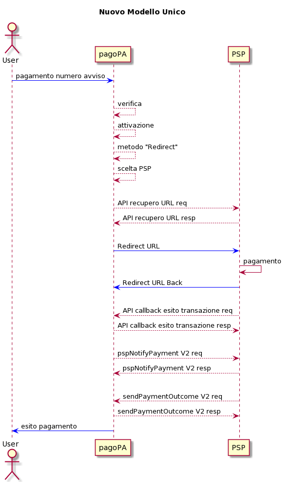
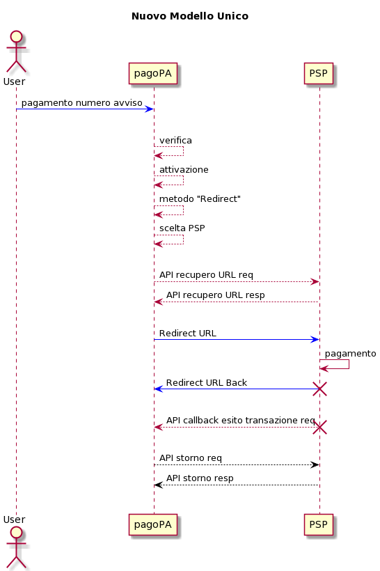
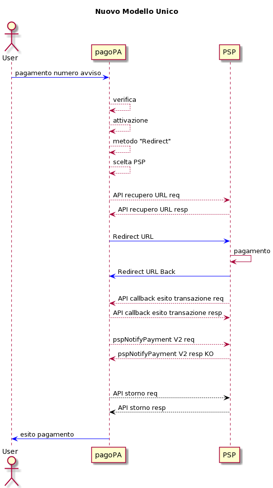

# Sequence diagram

## Fase di Pagamento 

Di seguito sequence relativo alle fasi di un pagamento .

<figure><figcaption></figcaption></figure>

## Fase di Storno 

### Caso 1 - Mancata ricezione dell’esito del pagamento 

pagoPA effettua la chiamata di storno con logica di retry se non riceve l’esito del pagamento entro N minuti

<figure><figcaption></figcaption></figure>

### Caso 2 - pspNotifyPayment KO 

pagoPA effettua la chiamata di storno con logica di retry quando il PSP ha riposto KO alla `pspNotifyPayment`

<figure><figcaption></figcaption></figure>
