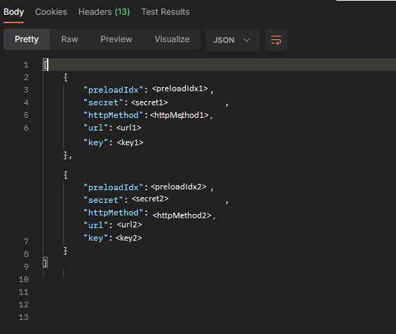

# Focus su Interoperabilità e generazione Voucher per SEND - UAT (Piattaforma Notifiche)

Di seguito vengono elencati i passaggi che permettono si generare il Voucher necessario per chiamare i servizi PND a seguito del completamento dell'adesione ad Interoperabilità.&#x20;

### Effettuare il login

E' possibile accedere ad Interoperabilità da qui: \
[https://selfcare.pagopa.it/auth/login](https://selfcare.pagopa.it/auth/login)\
inserendo le credenziali SPID/CIE dell'Amministratore. Una volta entrati, apparirà l'elenco degli Enti associati e sarà necessario selezionare quello di interesse ed accedere.

### Creare una richiesta di fruizione per l'e-service di SEND - UAT

Per inviare una richiesta di fruizione bisogna prima cercare l'e-service andando su _Fruizione > Catalogo e-service:_

<figure><figcaption></figcaption></figure>

poi avviare la ricerca dell'e-service di SEND - UAT e cliccare su _Richiedi fruizione_ creando una bozza di richiesta dove inserire tutte le informazioni richieste, tra cui gli attributi, che si dividono in:

* **Attributi certificati:** vengono verificati tramite le banche dati delle istituzioni.
* **Attributi Verificati:** vengono verificati dall’erogatore del servizio a seguito dell'invio della documentazione da parte del fruitore.
* **Attributi Dichiarati:** vengono dichiarati da chi effettua la richiesta di fruizione sotto la propria responsabilità

Maggiori dettagli sugli attributi sono qui: [https://docs.pagopa.it/interoperabilita-1/manuale-operativo/attributi](https://docs.pagopa.it/interoperabilita-1/manuale-operativo/attributi).

Quando la richiesta di fruizione è stata compilata con successo, cliccare su "Inoltra richiesta di fruizione"

<figure><figcaption></figcaption></figure>

Una volta che la richiesta di fruizione è stata inviata, questa verrà esaminata dall'Erogatore che dovrà approvarla. È sempre possibile verificare lo stato delle richieste di fruizione presentate andando su _Fruizione > Le tue richieste_.

Maggiori dettagli sulla richiesta di fruizione sono qui: [https://docs.pagopa.it/interoperabilita-1/manuale-operativo/richieste-di-fruizione](https://docs.pagopa.it/interoperabilita-1/manuale-operativo/richieste-di-fruizione)

### Creare una finalità per l'e-service di SEND - UAT

A seguito dell'approvazione della richiesta di fruizione per l'e-service di SEND - UAT è necessario creare una finalità andando su _Fruizione > Le tue finalità_ e cliccando "Aggiungi"_._

<figure><figcaption></figcaption></figure>

Compilare tutti i dati che appaiono sul Form, in particolare:

* **e-service da associare:** che dovrà corrispondere a quello di SEND - UAT
* **numero di chiamate stimate API/giorno:** corrisponde alla stima di chiamate al giorno che verranno effettuate verso l’erogatore. Questo valore potrà essere aggiornato in seguito e potrebbe essere necessaria l'attivazione manuale da parte dall’erogatore.

nella pagina successive bisogna compilare la sezione di analisi del rischio ed infine cliccare su "Crea bozza finalità" per pubblicare la finalità.

<figure><figcaption></figcaption></figure>

Maggiori dettagli sulla creazione di finalità sono qui: [https://docs.pagopa.it/interoperabilita-1/manuale-operativo/finalita](https://docs.pagopa.it/interoperabilita-1/manuale-operativo/finalita)

### Associare un client ad una finalità

Il client è un contenitore di materiale crittografico nel quale vengono inseriti un numero discrezionale di operatori di sicurezza, che sono autorizzati a caricare la chiave pubblica del materiale crittografico in loro possesso. \
Per creare un nuovo client bisogna andare nella sezione _Fruizione > I tuoi client e-service_ e cliccando su "Aggiungi"

<figure><figcaption></figcaption></figure>

Compilare tutti i dati che appaiono sul Form, selezionando tra gli operatori quelli abilitati ad operare nel back-office. \
Una volta creato un client, sarà possibile associarlo ad una finalità, entrando in _Fruizione > Le tue finalità,_ poi nel tab "Client associati" cliccare su "Aggiungi"

<figure><figcaption></figcaption></figure>

Infine apparirà un menù a tendina che permette di selezionare i client da associare:\


<figure><figcaption></figcaption></figure>

I client possono anche essere riutilizzabili su più finalità e modificati successivamente.

Maggiori dettagli sul client sono qui: [https://docs.pagopa.it/interoperabilita-1/manuale-operativo/client-e-materiale-crittografico](https://docs.pagopa.it/interoperabilita-1/manuale-operativo/client-e-materiale-crittografico)

### Caricare una chiave pubblica

prima di caricare una chiave pubblica, entrare nella sezione _Fruizione > I tuoi client_ selezionare "Ispeziona" sul client di riferimento ed assicurarsi che sia presente "_IL TOKEN PUò ESSERE STACCATO: SI_" come segue:

<figure><figcaption></figcaption></figure>

Poi accedere al tab "Chiavi pubblice" e cliccare su "Aggiungi"

<figure><figcaption></figcaption></figure>

Apparirà un pop up che permette di inserire il nome e la chiave pubblica associata al client.\


<figure><figcaption></figcaption></figure>

Per generare il materiale crittografico, bisogna aprire il terminale e incollare i comandi che seguono, uno alla volta:

```
openssl genrsa -out <nomeChiave>.rsa.pem 2048
openssl rsa -in <nomeChiave>.rsa.pem -pubout -out <nomeChiave>.rsa.pub
openssl pkcs8 -topk8 -inform PEM -outform PEM -nocrypt -in <nomeChiave>.rsa.pem -out <nomeChiave>.rsa.priv
```

Sostituendo \<nomeChiave> con il nome che si vuole dare al file contenente la chiave.

Il comando genererà una coppia di chiave pubblica e privata, ed un certificato che in questo caso non è necessario utilizzare. La chiave pubblica appena ottenuta, deve essere copiata nel riquadro "Chiave pubblica" del pop up del client; quella privata rimarrà in mano all'aderente, che la manterrà al sicuro e la userà per firmare la richiesta per ottenere un voucher dal server autorizzativo di PDND Interoperabilità.

### Generare un Voucher (o Access Token)

A questo punto è necessario generare il Voucher da inserire come Authorization header nelle chiamate verso i servizi B2B di SEND - UAT.

**1)** Il primo passo è costruire una _client assertion_ valida e firmarla con la propria chiave privata (che deve essere l'omologa della chiave pubblica depositata sul client su PDND Interoperabilità del punto sopra) come segue:\


<figure><figcaption></figcaption></figure>

nel prima pagina "Client assertion", potremo selezionare la chiave pubblica di riferimento e generare la client assertion con i comandi script che troviamo nella sezione in basso \


<figure><figcaption></figcaption></figure>

**NOTA:** modificare la variabile PATH\_CHIAVE\_PRIVATA con il path della chiave privata generata al punto precedente.

**2)** Salviamo l'output ottenuto ed andiamo nella seconda pagina "Stacco access token", dove dovremo lanciare il comando che troviamo nella pagina in basso:

<figure><figcaption></figcaption></figure>

**NOTA:** modificare la variabile LA\_TUA\_CLIENT\_ASSERTION con l'output ottenuto al punto precedente **1)**.

**3)** Come risposta al comando otterremo una response che contiene **access\_token, expires\_in** e **token\_type.** &#x20;

L'**access\_token** appena ottenuto corrisponde al Voucher che potrà essere utilizzato nelle chiamate verso i servizi B2B di SEND - UAT inserendolo come Header: `"Authorization: Bearer <accessToken>"`
