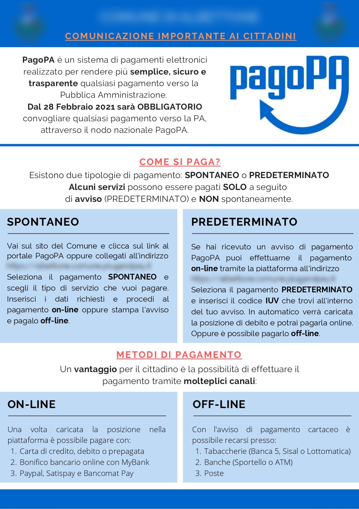

# Pubblicità e marketing

In caso di utilizzo del logo pagoPA su flyer, brochure, totem e locandine, si deve:

* Usare i [**termini corretti**](../enti-partner-e-intermediari-tecnologici/testi-descrittivi-e-termini.md) per comunicare il brand;&#x20;
* Seguire [**le** ](broken-reference)[**specifiche tecniche**](broken-reference) per l'utilizzo del logo.


Di seguito, trovi degli esempi di usi non ammessi.&#x20;


### Esempio 1&#x20;

In questa pubblicità si dovrebbe:

* Scrivere "pagoPA" in modo corretto;
* Utilizzare la [**palette colori**](../../specifiche-tecniche/colori.md) corretta;
* Parlare di "piattaforma pagoPA" e non di "sportello telematico".

<figure><figcaption>
Esempio di uso non ammesso 1
</figcaption></figure>

### Esempio 2

In questa pubblicità si dovrebbe:

* Rispettare lo [**spazio di sicurezza**](../../specifiche-tecniche/spazio-di-sicurezza.md) del logo;
* Non sovrapporre il logo alle creatività;
* Parlare di "integrazione di piattaforma" e non di "servizio";
* Scrivere correttamente "pagoPA".

<figure><figcaption>
Esempio di uso non ammesso 2
</figcaption></figure>

### Esempio 3

In questa pubblicità si dovrebbe:

* Rispettare lo [**spazio di sicurezza**](../../specifiche-tecniche/spazio-di-sicurezza.md) del logo;
* Utilizzare la [**versione corretta**](../../specifiche-tecniche/il-logo-pagopa.md) del logo pagoPA.

<figure><figcaption>
Esempio di uso non ammesso 3
</figcaption></figure>

### Esempio 4

In questa pubblicità si dovrebbe:

* Rispettare lo [**spazio di sicurezza**](../../specifiche-tecniche/spazio-di-sicurezza.md) del logo;
* Scrivere correttamente "pagoPA".

<figure><figcaption>
Esempio di uso non ammesso 4
</figcaption></figure>

### Esempio 5

In questa pubblicità si dovrebbe:

* Scrivere correttamente "pagoPA";
* Seguire le indicazioni in caso di [**accostamento a loghi di altri brand**](../../specifiche-tecniche/accostamento-ad-altri-loghi.md)**.**

<figure><figcaption>
Esempio di uso non ammesso 5
</figcaption></figure>

### Esempio 6

In questa pubblicità si dovrebbe:

* Scrivere correttamente "pagoPA".&#x20;

<figure><figcaption>
Esempio di uso non ammesso 6
</figcaption></figure>

