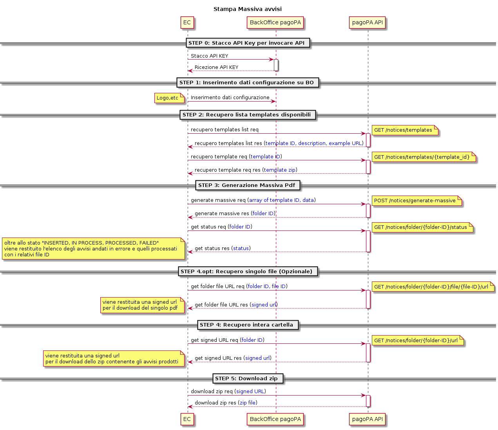

# Avviso Massivo

La stampa dell'avviso secondo la modalità massiva, prevede che l'API che va a generare i PDF, fornisca in output una url con la quale andare ad eseguire il download di tutti i pdf prodotti.

I template da utilizzare seguono le linee guida e le specifiche tecniche fornite da PagoPA indicate al seguente link: [https://docs.pagopa.it/avviso-pagamento/allegato-2/specifiche-tecniche](https://docs.pagopa.it/avviso-pagamento/allegato-2/specifiche-tecniche).

A differenza del processo di stampa singola (si veda [Avviso Singolo ](avviso-singolo.md)per maggiori info) il processo massivo prevede alcuni step differenti che sono descritti nel diagramma e nelle sezioni di seguito.

<figure><figcaption></figcaption></figure>

* dopo aver avviato il processo con `POST /notices/generate-massive` (che prevede in input l'array di avvisi e i relativi template id) l'API restituisce in output una `folderID`
* ottenuta la `FolderID` di cui sopra per conoscere lo stato di avanzamento del processo è necessario invocare (`GET`) l'API `/notices/folder/{folder_id}/status` passando come path parameter la `FolderID.` Essa restituisce nel formato seguente le informazioni sullo stato di elaborazione dei vari avvisi:

```json
{
  "noticesInError": [
    "string"
  ],
  "processedNotices": [
    "string"
  ],
  "status": "PROCESSED"
}
```

Lo stato può essere `"INSERTED", "IN PROCESS", "PROCESSED", "FAILED".`

* Nella sezione "noticesInError" vi sarà l'elenco degli avvisi non processati mentre nella sezione "processedNotices" sarà possibile visualizzare l'elenco di tutti gli avvisi correttamente elaborati e i loro ID.&#x20;
* Se si vuole infatti recuperare il singolo file di un avviso è possibile utilizzare l'API `/notices/folder/{folderId}/file/{fileId}/url` passando come path parameter sia la FolderID che il fileID ottenuto sopra.
* Se invece si vuole recuperare l'intero archivio è necessario usare `/notices/folder/{folderId}/url` passando come path parameter la FolderID. L'api restituisce una signedUrl della durata di 5 minuti con la quale effettuare il download del file zip contenente i file generati.

I file rimangono in archivio per un totale di **XX giorni** trascorsi i quali vengono eliminati.


**Nota: Gestione Idempotency Key**

Le chiamate verso l'API di generazione (/`notices/generate-massive)`prevedono in input nella sezione`Header` una chiave di idempotenza al fine di non permettere chiamate multiple identiche che potrebbero sovraccaricare l'infrastruttura tecnologica. A tal fine pertanto è necessario generare delle chiavi distinte per ogni nuova chiamata e passarle nell' `Header`.



L'API per la generazione massiva prevede un limite massimo pari a 1000 richieste di stampe.

