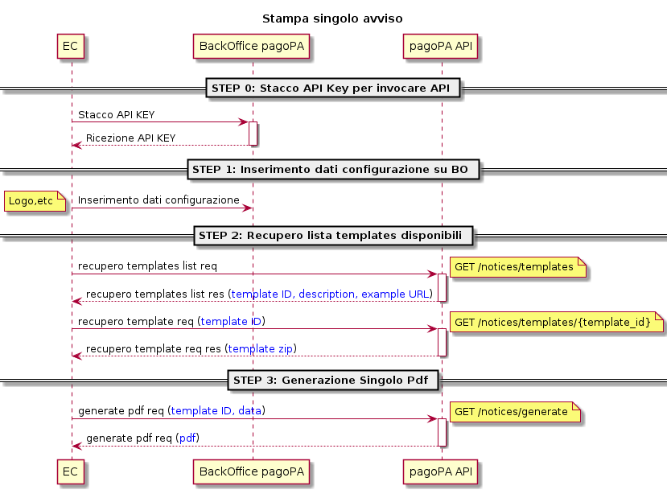

# Avviso Singolo

La stampa dell'avviso secondo la modalità singola, prevede che l'API che va a generare il PDF, fornisca in output il singolo pdf dell'avviso di pagamento richiesto.

I template da utilizzare seguono le linee guida e le specifiche tecniche fornite da PagoPA e sono riportati nella sezione ["Specifiche Tecniche" della "Guida tecnica agli avvisi di pagamento"](https://docs.pagopa.it/avviso-pagamento/allegato-2/specifiche-tecniche).

Si riporta di seguito il processo per la stampa avviso singolo pdf:\

<figure><figcaption>
Stampa avviso singolo
</figcaption></figure>

Il soggetto che aderisce al nuovo servizio di stampa pdf dell’avviso di pagamento delegando PagoPA, per prima cosa deve sottoscrivere nuove API Key all'interno del portale Backoffice pagopA (come descritto in [Autorizzazione alla stampa](autorizzazione-alla-stampa.md)).

Una volta aderito al servizio e generato pertanto la coppia di API Key, il soggetto sarà in grado di invocare le nuove API per generare i pdf relativi all'avviso di pagamento.&#x20;

La stampa dell’avviso di pagamento può essere effettuata soltanto dagli Enti Creditori/ Partner tecnologici autorizzati. Non è possibile per i Partner Tecnologici stampare gli avvisi degli Enti Creditori che non li hanno delegati su Selfcare e che non siano già associati ad una stazione del PT.

Di seguito gli step fondamentali da seguire:

1.  _Inserimento dei dati amministrativi su Backoffice pagoPA_: si tratta di uno step preliminare che deve effettuare l’Ente Creditore, grazie al quale indica quei dati statici utili alla stampa degli avvisi pagoPA. Nello specifico grazie a questo step può indicare i seguenti campi:

    * **Nome** **->** nome dell’Ente Creditore;
    * **Codice fiscale** **->**  codice fiscale o p.iva dell’Ente Creditore;
    * **CBILL ->** codice interbancario dell'Ente Creditore, conosciuto anche come codice SIA;
    * **Settore** **->** dato **facoltativo** che indica la denominazione dell’unità organizzativa che gestisce il pagamento; quest’informazione viene visualizzata nella sezione relativa all’Ente Creditore, indicata nel campo ENTE.SETTORE presente nella ["Guida Tecnica sugli avvisi di pagamento"](https://docs.pagopa.it/avviso-pagamento/allegato-2/specifiche-tecniche);
    * **Logo** **->** caricamento del logo in formato JPG o PNG; è il logo che compare sull’avviso di pagamento che corrisponde al campo ENTE.LOGO presente nella documentazione tecnica disponibile nella sezione[ Intestazione delle Specifiche Tecniche](https://docs.pagopa.it/avviso-pagamento/allegato-2/specifiche-tecniche/intestazione).
    * **Dove pagare** **->** viene chiesto di esplicitare se è possibile pagare l’avviso sul sito dell’Ente Creditore o sull’app, ed in caso affermativo di esplicitare se sia possibile pagare solo sul sito web, solo in app, oppure su entrambi. Questa Informazione viene visualizzata nella sezione relativa al pagamento sotto la dicitura _“Dove Pagare?”._ La documentazione tecnica per questa sezione è disponibile nella sezione ["Dove Pagare" delle Specifiche Tecniche](https://docs.pagopa.it/avviso-pagamento/allegato-2/specifiche-tecniche/dove-pagare);
    *   **Bollettino Postale PA** **->** l’Ente Creditore deve indicare se dispone di un conto corrente postale per gli incassi, ed in caso affermativo specificare:

        * Intestazione conto
        * Numero c/c postale
        * Codice autorizzazione

        Le specifiche sui dati del bollettino postale sono disponibili  nella sezione "[Bollettino Postale -Dati per il Pagamento" delle Specifiche Tecniche](https://docs.pagopa.it/avviso-pagamento/allegato-2/specifiche-tecniche/dati-per-il-pagamento/bollettino-postale-pa):
    * **Contatti per l’assistenza ->** l’Ente Creditore deve indicare le tipologie di contatti per l’assistenza disponibili (indirizzo email, indirizzo web, numero di telefono). Quest’informazione viene visualizzata nella sezione ENTE.INFO indicata nelle specifiche tecniche nella sezione "[Informazioni sull'Ente Creditore](https://docs.pagopa.it/avviso-pagamento/allegato-2/specifiche-tecniche/informazioni-sullente-creditore)".

    Il dettaglio della compilazione dei dati preliminari sul Backoffice pagoPA è disponibile nel relativo manuale nella sezione "[Avvisi di Pagamento](https://docs.pagopa.it/manuale-back-office-pagopa/manuale-operativo-back-office-pagopa-ente-creditore/funzionalita/avvisi-di-pagamento)".
2. _Recupero della lista dei template utilizzabili_: l’Ente Creditore tramite l’API Key recupera la lista dei template disponibili per la generazione dell’avviso.

Il recupero della lista dei template avviene tramite la

`GET/notices/templates`

3. _Generazione singolo pdf:_ l’Ente Creditore per la generazione del singolo pdf chiama la `GET/notices/generates` indicando il _template\_id_ e compilando i dati necessari al popolamento del pdf. Con il campo _template\_id_ si indica il template da impiegare per la produzione dell’avviso di pagamento.

Attualmente esistono le seguenti varianti di template per la stampa del singolo pdf che verranno dettagliate nelle prossime pagine:

* [Template rata unica](templates/rata-unica/)
* [Template rate multiple (da 2 a 9 rate)](templates/rate-2..9/)
* [Template rate multiple (>9)](templates/rate-greater-than-9/)
* [Template violazione codice della strada](templates/violazione-codice-della-strada/)

