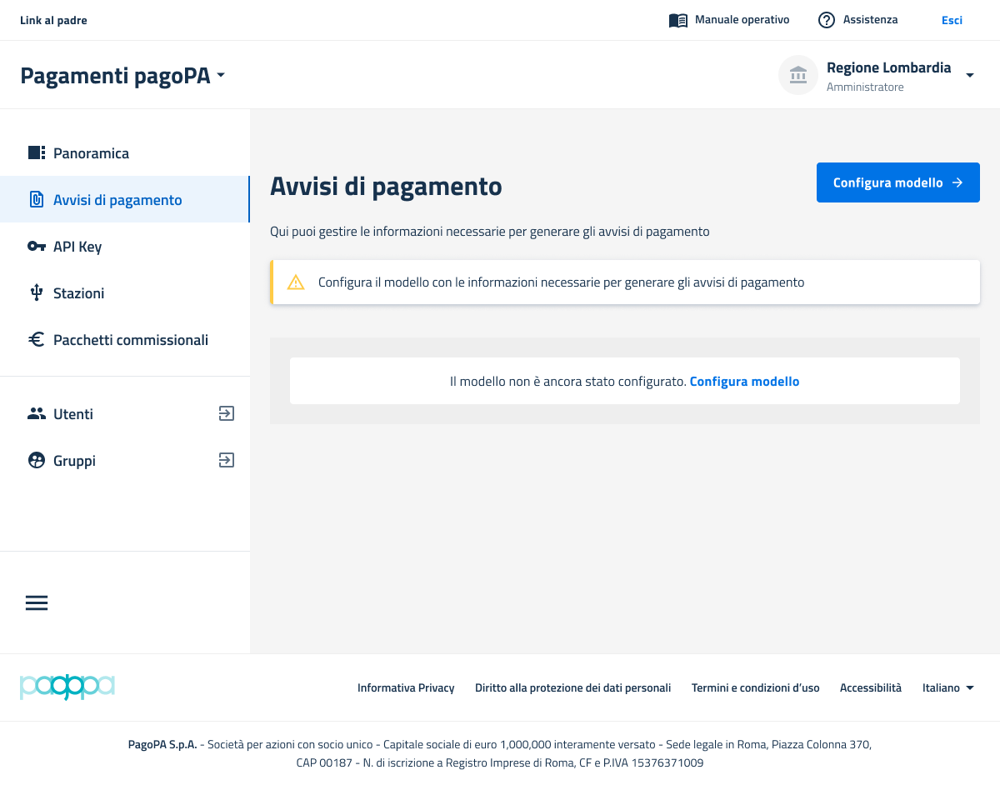
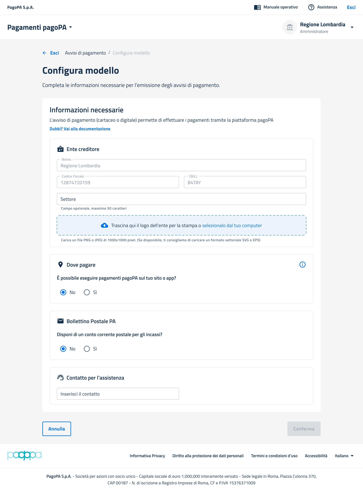
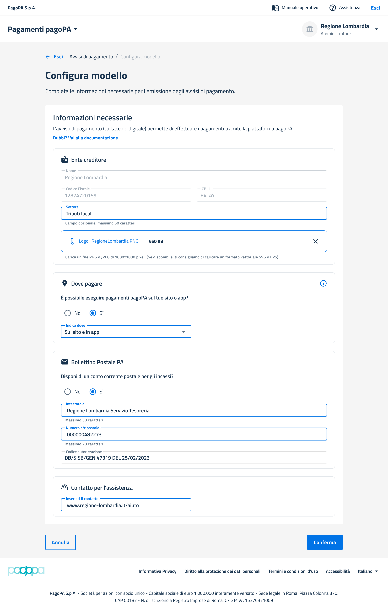
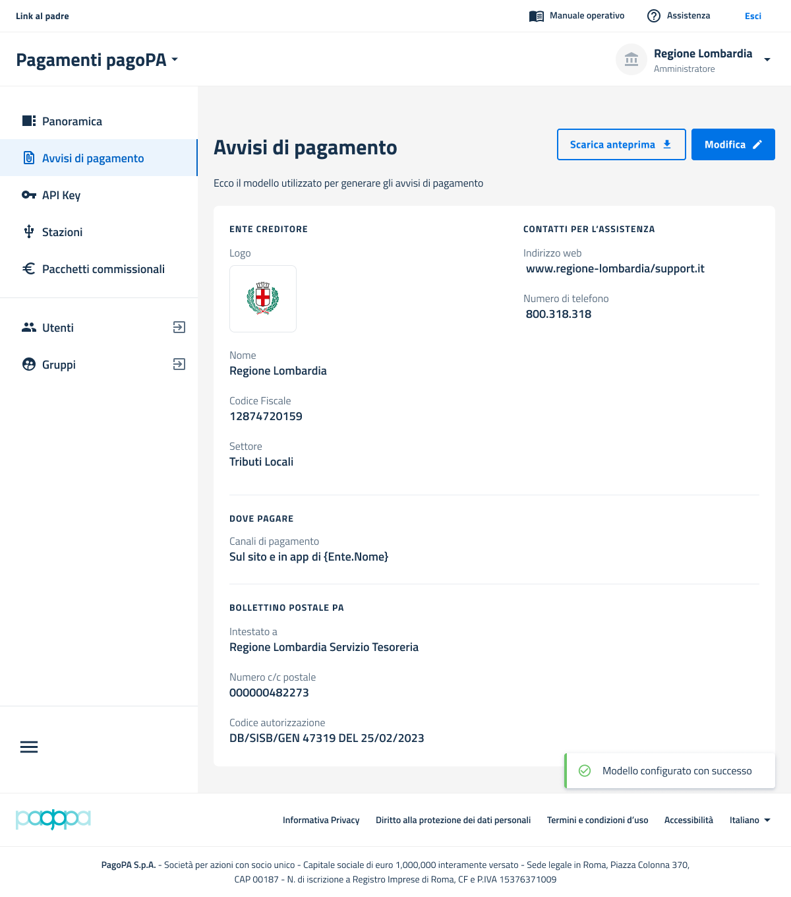

# Compilazione dati configurazione su Backoffice pagoPA

Per poter stampare correttamente un avviso di pagamento è necessario configurare alcuni dati all'interno dell'apposita sezione del BackOffice pagoPA. (Maggiori info su registrazione a SelfCare e adesione al prodotto pagoPA sono riportate nel [Manuale Operativo di Back Office](https://docs.pagopa.it/manuale-back-office-pagopa))

All'interno della sezione "Avvisi di pagamento" del prodotto BackOffice pagoPA è possibile configurare alcuni dati necessari alla stampa.

I dati necessari infatti per poter configurare l'avviso di pagamento sono i seguenti:

* _**Nome Ente ->**_ dato recuperato in automatico dal Backoffice pagoPA;
* _**Codice Fiscale Ente ->**_ dato recuperato in automatico dal Backoffice pagoPA;
* _**Codice CBILL ->**_ dato recuperato in automatico dal Backoffice pagoPA;
* _**Logo ->**_ dato **obbligatorio** necessario per inserire il logo all'interno dell'avviso di pagamento (cfr.  sezione[ Intestazione delle Specifiche Tecniche](https://docs.pagopa.it/avviso-pagamento/allegato-2/specifiche-tecniche/intestazione) );
* _**Settore ->**_ dato **opzionale** che descrive l'unità organizzativa che gestisce il pagamento (cfr. sezione [Informazioni sull'Ente Creditore delle Specifiche Tecniche](https://docs.pagopa.it/avviso-pagamento/allegato-2/specifiche-tecniche/informazioni-sullente-creditore#ente-settore));
* _**Luogo dove possibile pagare l'avviso ->**_ menu con tre ipotesi di scelta a seconda dei quali si valorizza la sezione "Paga con l'APP IO" in modo diverso (cfr. [sezione "Dove Pagare" delle Specifiche Tecniche](https://docs.pagopa.it/avviso-pagamento/allegato-2/specifiche-tecniche/dove-pagare#sezione-canali-digitali));
* _**Dati necessari per il bollettino postale ->**_ sezione con i seguenti dati da valorizzare qualora si necessiti di un bollettino postale:
  * Intestazione C/C postale (opzionale)
  * Numero C/C postale
  * Codice autorizzativo rilasciato da Poste Italiane per la stampa in proprio dei bollettini postali
* _**Contatto per l'assistenza ->**_ dato **obbligatorio** che indica i riferimenti dei canali di contatto dell'Ente Creditore destinati ai cittadini, come ad esempio sito web, call center o email dedicata. (cfr. specifiche tecniche sezione ["Informazioni sull'Ente Creditore"](https://docs.pagopa.it/avviso-pagamento/allegato-2/specifiche-tecniche/informazioni-sullente-creditore#ente-info) ).

I dati di cui sopra sono configurabili selezionando il tasto "_**Configura modello**_" :&#x20;

<figure><figcaption></figcaption></figure>

Una volta cliccato il tasto appare infatti la form con i dati da inserire (quelli recuperati da Backoffice pagoPA non sono modificabili):

<figure><figcaption></figcaption></figure>

<figure><figcaption></figcaption></figure>

<figure><figcaption></figcaption></figure>
