# 🔌 Installazione e uso

Il Pulsante Firma con IO è scritto in JavaScript e viene distribuito come [Web Component](https://developer.mozilla.org/en-US/docs/Web/API/Web\_components), in modo da poter essere integrato all'interno delle pagine web e delle web-app JavaScript indipendentemente dalle tecnologie e i framework JavaScript adottati.

Una volta importato, il componente è disponibile in pagina sotto forma di `custom element` HTML, con il nome di `io-sign`.

### Includere il Pulsante Firma con IO

Per poter usare il componente `io-sign` è necessario includerlo all'interno delle proprie pagine HTML (dentro `<head>` o alla fine di `<body>`)

```html
<script type="module" src="https://assets.cdn.io.pagopa.it/sign/io-sign.js"></script>
```

Infine, per mostrare il Pulsante Firma con IO in pagina è sufficiente dichiarare l'elemento HTML appena importato all'interno del proprio template HTML o componente JS, come qualsiasi altro elemento HTML (`form`, `div`, `video`, ...)

```html
<io-sign></io-sign>
```

### Funzionamento del componente

Il Pulsante Firma con IO, al click o tap da parte del cittadino, emette un [Evento](https://developer.mozilla.org/en-US/docs/Web/API/Event) chiamato `io-sign.cta.click` nel DOM in cui è stato inserito. Una volta emesso l'evento, il componente entra nello stato `loading` che segnala all'utente l'inizio del flusso di creazione (o ottenimento) di una Richiesta di Firma.

Lo stato `loading` termina quando viene chiamato il metodo `redirectOrShowQrCode(signatureRequestId)` dell'elemento, a cui occorre passare come unico parametro in input l'ID della `Richiesta di Firma` da inoltrare al cittadino.

L'elemento supporta l'attributo HTML `disabled` (che funziona in modo del tutto similare all'attributo omonimo presente in elementi HTML come `input` e `button`), che rende il Pulsante Firma con IO non cliccabile e stilizzato in modo da essere visto come disattivato.

Il componente, infine, espone la funzione `reset()`, che annulla il `loading` e ne reimposta lo stato (utile per gestire casistiche di errore).

#### Esempio

Questo esempio mostra come aggiungere l'elemento `<io-sign>` in pagina, gestire l'evento `io-sign.cta.click` emesso al click del Pulsante Firma con IO e chiamare la funzione `redirectOrShowQrCode` per mostrare il QRCode o portare l'utente direttamente su App IO o `reset` per terminare il loading.

Nel tuo applicativo all'interno della funzione (qui nominata) `createOrRetrieveSignatureRequest` dovrai mettere tutta la business logic necessaria per creare la richiesta di Firma, ottenerne una già creata, caricare i documenti dialogando con le tue API back-end integrate alle API REST di Firma con IO.



Riassumendo, per ingaggiare il cittadino tramite il Pulsante Firma con IO all'interno della tua pagina Web dovrai:

1. Includere l'elemento HTML `io-sign` in pagina
2. Registrare un `event listener` sull'evento `io-sign.cta.click` emesso dal componente `io-sign`
3. Inserire la propria business logic all'interno dell'handler dell'evento appena registrato
4. Chiamare la funzione `redirectOrShowQrCode` per mostrare il QRCode o reindirizzare l'utente su app IO


Per motivi di **sicurezza** è opportuno effettuare il flusso di creazione della richiesta di Firma, compreso del caricamento dei documenti PDF, _esclusivamente_ in un contesto server to server (API sito web verso API Firma con IO)



L'esempio di codice mostrato utilizza le funzionalità native di JavaScript, ma è possibile integrare il componente anche all'interno di web application complesse che usano librerie/framework come React, jQuery, Vue, Svelte o Angular.


### Sequence diagram

```mermaid
sequenceDiagram
    autonumber
    participant IO_API as API Firma con IO
    participant ISSUER_API as API Ente
    participant ISSUER_JS as JS Ente
    participant E as DOM Event ("io-sign.cta.click")
    participant CTA as Pulsante Firma con IO
    actor U as Cittadino

    ISSUER_JS->>E: Registra un "handler" per l'evento
    U->>CTA: Click o tap
    activate CTA
    CTA->>CTA: Entra in stato "loading"
    CTA->>E: Emette
    E->>ISSUER_JS: Esegue la funzione "handler"
    activate ISSUER_JS
    ISSUER_JS->>ISSUER_API: Effettua una chiamata HTTP per<br> creare o richiedere una Richiesta di Firma
    activate ISSUER_API
    ISSUER_API->>IO_API: Effettua chiamate HTTP per creare <br> nuova richiesta o recuperarne <br> una già esistente caricando i documenti <br> se necessario
    IO_API->>ISSUER_API: Restituisce una Richiesta di Firma <br> (in stato WAIT_FOR_SIGNATURE o successivo)
    ISSUER_API->>ISSUER_JS: Restituisce una Richiesta di Firma <br> (in stato WAIT_FOR_SIGNATURE o successivo)
    deactivate ISSUER_API
    ISSUER_JS->>CTA: Esegue la funzione "redirectOrShowQrCode" <br> passando l'ID della Richiesta di Firma <br> appena ottenuta
    deactivate ISSUER_JS
    CTA->>U: Mostra QRCODE (su PC) o apre app IO (Mobile)
    deactivate CTA
```


