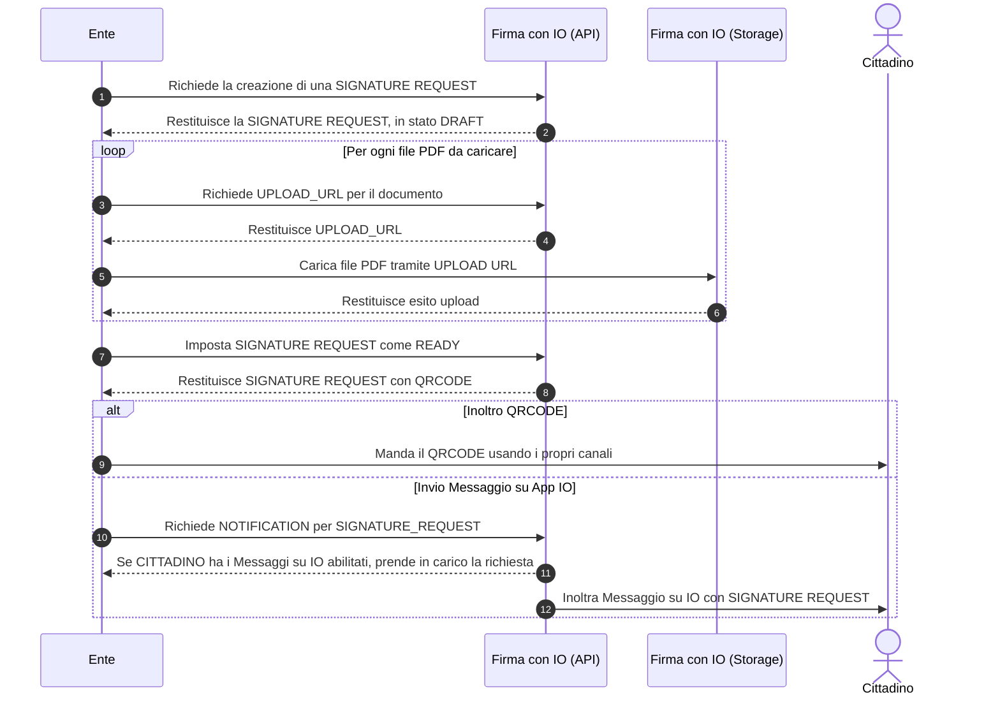

# ✍ Richiedere una firma

Una volta preparati i documenti in uno dei formati supportati e inseriti i campi firma, segui questi step per richiedere la firma all'utente:

<mark style="color:blue;">Step 1</mark>: Crea un Dossier

[Per scoprire come farlo, vai qui ](../creare-il-dossier.md)

<mark style="color:blue;">Step 2</mark>: Recupera l'ID del cittadino

[Per scoprire come farlo, vai qui ](recupero-id-del-cittadino.md)

<mark style="color:blue;">Step 3</mark>: Crea una <strong>Signature Request</strong>

[Per scoprire come farlo, vai qui ](creazione-di-una-signature-request.md)

<mark style="color:blue;">Step 4</mark>: Carica i documenti

[Per scoprire come farlo, vai qui ](upload-dei-documenti.md)

<mark style="color:blue;">Step 5</mark>: Invia la richiesta di firma 

[Per scoprire come farlo, vai qui](invio-della-richiesta-di-firma/)&#x20;

Ecco un diagramma di sequenza che delinea il processo di creazione di una "Richiesta di Firma", una volta ottenuti "Signer ID" e "Dossier ID"

