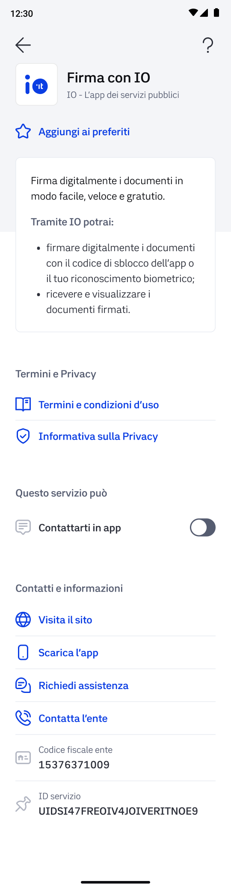
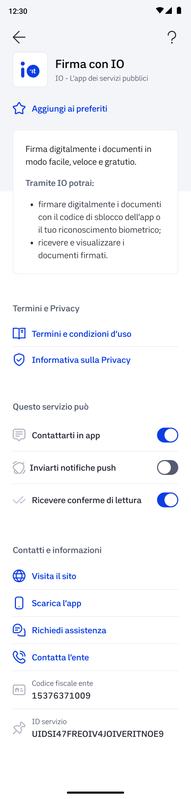

# 📳 Tramite messaggio su IO

Se vuoi inviare la richiesta di firma **tramite messaggio su IO**, devi effettuare i seguenti passaggi :

1. attendere alcuni secondi affinché la signature request passi dallo status `READY` allo stato `WAIT_FOR_SIGNATURE;`
2. effettuare una richiesta verso l'endpoint `PUT /api/v1/sign/signature-requests/{signature_request_id}/notification` senza specificare nulla all'interno del corpo del messaggio.

Se l'utente ha **attivato la ricezione dei messaggi** da parte del servizio **Firma con IO**, riceverai in output il seguente messaggio contenente l'id del messaggio inviato all'utente:

```json
{
  "io_message_id": "01G7VBM888NDGCMA84ZVZYJGZQ"
}
```

### Cosa succede se l'utente ha scelto di non ricevere comunicazioni da parte di Firma con IO?

Nel caso in cui provassi ad inviare un messaggio di firma ad un utente che ha scelto di **non ricevere comunicazioni** da parte di Firma con IO (ovvero se nella scheda del servizio Firma con IO non ha il **flag “Contattarti in app” attivo**):



Riceverai un **messaggio di errore** che non ti consentirà di proseguire con l'invio del messaggio _(ovvero, il parametro "**io\_message\_id**" non verrà restituito)._

In questo caso, ti consigliamo di:

* Suggerire all'utente di **attivare la comunicazione** del servizio Firma con IO **dalla scheda servizio** presente nella sezione "Servizi" dell'app;
* Inviare la richiesta di firma tramite canali alternativi — vedi [tramite-pulsante-firma-con-io-o-qr-code.md](tramite-pulsante-firma-con-io-o-qr-code.md "mention")

Nel caso in cui, invece, l'utente **disattiva solo le notifiche push** nella scheda del servizio Firma con IO:



Il destinatario riceve e può visualizzare il messaggio in app, senza, però, ricevere la notifica push; per questo motivo riceverai l’io\_message\_id e non un errore.


