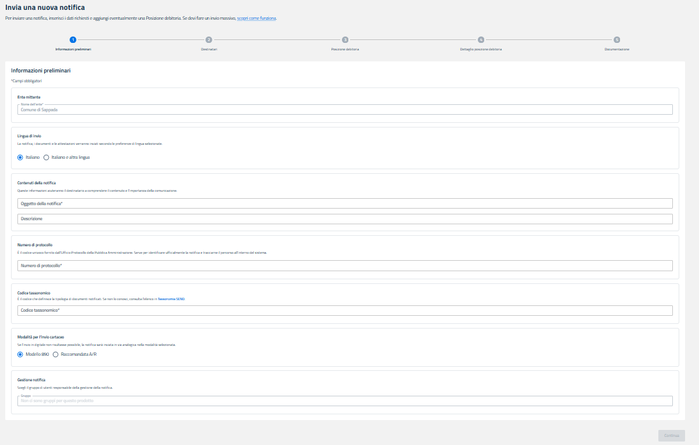

# Come gestire gli stream

## Inserimento e creazione stream con il comando curl


**NOTA:** i comandi che verranno descritti di seguito dovranno essere lanciati con un terminal SSH, su OS Windows si può utilizzare ad esempio git bash.


### Step 1 - Creazione e configurazione dello stream

Creare lo stream andando a configurare l'**eventType** con uno dei seguenti:

* **STATUS:** per registrare gli eventi di cambiamento di stato delle notifiche
* **TIMELINE:** per registrare gli eventi di timeline.

Nel campo **groups** dovranno essere inseriti uno o più gruppi tramite il l'id del gruppo, in modo da realizzare una segregazione tra gli eventi delle notifiche che appartengono solo ai gruppi specificati.

All'interno del **filterValues** è possibile inserire un array di eventi di tipo **STATUS/TIMELINE** che verranno utilizzati per filtrare e registrare nello stream solo questi eventi; se invece si inserisce un array con il valore `DEFAULT`, andranno riportati gli eventi che hanno ripercussione sul cambiamento di stato del workflow o che riportano dati di interesse per il mittente. Qui è possibile vedere quali eventi verranno restituiti: [Stream di timeline 2.4](broken-reference).

Lanciare il seguente comando:

```bash
curl --location 'https://<baseurlAmbiente>/delivery-progresses/v2.3/streams' \
--header 'Content-Type: application/json' \
--header 'Accept: application/json' \
--header 'x-api-key: <apiKey>' \
--header 'Authorization: Bearer <PDNDVoucher>' \
--data '{
    "title": "<title>",
    "eventType": "<eventType>",
    "groups": [
        "<groupId>"
    ],
    "filterValues": [
        "<filterValues>"
    ],
    "replacedStreamId" :"<replacedStreamId>"
}'
```

Sostituire i seguenti:

* **\<baseurlAmbiente>:** inserire la url dell'ambiente di riferimento, nel caso di UAT è il seguente: **https://api.uat.notifichedigitali.it**
* **\<apiKey>:** inserire la apiKey dell'Ente di riferimento, precedentemente generata su PND
* **\<PDNDVoucher>:** inserire inserire il Voucher generato su **PDND Interoperabilità,** assicurandosi che non sia scaduto
* **\<title>:** inserire un titolo da attribuire a questo stream
* **\<groupId>:** Id del gruppo per ottenere la segregazione tra gli eventi delle notifiche che appartengono solo ai gruppi specificati
* **\<eventType>:** inserire la tipologia di stream a scelta tra **STATUS** e **TIMELINE**&#x20;
* **\<filterValues>:** inserire un array di eventi che verranno utilizzati come filtro. Se valorizzato con array vuoto: `DEFAULT` lo stream registrerà tutti gli eventi eventi che hanno ripercussione sul cambiamento di stato del workflow o che riportano dati di interesse per il mittente
* **\<replacedStreamId>:** campo opzionale, serve per sostituire lo stream indicato tramite streamId da quello che verrà creato.

Nella response di questo servizio, si otterrà il seguente payload:

```json
{
    "title": "<title>",
    "eventType": "<eventType>",
    "groups": [
        "<groupId>"
    ],
    "filterValues": [
        "<filterValues>"
    ],
    "streamId": "<streamId>",
    "activationDate": "<activationDate>",
    "disabledDate": null,
    "version": "<version>"
}
```

* **\<streamId>:** id dello stream che viene autogenerato dal servizio
* **\<activationDate>:** data di attivazione dello stream autogenerata dal servizio
* **\<version>:** versione dello stream creato


**NOTA:** Una volta creato lo stream verranno registrati tutti gli eventi emessi dalle notifiche a seguito della loro creazione, di conseguenza si consiglia di creare gli stream prima di inserire le notifiche.


### Step 2 - Prima interrogazione dello stream

La prima interrogazione dello stream permetterà di ricevere i primi 50 eventi registrati dallo stream. È importante lanciare la curl con il **--verbose** che permetterà di visualizzare nell'header della response il valore "_retry-after_" utile per la prossima chiamata.\
Lanciare il seguente comando:

```bash
curl --location 'https://<baseurlAmbiente>/delivery-progresses/v2.3/streams/<streamId>/events' \
--header 'Accept: application/json' \
--header 'x-api-key: <apiKey>' \
--header 'Authorization: Bearer <PDNDVoucher>' \
--verbose
```

Sostituire i seguenti:

* **\<baseurlAmbiente>:** inserire la url dell'ambiente di riferimento, nel caso di UAT è il seguente: **https://api.uat.notifichedigitali.it**
* **\<apiKey>:** inserire la apiKey dell'Ente di riferimento, precedentemente generata su PND
* **\<PDNDVoucher>:** inserire inserire il Voucher generato su **PDND Interoperabilità,** assicurandosi che non sia scaduto
* **\<streamId>:** inserire l'id dello stream che si vuole interrogare

Nella response di questo servizio, si otterrà il seguente payload che rappresenta tutti gli eventi:

```json
{
    "eventId": "00000000000000000000000000000000000001",
    "timestamp": "<timestamp>",
    "notificationRequestId": "<notificationRequestId>",
    "iun": "<iun>",
    "newStatus": "<newStatus>",
    "timelineEventCategory": "<timelineEventCategory>",
    "recipientIndex": "<recipientIndex>",
    "analogCost": <analogCost>,
    "channel": "<channel>",
    "legalfactIds": ["<legalfactIds>"],
    "validationErrors": <validationErrors>
},
[... altri eventi...]
{
    "eventId": "00000000000000000000000000000000000049",
    "timestamp": "<timestamp>",
    "notificationRequestId": "<notificationRequestId>",
    "iun": "<iun>",
    "newStatus": "<newStatus>",
    "timelineEventCategory": "<timelineEventCategory>",
    "recipientIndex": "<recipientIndex>",
    "analogCost": <analogCost>,
    "channel": "<channel>",
    "legalfactIds": ["<legalfactIds>"],
    "validationErrors": <validationErrors>
},
```

Gli eventi ottenuti dovranno essere memorizzati dal client poichè nelle successive chiamate i risultati ottenuti verranno consumati e cancellati dallo stream per lasciare il posto agli eventi successivi.


**NOTA:** nell'header della response ottenuta fare attenzione al campo "_retry-after_" che deve essere memorizzato per le successive chiamate:


* se`retryAfter = 0` è possibile richiamare immediatamente il servizio per ottenere gli eventi successivi se invece
* se`retryAfter` ≠ `0` è necessario attendere la quantità di tempo (espressa in millisecondi) del valore restituito, prima di richiamare di nuovo il servizio

È quindi fondamentale rispettare la logica che viene rappresentata dal campo  `retry-after` il quale fornisce l'indicazione al client su quando richiamare il servizio; pertanto, si **sconsiglia** di creare dei processi di batch che effettuino la chiamata in un momento fisso e/o ripetuto nei giorni.


### Step 3 - Interrogazione dello stream successive alla prima

Dalle interrogazioni successive alla prima dello stream, si otterranno i 50 eventi successivi a quello del lastEventId (l'eventId dell'ultimo evento ottenuto nelle precedenti chiamate).

Non è possibile ottenere più di 50 eventi in una singola chiamata, questo valore è configurato a livello applicativo e non può essere modificato dal consumer.

Anche in questo caso è importante lanciare la curl con il **--verbose** che permetterà di visualizzare nell'header della response il valore "_retry-after_" utile per le chiamate successive.\
Lanciare il seguente comando:

```bash
curl --location 'https://<baseurlAmbiente>/delivery-progresses/v2.3/streams/<streamId>/events?lastEventId=<lastEventId>' \
--header 'Accept: application/json' \
--header 'x-api-key: <api-key>' \
--header 'Authorization: Bearer <PDNDVoucher>' \
--verbose
```

Sostituire i seguenti:

* **\<baseurlAmbiente>:** inserire la url dell'ambiente di riferimento, nel caso di UAT è il seguente: **https://api.uat.notifichedigitali.it**
* **\<apiKey>:** inserire la apiKey dell'Ente di riferimento, precedentemente generata su PND
* **\<PDNDVoucher>:** inserire inserire il Voucher generato su **PDND Interoperabilità,** assicurandosi che non sia scaduto
* **\<streamId>:** inserire l'id dello stream che si vuole interrogare
* **\<lastEventId>:** inserire l'eventId dell'ultimo evento ottenuto nella precedente chiamata

Gli eventi ottenuti dovranno essere memorizzati dal client poichè nelle successive chiamate i risultati ottenuti verranno consumati e cancellati dallo stream per lasciare il posto agli eventi successivi.


**NOTA:** nella response ottenuta fare attenzione al campo "_retry-after_" che deve essere memorizzato per le successive chiamate:

* se`retryAfter = 0` è possibile richiamare immediatamente il servizio per ottenere gli eventi successivi se invece
* se`retryAfter` ≠ `0` è necessario attendere la quantità di tempo (espressa in millisecondi) del valore restituito, prima di richiamare di nuovo il servizio

È quindi fondamentale rispettare la logica che viene rappresentata dal campo  `retry-after` il quale fornisce l'indicazione al client su quando richiamare il servizio; pertanto, si **sconsiglia** di creare dei processi di batch che effettuino la chiamata in un momento fisso e/o ripetuto nei giorni.


## Inserimento e creazione stream con Postman


**NOTA:** prima di procedere con l'inserimento e la creazione dello stream utilizzando Postman, assicurarsi di aver correttamente importato le definizioni delle API su Postman ed aver configurato l'ambiente di test seguendo i passaggi descritti al seguente link:[Generazione client e definizioni delle API](https://app.gitbook.com/o/KXYtsf32WSKm6ga638R3/s/22sG8XdGZ5NgDBIoHgF2/~/diff/~/revisions/MgTfVBOxi9cHR0Qsd7DZ/readme/generazione-client-e-definizioni-delle-api)


### Step 1 -  Creazione e configurazione dello stream <a href="#id-1-creazione-e-configurazione-dello-stream" id="id-1-creazione-e-configurazione-dello-stream"></a>

Creare lo stream andando a configurare l'**eventType** con uno dei seguenti:

* **STATUS:** per registrare gli eventi di cambiamento di stato delle notifiche
* **TIMELINE:** per registrare gli eventi di timeline.

Nel campo **groups** dovranno essere inseriti uno o più gruppi tramite il l'id del gruppo, in modo da realizzare una segregazione tra gli eventi delle notifiche che appartengono solo ai gruppi specificati.All'interno del **filterValues** è possibile inserire un array di eventi di tipo **STATUS/TIMELINE** che verranno utilizzati per filtrare e registrare nello stream solo questi eventi; se invece si inserisce un array con il valore `DEFAULT`, vanno riportati gli eventi che hanno ripercussione sul cambiamento di stato del workflow o che riportano dati di interesse per il mittente. Qui è possibile vedere quali eventi verranno restituiti: [Stream di timeline 2.4](https://app.gitbook.com/o/KXYtsf32WSKm6ga638R3/s/22sG8XdGZ5NgDBIoHgF2/~/diff/~/revisions/MgTfVBOxi9cHR0Qsd7DZ/readme/creazione-e-gestione-degli-stream/stream-di-timeline).Aprire la scheda **Crea nuovo stream di eventi** ed inserire nel body il seguente payload:

<figure><figcaption></figcaption></figure>

Sostituire i seguenti:

* **\<baseurlAmbiente>:** inserire la url dell'ambiente di riferimento, nel caso di UAT è il seguente: **https://api.uat.notifichedigitali.it**
* **\<apiKey>:** inserire la apiKey dell'Ente di riferimento, precedentemente generata su PND
* **\<PDNDVoucher>:** inserire inserire il Voucher generato su **PDND Interoperabilità,** assicurandosi che non sia scaduto
* **\<title>:** inserire un titolo da attribuire a questo stream
* **\<groupId>:** Id del gruppo per ottenere la segregazione tra gli eventi delle notifiche che appartengono solo ai gruppi specificati
* **\<eventType>:** inserire la tipologia di stream a scelta tra **STATUS** e **TIMELINE**
* **\<filterValues>:** inserire un array di eventi che verranno utilizzati come filtro. Se valorizzato con array vuoto: `DEFAULT` lo stream registrerà tutti gli eventi eventi che hanno ripercussione sul cambiamento di stato del workflow o che riportano dati di interesse per il mittente
* **\<replacedStreamId>:** campo opzionale, serve per sostituire lo stream indicato tramite streamId da quello che verrà creato.

Nella response di questo servizio, si otterrà il seguente payload:

<figure><figcaption></figcaption></figure>

* **\<streamId>:** id dello stream che viene autogenerato dal servizio
* **\<activationDate>:** data di attivazione dello stream autogenerata dal servizio


**NOTA:** Una volta creata la stream verranno registrati tutti gli eventi emessi dalle notifiche a seguito della loro creazione, di conseguenza si consiglia di creare le stream prima di inserire le notifiche.


### Step 2 - Prima interrogazione dello stream <a href="#id-2-prima-interrogazione-dello-stream" id="id-2-prima-interrogazione-dello-stream"></a>

La prima interrogazione dello stream permetterà di ricevere i primi 50 eventi registrati dallo stream. Aprire la scheda **Leggi progressi notifiche** e riprodurre questa configurazione:

<figure><figcaption></figcaption></figure>

Sostituire i seguenti:

* **\<baseurl>:** inserire la url dell'ambiente di riferimento, nel caso di UAT è il seguente: **https://api.uat.notifichedigitali.it**
* **\<streamId>:** inserire l'id dello stream che si vuole interrogare

Nella response di questo servizio, si otterrà il seguente payload che rappresenta tutti gli eventi:

<figure><figcaption></figcaption></figure>

Gli eventi ottenuti dovranno essere memorizzati dal client poichè nelle successive chiamate i risultati ottenuti verranno consumati e cancellati dallo stream per lasciare il posto agli eventi successivi. E' poi necessario selezionare il tab Headers della response per visualizzare i valori ottenuti:

<figure><figcaption></figcaption></figure>


NOTA: nell'header della response ottenuta fare attenzione al campo retry-after che deve essere memorizzato per le successive chiamate:

* se `retryAfter = 0` è possibile richiamare immediatamente il servizio per ottenere gli eventi successivi&#x20;
* se `retryAfter ≠ 0` è necessario attendere la quantità di tempo (espressa in millisecondi) del valore restituito, prima di richiamare di nuovo il servizio.

È quindi fondamentale rispettare la logica che viene rappresentata dal campo "retry-after" il quale fornisce l'indicazione al client su quando richiamare il servizio; pertanto si sconsiglia di creare dei processi di batch che effettuino la chiamata in un momento fisso e/o ripetuto nei giorni.


### Step 3 - Interrogazione dello stream successive alla prima

Dalle interrogazioni successive alla prima dello stream, si otterranno i 50 eventi successivi a quello del lastEventId (l'eventId dell'ultimo evento ottenuto nelle precedenti chiamate).\
Aprire la scheda **Leggi progressi notifiche** e riprodurre questa configurazione:

<figure><figcaption></figcaption></figure>

Sostituire i seguenti:

* **\<baseurlAmbiente>:** inserire la url dell'ambiente di riferimento, nel caso di UAT è il seguente: **https://api.uat.notifichedigitali.it**
* **\<streamId>:** inserire l'id dello stream che si vuole interrogare
* **\<lastEventId>:** inserire l'eventId dell'ultimo evento ottenuto nella precedente chiamata

Gli eventi ottenuti dovranno essere memorizzati dal client poichè nelle successive chiamate i risultati ottenuti verranno consumati e cancellati dallo stream per lasciare il posto agli eventi successivi.

**NOTA:** nella response ottenuta fare attenzione al campo "_retry-after_" che deve essere memorizzato per le successive chiamate:

* se`retryAfter = 0` è possibile richiamare immediatamente il servizio per ottenere gli eventi successivi se invece
* se`retryAfter` ≠ `0` è necessario attendere la quantità di tempo (espressa in millisecondi) del valore restituito, prima di richiamare di nuovo il servizio

E' quindi fondamentale rispettare la logica che viene rappresentata dal campo  "_retry-after_" il quale fornisce l'indicazione al client su quando richiamare il servizio; pertanto si sconsiglia di creare dei processi di batch che effettuino la chiamata in un momento fisso e/o ripetuto nei giorni.\
