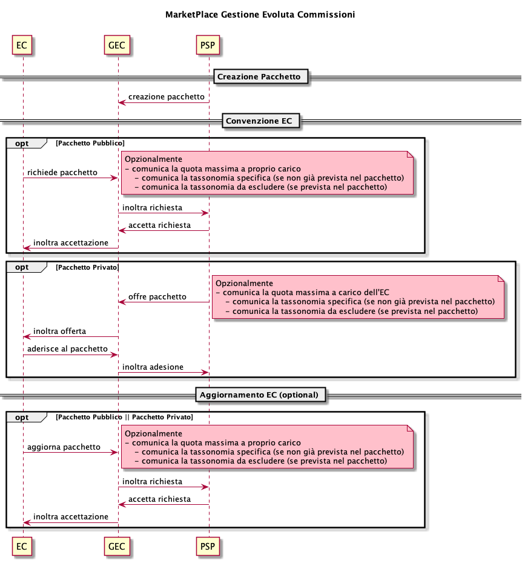

# Advanced commission management

PagoPA S.p.A has implemented this service that introduces a rules engine that acts as a converter for all of the platform’s payment operations, making it possible for the PSP to create ad hoc commission package for specific payments, guaranteeing greater flexibility based on

* different commissions with respect to the EC
* touchpoint
* taxonomy of the debt position
* amount
* selected payment tool
* period

every EC has the possibility, for each commission package, to set the fee they charge and also associate it with certain taxonomies.

This service is an alternative to the use of the **Information Data Catalog.**

## Marketplace

This is the tool that allows the ECs to participate in certain packages (public or private) exposed by the PSPs or to complete global packages with additional attributes (their commissions and taxonomy).

Each PSP can define 3 types of commission packages

* global → available for the payments of any EC;
* public → available only for payments of the ECs who activated an “agreement” via the marketplace;
* private → available only for payments of the ECs who activated an “agreement” via the marketplace upon invitation of the PSP;

### Use cases

* Each PSP has CRUD interfaces available for managing a package for each commission;
* each PSP can define an amount for each package;
* each PSP can define a range for the transaction amount for each package;
* each PSP can associate a payment method with each package;
* each PSP can associate a touchpoint with each package;
* each PSP can associate a taxonomic code with each package;
* each PSP can associate a validity period with each package;
* each PSP can offer their private packages to the ECs;
* each PSP can accept registration requests from ECs for their public packages;
* each PSP can accept registration changes from ECs for their public packages;
* each EC has CRUD interfaces available for managing the packages to which they have access;
* each EC can charge a commission fee for each public or private package to which they have access;
* each EC can associate a filter for the taxonomic code for the commission fee they want to charge;
* each EC can request to register for a public package;
* each EC can change their registration with a public package;
* each EC can accept the offer of a private package.