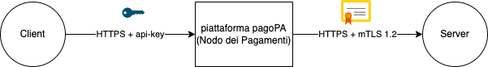

# Connectivity

An entity that wants to interact in the pagoPA system can activate and manage a direct connection with the pagoPA platform. The term “direct connection” refers to all of the redundant connections between a primary and a secondary site (to be activated in case of disaster recovery) of the entity directly connected to the corresponding primary and secondary sites with which the pagoPA platform provides the services. The size of the direct connection is determined by the entity who wants to connect directly, in compliance with the availability, performance and security requirements indicated in this document.

The pagoPA platform can be reached by default from the Internet.

In any case, the entity that intends to connect directly (in any manner) must guarantee the use of of high-performance redundant connectivity both for the primary site as well as the secondary site dedicated to disaster recovery.

## Connection to pagoPA via the internet 

An entity can connect directly to the pagoPA platform using connectivity via internet, in compliance with the following constraints:

* use of the https transport protocol with a channel encoded and authenticated by Transport Layer Security (TLS) version 1.2 or higher, enabling mutual authentication between the parties (client authentication) for what concerns the connectivity from the Payment node and using an api-key for what concerns the connectivity to the payment node. For this purpose, it is mandatory to use x.509 digital certificates for the creation of the TLS channel. Keep in mind that in the pagoPA system, the directly connected entity will be authenticated by the pagoPA platform both when receiving the requests (api-key), as well as when sending them (server authentication);
* use of a connection suitable for supporting compliance of the expected LdS considering the volume of transactions the entity expects to have.

## Connection activation procedure

### Server payment node

The new registrations take place by means of the generation of the api-keys on the pagoPA backoffice portal, which can be accessed via the [PagoPA Reserved Area](https://selfcare.pagopa.it/), for all the information related to the registration process for the PagoPA Reserved Area refer to the following link: [Area Riservata-Come Aderire](https://docs.pagopa.it/area-riservata/area-riservata/come-aderire). 

The complete procedure for obtaining the api-keys is described in the BackOffice-pagoPA operating manuals dedicated to ECs, to PSPs and Technological partners.

The procedure in the manuals is valid for all pagoPA system environments (test and production).

Once generated, the api-keys are made available on the pagoPA BackOffice portal, and it is the responsibility of the requesting entity to manage the keys according to best practices and not disclose them, in the case of a possible theft or if they were compromised, they must be regenerated immediately.

The api-keys do not expire and are both valid. Normally the primary one is used, the secondary one can be useful if it is necessary, for reasons related to security, to regenerate the primary key.

The key must be passed as input for all calls the client makes to the pagoPA platform by means of the definition of the HTTP header `Ocp-Apim-Subscription-Key`, if the HTTP header is not defined or if the key is incorrect or no longer valid, the APIM will respond with error http 401.

The activation procedure ends with the verification of the mutual reachability of the systems.

### Client payment node

The procedure described below is valid for all pagoPA system environments (test and production):

1. the entity that wants to connect directly to the pagoPA platform must have a x.509 digital certificate issued by a Certification Authority that is a member of the CA/Browser Forum ([https://cabforum.org/members/](https://cabforum.org/members/)). PagoPA S.p.A. has the right to authorize the connection using a certificate issued by a different CA and authorize the connection to the external test environment using another type of certificate;
2. the Subject field in every certificate must contain a CN coherent with the FQDN of the URL of the service it intends to expose;
3. the URL of the application service to be exposed must be provided, by means of suitable configuration in the pagoPA system infrastructure, and it must respect the format \<PROTOCOL>://\<FQDN>:\<PORT>/\<CONTEXT_PATH> example https://myservice.subservice.it:443//context/subcontext, the FQDN must coincide with the CN specified in point 2;
4. when establishing the connection to the concerned entity, pagoPA enables mutual authentication (mTLS), the entity can publicly download the x.509 digital certificate of the platform at the following links:

* test:[ https://raw.githubusercontent.com/pagopa/pagopa-node-forwarder/main/certs/forwarder.uat.platform.pagopa.it.pem](https://raw.githubusercontent.com/pagopa/pagopa-node-forwarder/main/certs/forwarder.uat.platform.pagopa.it.pem)​
* production:[ https://raw.githubusercontent.com/pagopa/pagopa-node-forwarder/main/certs/forwarder.platform.pagopa.it.pem](https://raw.githubusercontent.com/pagopa/pagopa-node-forwarder/main/certs/forwarder.platform.pagopa.it.pem)​

The activation procedure ends with the verification of the mutual reachability of the systems.

\\