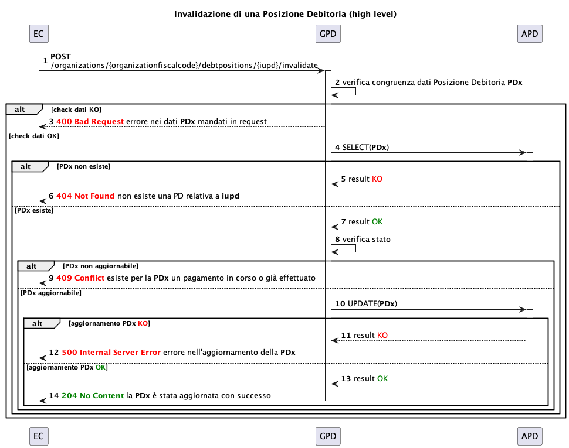
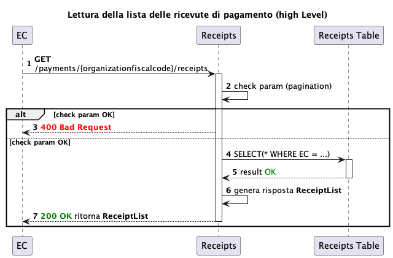
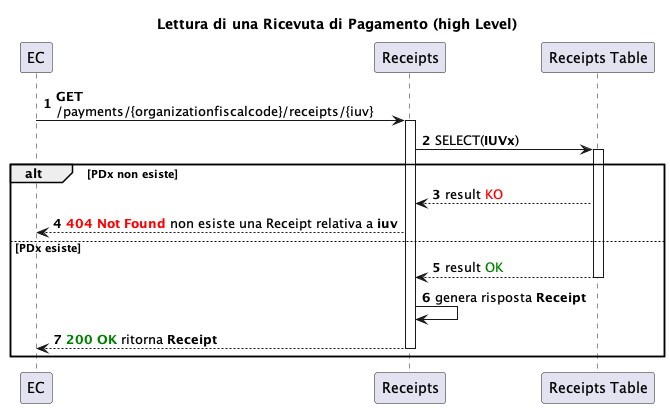
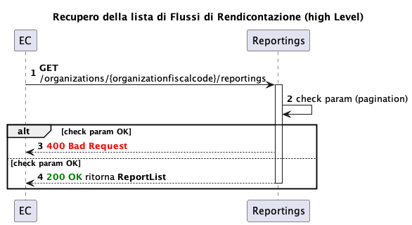
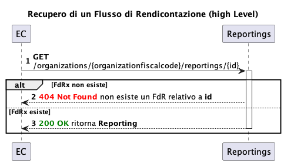

# Available operations

 All the indicated operations are divided by fiscal code of the creditor (`organizationfiscalcode`).

In the case of intermediation, it is possible to associate the intermediary’s _subscription key_ with _1_ to _n_ fiscal codes of intermediated institutions, which allows the intermediaries to use a single _subscription key_ to invoke the APIs on behalf of all the intermediated institutions. This enabling operations must be requested from PagoPA at the same time as the creation of the _subscription key_ or afterward. 

The _subscription keys_ and their relative enabling operations are divided by _UAT/PROD_ environment. 

## Debt position management

In the following sequence diagrams, the acronym GPD is used to identify the Debt position management service and APD is used for Debt position management (database).

For details see [https://github.com/pagopa/pagopa-api/tree/SANP3.7.1/openapi](https://github.com/pagopa/pagopa-api/tree/SANP3.7.1/openapi)

### Creating a debt position

 [https://raw.githubusercontent.com/pagopa/pagopa-api/SANP3.7.1/openapi/gpd.json](https://raw.githubusercontent.com/pagopa/pagopa-api/SANP3.7.1/openapi/gpd.json) 

.png)

When creating the debt position, the service will check the input data and check for duplicates.

The input data checks include:

* compulsoriness of the data
* coherence of the dates (for example `due_date` ≥ `validity_date)`
* coherence of the amounts (for example the sum of the payment amounts must be equal to the total amount)
* validity of the taxonomy
* IBAN validity (must be recorded on the pagoPA platform)

The check for duplicates is based on the payment identifiers (IUPD, IUV and fiscalCode)

The _query parameter_ `toPublish` makes it possible to automatically publish a debt position when it is created, by setting this parameter to `true` and also entering `null` in the `validityDate` field, the debt position will be automatically set to the VALID state and be ready to be paid.

### Reading a list of debt positions and a single debt position

 [https://raw.githubusercontent.com/pagopa/pagopa-api/SANP3.7.1/openapi/gpd.json](https://raw.githubusercontent.com/pagopa/pagopa-api/SANP3.7.1/openapi/gpd.json) 

.png)

Reading a list of debt positions always requires pagination. It is also possible to filter by `due_date` to limit the results.

 [https://raw.githubusercontent.com/pagopa/pagopa-api/SANP3.7.1/openapi/gpd.json](https://raw.githubusercontent.com/pagopa/pagopa-api/SANP3.7.1/openapi/gpd.json) 

.png)

Reading a debt position is based on the input identifier (IUPD). If the IUPD does not exist, an error is output.

### Updating a debt position

 [https://raw.githubusercontent.com/pagopa/pagopa-api/SANP3.7.1/openapi/gpd.json](https://raw.githubusercontent.com/pagopa/pagopa-api/SANP3.7.1/openapi/gpd.json) 

.png)

During the update phase, in addition to the already mentioned checks during creation, a check is made that the position exists and can be updated.

In particular, the updatability of the debt position depends on the state of the position itself (for example, if a position was already paid it cannot be updated)

 It is important to pay particular attention to the `notificationFee` field, which contains the notification fees for the debt position. This field is managed only by the notification platform and if applicable, the amount is added automatically by the GPD to the amount of the debt position.   
Therefore during the phase of updating the amount `amount` of one of the `transfer`s included in a `paymentOption`, the EC does not have to take the value in the `notificationFee` field into account. 

### Canceling a debt position

 [https://raw.githubusercontent.com/pagopa/pagopa-api/SANP3.4.1/openapi/gpd.yaml](https://raw.githubusercontent.com/pagopa/pagopa-api/SANP3.4.1/openapi/gpd.yaml) 

.png)

Canceling a debt position requires checking both its existence (IUPD) and state (for example, a debt position cannot be canceled if it was already paid)

### Publishing a debt position

 [gpd_core.json](../../.gitbook/assets/gpd_core.json) 

.png)

Publishing a debt position makes it possible to switch from the `DRAFT` state to the `PUBLISHED.` state. 

The `DRAFT` state does not in fact permit normal operations with the pagoPA platform. Only when the creditor publishes the position, and in coherence with the validity and expiration date, can it be paid on the platform.

### Invalidating a debt position

 [gpd_core.json](../../.gitbook/assets/gpd_core.json) 

The invalidation of a debt position consists of a logical cancellation. It is possible only starting from the `PUBLISHED` and `VALID` states.

The function is useful if you want to indicate to the user, during the payment phase, that the debt position was invalidated.

## Payment receipts

Two APIs are available for recovering the payment receipts:

* payment receipt list
* single receipt details

 [https://raw.githubusercontent.com/pagopa/pagopa-api/SANP3.7.0/openapi/gpd_payments.json](https://raw.githubusercontent.com/pagopa/pagopa-api/SANP3.7.0/openapi/gpd_payments.json) 

<figure><figcaption></figcaption></figure>

 [https://raw.githubusercontent.com/pagopa/pagopa-api/SANP3.7.0/openapi/gpd_payments.json](https://raw.githubusercontent.com/pagopa/pagopa-api/SANP3.7.0/openapi/gpd_payments.json) 

<figure><figcaption></figcaption></figure>

## Reporting flows

Functions for reading the reporting flows are made available.

* List of reporting flows for a Creditor
* Details of the reporting flow

 Enabling to the service for managing the reporting flows on GPD is not automatic and must be explicitly requested during the on-boarding of the EC 

 [gpd_fdr.yaml](../../.gitbook/assets/gpd_fdr.yaml) 

 [gpd_fdr.yaml](../../.gitbook/assets/gpd_fdr.yaml) 

