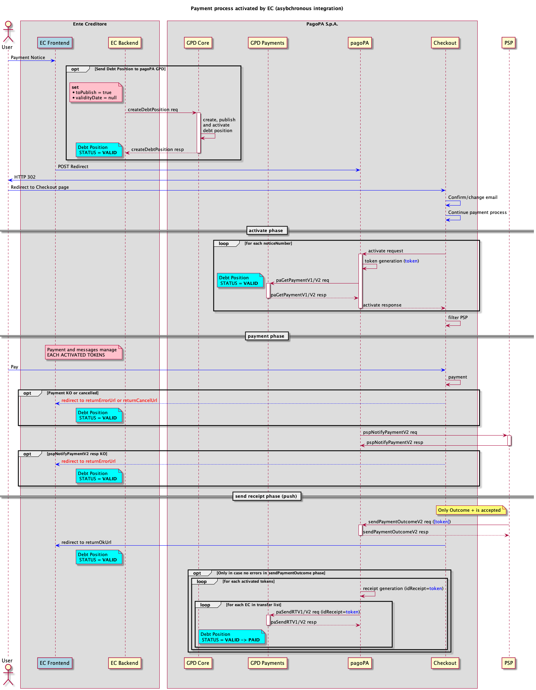

# Payments at the EC frontend in asynchronous mode

This page provides a possible integration flow for a payment started from the EC frontend, if it is in production on the pagoPA platform in asynchronous mode.

 The flow described in this section is provided only as an example and therefore must not be considered a specific mandatory implementation. 

The purpose of the _payments made at the EC frontend in asynchronous mode_ is to make sure that in all the cases in which the debt position cannot be previously loaded, it is present in the PagoPA debt position service prior to the payment activation phase.

<figure><figcaption></figcaption></figure>

* When the EC frontend receives the request to pay one or more notices, before sending the request to Checkout by means of a [redirect](../../creditor/integration-methods/integration-of-the-EC-touch-point-with-checkout.md), it loads the relative debt position(s) by invoking the [`createDebtPosition`](available-operations.md) api exposed by the _GPD core_ component;
* in order to create, publish and set the debt positions to the `VALID` state with a single invocation to the _GPD core_ component, it is suggested to set the query parameter `toPublish=true` and the field of the debt position `validityDate=null;`
* at this point, the debt position(s) are present in the PagoPA **debt position** service and they are in the correct state to be paid;
* Checkout, based on the number of notices received, requests the node to activate the _n_ payments, in turn the payment node forwards the requests to the _GPD payments_ component, which will respond to the primitive [paGetPaymentV2](../primitive.md#pagetpayment-versione-2) on behalf of the EC;
* the payment process proceeds unvaried as described on the page [Payment at the EC frontend](../../use-cases/payment-at-the-ECs-frontend.md) up to the moment of invoking the primitive [paSendRTV2](../primitive.md#pasendrt-versione-2), which in the case of asynchronous integration is forwarded to the _GPD payments_ component and possibly to the configured broadcast stations;
* the direct EC or the intermediary must make an endpoint available that is compliant with the specifications indicated in the [Connectivity](../connectivity.md#nodo-dei-pagamenti-client) section, and where the [paSendRTV2](../primitive.md#pasendrt-versione-2) service can be exposed. This allows PagoPA S.p.A. to configure a **broadcast station** on which it sends the _receipts_ in real time as the payments are completed with a positive result. This configuration helps the EC receive the receipts in **push mode,** without using polling mechanisms toward the [APIs ](available-operations.md#ricevute-di-pagamento)exposed by the `GPD-Core` component. The [APIs](available-operations.md#ricevute-di-pagamento) for recovering the _receipts_ can be used in particular cases, such as for a technical problem when receiving one or more _receipts_ via the broadcast station; 
* when the `GPD-Payments` component receives the _receipt_, it closes the debt position.