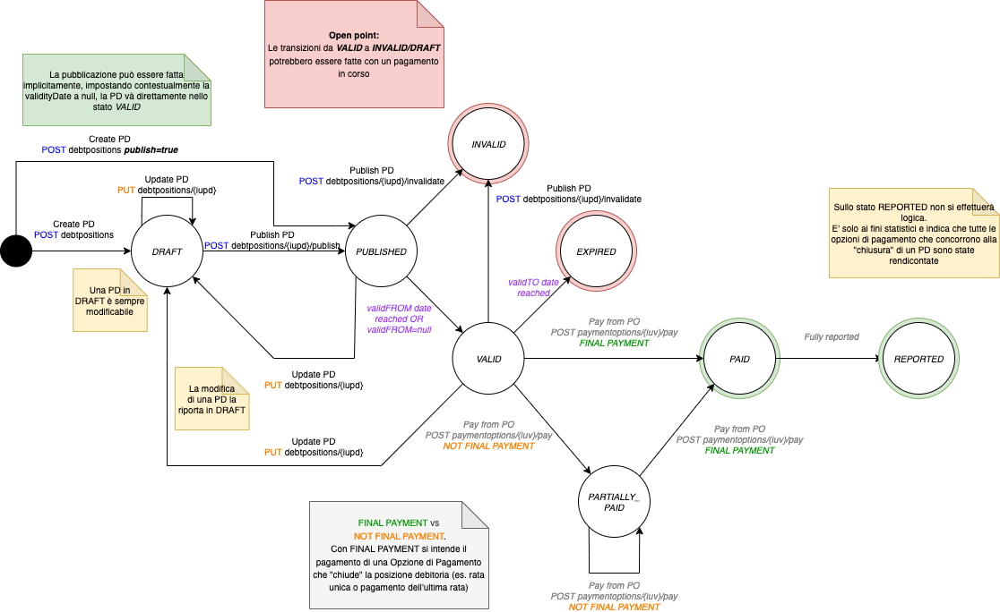
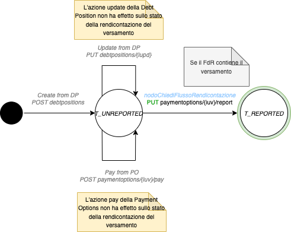

# States of the debt position

This section represents the state machines of the 3 main states (debt position, payment option and payment).

The actions indicated below can come from 2 sources:

* Technological partner/intermediary or a creditor (for example, the creation or update of a debt position)
* Payment node (for example via reception of a payment receipt)

## Debt position

<figure><figcaption></figcaption></figure>

## Payment option

.png)

## Payment

