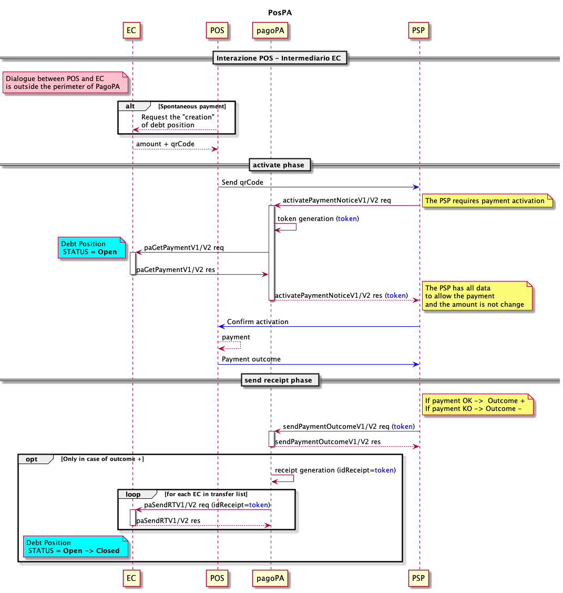

# Physical POS

The content of this page is provided only _as a guide_, is immediately applicable and serves the purpose of promoting card payments in all possible payment scenarios, providing information both to PSPs as well as to all types of ECs registered with pagoPA, defining the characteristics of a payment service compatible with the implementing specifications of the pagoPA platform. 

<figure><figcaption></figcaption></figure>

* A prerequisite for the payment is that the debt position has been previously created by the EC and communicated to the POS with its fundamental data, _qrCode_ and _amount_;
* the _qrCode_ must be exchanged with the PSP so that the latter can proceed with the activation;
* with [activatePaymentNotice](primitive.md#activatepaymentnotice) the PSP requests the node to activate the payment at the EC, this phase is mandatory for the PSPs; to correctly identify the type of payment in the _touchPoint_ tag the "POS" value must be entered;
* The request to activate the payment reaches the creditor by means of [paGetPayment](primitive.md#pagetpayment);
* the activation confirmation is forwarded to the POS which, at this point, permits the payment and sends its result to the PSP;
* The PSP is OBLIGATED to provide the payment result in real time with the [sendPaymentOutcome](primitive.md#sendpaymentoutcome), therefore as soon as the end user has paid or confirmed on the PSP touchpoint, and in any case before the expiration of the token, both in case of a successful payment (outcome = OK), as well as in case of an unsuccessful payment (outcome = KO);
* By means of the primitive [paSendRT](primitive.md#pasendrt), the _receipt_ is sent to the _n_ creditors involved with the payment only if the payment was made, the _receipt_ is an object generated by the pagoPA platform;
* When the creditor receives the _receipt_, they must close the debt position and consider it fully paid.

To manage the errors, refer to [Error management](https://app.gitbook.com/o/KXYtsf32WSKm6ga638R3/s/mU2qgiLV1G3m9z1VjAOc/ "mention").