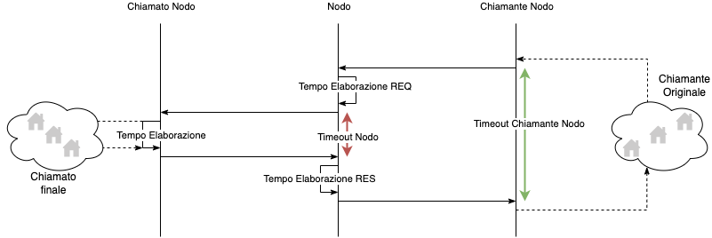
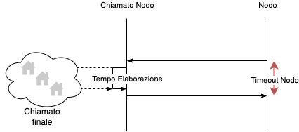

# Quality indicators for registered entities

 [creditor-service-levels.md](creditor-service-levels.md) 

 [psp-service-levels.md](psp-service-levels.md) 

## Response time

The following chart shows the lead times of the pagoPA platform

* the _Processing time_ represents what is indicated in [#livelli-di-servizio-dei-metodi-degli-ec](creditor-service-levels.md#livelli-di-servizio-dei-metodi-degli-ec "mention");
* _Node Timeout_ represents what is indicated in [#gestione-dei-timeout-verso-gli-ec](creditor-service-levels.md#gestione-dei-timeout-verso-gli-ec "mention") or [#gestione-dei-timeout-verso-i-psp](psp-service-levels.md#gestione-dei-timeout-verso-i-psp "mention"), depending on the nature of the _Called Node_;
* the _Node Caller Timeout_ represents what is indicated in [#gestione-dei-timeout-del-nodo](./#gestione-dei-timeout-del-nodo "mention") for the synchronous methods. 

The following chart shows the times in which the pagoPA platform acts as a server in the case of non-synchronous methods

.png)

* the _Node Caller Timeout_ represents what is indicated in [#gestione-dei-timeout-del-nodo](./#gestione-dei-timeout-del-nodo "mention") for the non-synchronous methods. 

The following chart shows the times in which the pagoPA platform acts as a client

* the _Processing time_ represents what is indicated in [#livelli-di-servizio-dei-metodi-degli-ec](creditor-service-levels.md#livelli-di-servizio-dei-metodi-degli-ec "mention") or [#livelli-di-servizio-dei-metodi-dei-psp](psp-service-levels.md#livelli-di-servizio-dei-metodi-dei-psp "mention"), depending on the nature of the _Called Node_;
* _Node Timeout_ represents what is indicated in [#gestione-dei-timeout-verso-gli-ec](creditor-service-levels.md#gestione-dei-timeout-verso-gli-ec "mention") or [#gestione-dei-timeout-verso-i-psp](psp-service-levels.md#gestione-dei-timeout-verso-i-psp "mention"), depending on the nature of the _Called Node._

## Retry processes

In cases of timeout, the retry processes must be activated for the following primitives:

* [nodoInviaFlussoRendicontazione](../primitive.md#nodoinviaflussorendicontazione)
* [sendPaymentOutcome](../primitive.md#sendpaymentoutcome)

The retry processes must be adopted for calculating the exponential backoff logic wait time starting from the detection of the timeout

$$wait time = slot time * (2\^k - 1)$$

with _K_ that is the number of the attempt (first attempt = 1) and _slottime_ is equal to the maximum wait time of the original caller.

The retry processes must have a maximum number of 5 attempts, functions must be provided for consulting and resetting the attempt counter so that the process can be restarted if necessary.

In the case of timeout for the following primitives:

* [activatePaymentNotice](../primitive.md#activatepaymentnotice)
* [demandPaymentNotice](../primitive.md#demandpaymentnotice)
* [nodoChiediElencoFlussiRendicontazione](../primitive.md#nodochiedielencoflussirendicontazione)
* [nodoChiediFlussoRendicontazione](../primitive.md#nodochiediflussorendicontazione)
* [nodoChiediInformativaPA](../primitive.md#nodochiediinformativapa)
* [nodoChiediTemplateInformativaPSP](../primitive.md#nodochieditemplateinformativapsp)
* [nodoChiediCatalogoServizi](../primitive.md#nodochiedicatalogoservizi)
* [verificaBollettino](../primitive.md#verificabollettino)
* [verifyPaymentNotice](../primitive.md#verifypaymentnotice)

an automatic retry process is not necessary, but if a new invocation is necessary the minimum wait time before performing a new attempt must respect the exponential backoff logic indicated above.

## Managing the node timeouts

The timeout represents a predetermined period of time after which a given operation can considered concluded by the EC and PSP.

The following table shows, for each primitive:

* the minimum wait times for synchronous methods
* the suggested wait times for non-synchronous methods

for the node response

by the ECs

<table><thead><tr><th width="397.44897959183675">Primitive</th><th width="225" align="center">Timeout in seconds</th><th data-type="checkbox">Synchronous</th></tr></thead><tbody><tr><td><a href="../primitive.md#nodochiedielencoflussirendicontazione">nodoChiediElencoFlussiRendicontazione</a></td><td align="center">15</td><td>false</td></tr><tr><td><a href="../primitive.md#nodochiediflussorendicontazione">nodoChiediFlussoRendicontazione</a></td><td align="center">60</td><td>false</td></tr></tbody></table>

by the PSPs

<table><thead><tr><th width="397.44897959183675">Primitive</th><th width="225" align="center">Timeout in seconds</th><th data-type="checkbox">Synchronous</th></tr></thead><tbody><tr><td><a href="../primitive.md#activatepaymentnotice">activatePaymentNotice</a></td><td align="center">12</td><td>true</td></tr><tr><td><a href="../primitive.md#demandpaymentnotice">demandPaymentNotice</a></td><td align="center">12</td><td>true</td></tr><tr><td><a href="../primitive.md#nodochiedicatalogoservizi">nodoChiediCatalogoServizi</a></td><td align="center">15</td><td>false</td></tr><tr><td><a href="../primitive.md#nodochiediinformativapa">nodoChiediInformativaPA</a></td><td align="center">15</td><td>false</td></tr><tr><td><a href="../primitive.md#nodochieditemplateinformativapsp">nodoChiediTemplateInformativaPSP</a></td><td align="center">15</td><td>false</td></tr><tr><td><a href="../primitive.md#nodoinviaflussorendicontazione">nodoInviaFlussoRendicontazione</a></td><td align="center">60</td><td>false</td></tr><tr><td><a href="../primitive.md#sendpaymentoutcome">sendPaymentOutcome</a></td><td align="center">15</td><td>false</td></tr><tr><td><a href="../primitive.md#verificabollettino">verificaBollettino</a></td><td align="center">12</td><td>true</td></tr><tr><td><a href="../primitive.md#verifypaymentnotice">verifyPaymentNotice</a></td><td align="center">12</td><td>true</td></tr></tbody></table>

## Resolution time for a critical event

If a critical event occurs, the Creditor or PSP must acknowledge the problem within 5 minutes and then send an email to the operational workgroup of the NodoSPC containing information regarding the overall planning they will adopt to resolve the problem in question, structured based on the complexity of the problem itself (e.g. immediate bug fix, possible temporary solution, closure of the event).