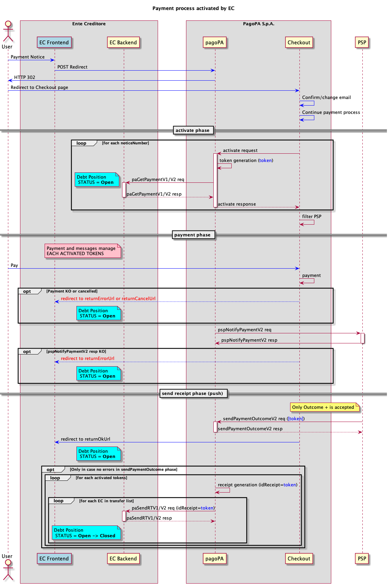

# Pagamento presso frontend dell'EC

Questo processo viene attivato nel momento in cui l'operazione di pagamento è avviata dal front end di un EC, il workflow si prefigge lo scopo di aver minor impatto possibile su EC e PSP, infatti, le interfacce di comunicazione sono le stesse utilizzate per il pagamento presso i PSP, quindi ne condividono tutti i presupposti.

<figure><figcaption></figcaption></figure>

* quando il front end dell'EC riceve la richiesta di pagamento di uno o più avvisi la inoltra con una [redirect](../ente-creditore/modalita-dintegrazione/integrazione-touch-point-dellec-con-checkout.md) a Checkout, l'interfaccia di front end di PagoPA S.p.A.;
* Checkout, in base al numero di avvisi che ha ricevuto, chiede al Nodo di attivare gli _n_ pagamenti presso l’EC;
* ogni singola richiesta di attivazione di pagamento giunge all’EC per mezzo della [paGetPayment](../appendici/primitive.md#pagetpayment);
* Checkout permette al PSP aderente, che offre all’interno della piattaforma pagoPA i propri strumenti di pagamento digitali ([offrire-sistemi-di-pagamento-su-touchpoints-di-pagopa-s.p.a..md](../prestatore-di-servizi-di-pagamento/modalita-di-integrazione/offrire-sistemi-di-pagamento-su-touchpoints-di-pagopa-s.p.a..md "mention")), di incassare la somma dovuta dall'utente;&#x20;
* una volta concluse le operazioni di pagamento, Checkout effettua una redirect verso il frontend dell'EC e invia gli esiti al Nodo che provvede ad inviarli al PSP tramite la [pspNotifyPayment vers. 2](../appendici/primitive.md#versione-2-4), nel caso di risposta KO da parte del PSP il processo viene interrotto e il pagamento deve essere stornato;
* a fronte di eccezioni tecniche durante la chiamata alla [pspNotifyPayment vers. 2](../appendici/primitive.md#versione-2-4) che impedissero di ricevere una response,  il Nodo attenderebbe il verificarsi del primo dei seguenti eventi
  * _scadenza del payment token_: il processo viene interrotto e il pagamento deve essere stornato;
  * _ricezione della_ [_sendPaymentOutcome vers. 2_](../appendici/primitive.md#versione-2-3)_:_ il flusso procede normalmente, tenendo sempre presente che il PSP non può inviare un outcome = KO;
* nel caso il PSP inviasse una [sendPaymentOutcome vers. 2](../appendici/primitive.md#versione-2-3) dopo aver risposto con un KO alla [pspNotifyPayment vers. 2](../appendici/primitive.md#versione-2-4) il Nodo risponderebbe con un KO per segnalare l'esito discorde;
* in caso di accettazione della [pspNotifyPayment vers. 2](../appendici/primitive.md#versione-2-4) il PSP è tenuto a fornire l'esito del pagamento **entro 2sec** dall'accettazione con la [sendPaymentOutcome vers. 2](../appendici/primitive.md#versione-2-3), che contiene un singolo outcome per tutti i tokens attivati nelle fasi precedenti;
* se il PSP inviasse un outcome = KO dopo aver accettato la [pspNotifyPayment vers. 2](../appendici/primitive.md#versione-2-4) il Nodo risponderebbe con un KO per segnalare l'esito discorde;
* tramite la primitiva [paSendRT](../appendici/primitive.md#pasendrt) viene inoltrata agli _n_ EC interessati al pagamento la _receipt_ (ricevuta) solo se il pagamento è stato effettuato, la _receipt_ è un oggetto generato dalla piattaforma pagoPA;
* quando l'EC riceve la _receipt_ deve chiudere la posizione debitoria e considerarla interamente saldato l’avviso oggetto del pagamento.

Per la gestione degli errori fare riferimento a [Gestione degli errori](https://app.gitbook.com/o/KXYtsf32WSKm6ga638R3/s/mU2qgiLV1G3m9z1VjAOc/ "mention").

Per un corretto e standardizzato utilizzo dei _metadata_ è stato creato un apposito [Dizionario dei metadata](https://app.gitbook.com/o/KXYtsf32WSKm6ga638R3/s/u6YdY319vyFX9MIvnKBa/ "mention"), in cui è presente una sezione dedicata alle informazioni del canale di pagamento presenti in _additionalPaymentInformations_ della [pspNotifyPayment vers. 2](../appendici/primitive.md#versione-2-4).
