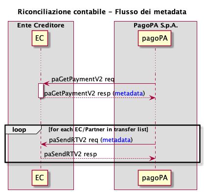

# Account reconciliation

The creditor must complete the payment life cycle by checking that the bank flow corresponds to what was reported. To do so they use the identifier of the reporting flow indicated in the description of the repayment, associating it with the corresponding reporting flow downloaded from the pagoPA platform. After this procedure there is the part in which the amounts, once verified, must be allocated to the correct financial statement items, so that the payment orders can be made and the account reconciliation procedure can be completed.

To permit the information required for account reconciliation to transit on the pagoPA platform, it is necessary to use the _metadata_ structure available in the primitives [paGetPayment vers. 2](../appendices/primitive.md#pagetpayment) and [paSendRT vers. 2](../appendices/primitive.md#pasendrt).

To be able to use the _metadata_ in a correct and standardized manner, a [metadata dictionary](https://app.gitbook.com/o/KXYtsf32WSKm6ga638R3/s/u6YdY319vyFX9MIvnKBa/ "mention") has been prepared that contains a section dedicated to account reconciliation.

* in the _response_ to the request for payment activation that the creditor receives via [paGetPayment vers.2](../appendices/primitive.md#pagetpayment), it is possible to insert the _metadata_ for each individual transfer;
* the primitive [paSendRT vers. 2](../appendices/primitive.md#pasendrt), which is sent to the _n_ creditors involved in the payment via their technological partners/intermediaries, is used to send the _metadata_ that was entered in the [paGetPayment vers. 2](../appendices/primitive.md#pagetpayment) _response_;
* the [paSendRT vers. 2](../appendices/primitive.md#pasendrt) is forwarded to  
  * the _station_ of the primary creditor, from which the payment was activated;
  * all _stations_ of all the creditors configured as _broadcast_;

By using this flow, all software of the creditors involved in the payment can receive [paSendRT vers. 2](../appendices/primitive.md#pasendrt) and use the content of the _metadata_ to manage the account reconciliation.