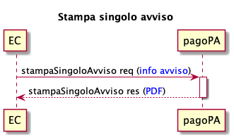
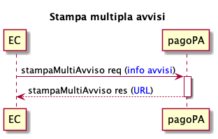

# Printing pagoPA notices

This new function provides the creditors with a new primitive for printing the pagoPA payment notices in pdf format, with the possibility for the creditors to therefore manage the entire life cycle of the notice, from generation to printing. 

 The use of this function allows the institution to considerably simplify the process for managing the debt position, entrusting PagoPa with the life cycle of printing the notice by means of a simple integration, or in a transparent manner if integrated with other initiatives (e.g. [integration-via-asynchronous-api.md](integration-methods/integration-via-asynchronous-api.md "mention")).

## **Print single notice**

<figure><figcaption></figcaption></figure>

* The creditor sends all the information necessary to stampaSingoloAvviso, as indicated in the section [#informazioni-richieste-per-la-stampa-dellavviso-di-pagamento](printing-pagoPA-notices.md#informazioni-richieste-per-la-stampa-dellavviso-di-pagamento "mention");
* the stampaSingoloAvviso responds with the PDF of the requested _payment notice_, in compliance with the specifications described in the [payment notices](https://docs.pagopa.it/avviso-pagamento).

## **Print multiple notices**

<figure><figcaption></figcaption></figure>

* The creditor sends all the information necessary to stampaMultiAvviso, as indicated in the section [#informazioni-richieste-per-la-stampa-dellavviso-di-pagamento](printing-pagoPA-notices.md#informazioni-richieste-per-la-stampa-dellavviso-di-pagamento "mention");
* the stampaMultiAvviso provides the url where it is possible to download all the PDFs of the requested _payment notices_, in compliance with the specifications described in [payment notices](https://docs.pagopa.it/avviso-pagamento).

## **Information required for printing the payment notice**

To be able to use the function, the creditor must send the following information for each payment notice:

_Header_

* subject of the notice, clear and significant text for the person who receives the notice.

_Information about the creditor_

* Fiscal code of VAT no. of the creditor;
* Name of the creditor;
* Name of the organizational unit that manages the payment.

_Information about the recipient_

* Fiscal code (or if not available, VAT no.) of the paying entity;
* first and last name of the paying entity;
* address of the paying entity.

_Amount and due date_

* Payment due date;
* Payment amount.

_Where to pay_

* A fixed text that lists the site (or app) of the creditor among the available channels, if it permits to pay the notice;
* A text that mentions the physical channel of the creditor, if it permits to pay the notice.

_Payment data_

* Two-dimensional barcode / Data Matrix code;
* Notice code;
* Interbank code of the creditor, also known as the SIA code.