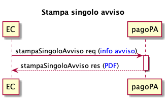
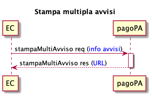

# Stampa avvisi pagoPA

Questa nuova funzionalità mette a disposizione degli EC una nuova primitiva per stampare l’avviso di pagamento pagoPA in formato pdf, con la possibilità quindi per gli EC di gestire l’intero ciclo di vita dell'avviso, dalla generazione alla stampa.&#x20;

&#x20;L'utilizzo della funzionalità consente all'Ente di semplificare notevolmente il processo di gestione della posizione debitoria delegando a PagoPA il ciclo di vita della stampa dell'avviso tramite una semplice integrazione o in maniera trasparente in caso di adesione ad altre iniziative (es. [integrazione-tramite-api-asincrone.md](modalita-dintegrazione/integrazione-tramite-api-asincrone.md "mention")).

## **Stampa singolo avviso**

<figure><figcaption></figcaption></figure>

* L’EC invia tutte le informazioni necessarie alla stampaSingoloAvviso, come indicate nella sezione [#informazioni-richieste-per-la-stampa-dellavviso-di-pagamento](stampa-avvisi-pagopa.md#informazioni-richieste-per-la-stampa-dellavviso-di-pagamento "mention");
* la stampaSingoloAvviso risponde con il PDF dell’_avviso di pagamento_ richiesto, conforme alle specifiche descritte in [Avvisi di pagamento](https://docs.pagopa.it/avviso-pagamento).

## **Stampa multipla avvisi**

<figure><figcaption></figcaption></figure>

* L’EC invia tutte le informazioni necessarie alla stampaMultiAvviso, come indicate nella sezione [#informazioni-richieste-per-la-stampa-dellavviso-di-pagamento](stampa-avvisi-pagopa.md#informazioni-richieste-per-la-stampa-dellavviso-di-pagamento "mention");
* la stampaMultiAvviso fornirà l’url dove poter effettuare il download di tutti i PDF degli _avvisi di pagamento_ richiesti, conformi alle specifiche descritte in [Avvisi di pagamento](https://docs.pagopa.it/avviso-pagamento).

## **Informazioni richieste per la stampa dell'avviso di pagamento**

Per usufruire della funzionalità l’EC dovrà inviare, per ogni Avviso di Pagamento, le seguenti informazioni:

_Intestazione_

* oggetto dell’Avviso, testo chiaro e significativo per chi riceve l'avviso.

_Informazioni sull’Ente Creditore_

* Codice Fiscale o Partita IVA dell'Ente Creditore;
* denominazione dell'Ente Creditore;
* denominazione dell'unità organizzativa che gestisce il pagamento.

_Informazione sul destinatario_

* Codice Fiscale (o, in assenza, Partiva IVA) del soggetto pagatore;
* nome e cognome del soggetto pagatore;
* indirizzo del soggetto pagatore.

_Importo e scadenza_

* Data di scadenza del pagamento;
* importo del pagamento.

_Dove pagare_

* Eventuale testo fisso che elenca il sito (o app) dell'Ente Creditore tra i canali disponibili, se consente di effettuare il pagamento dell'avviso;
* eventuale testo che menziona il canale fisico dell'Ente Creditore, se consente di effettuare il pagamento dell'avviso.

_Dati del pagamento_

* Codice a barre bidimensionale / Data Matrix;
* codice Avviso;
* codice interbancario dell'Ente Creditore, conosciuto anche come Codice SIA.
