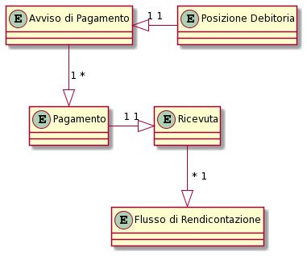
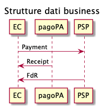
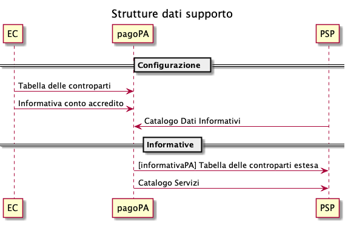

# Data model

When describing the interfaces, reference will be made to some entities whose relationships are shown by the following diagram

* _Debt position_: the entity (the service) for which the creditor wants to receive payments via the platform.
* _Payment notice_: represents the notification (paper or digital) of the debt position toward the citizen.
* _Payment_: describes in detail the payment transaction correlated to a notice and contains collection and credit information.
* _Receipt_: it describes the result of a payment and contains the details of the collection and the indication of the credit, it also contains the reference to the payment notice.
* _Reporting flow_: it details the repayment made towards the current accounts of a creditor by a PSP and contains the list of all the payments.

## Business data structures 

The _**payment**_ is an object generated by the creditor, managed by the pagoPA platform and forwarded to the PSP; the creditor provides this object to the pagoPA platform with the response to [paGetPayment](../appendices/primitive.md#pagetpayment), the pagoPA platform supplies this object to the PSP with the response to [activatePaymentNotice](../appendices/primitive.md#activatepaymentnotice); the _payment_ object provided to the PSP contains a subject of data sent by the creditor to the pagoPA platform.

The _**receipt**_ is an object generated by the pagoPA platform based on the data received form the response to [paGetPayment](../appendices/primitive.md#pagetpayment) (from the creditor) and from the [sendPaymentOutcome](../appendices/primitive.md#sendpaymentoutcome) (from the PSP); it is sent to the _n_ creditors involved with the payment by means of the primitive [paSendRT](../appendices/primitive.md#pasendrt); the _receipt_ object is sent to the EC only if the payment was made.

The _**reporting flow**_ contains the information that must be made availalbe to the creditor to perform the payment reconciliation operations, this flow must be made available to the concerned parties by the PSP who performed the payment operation by and no later than 24 hours from the second business day following the receipt of the payment order (D+2). The PSP send each individual reporting flow to the pagoPA platform via the primitive [nodoInviaFlussoRendicontazione](../appendices/primitive.md#nodoinviaflussorendicontazione); to receive the reporting flows from the creditor, the primitives to use are the [nodoChiediElencoFlussiRendicontazione](../appendices/primitive.md#nodochiediflussorendicontazione), to have the list of the available flows, and the [nodoChiediFlussoRendicontazione](../appendices/primitive.md#nodochiediflussorendicontazione) to download a specific flow.

.png)

## Support data structures 

The **Information Data Catalog** is the data structure through which, for the purpose of transparency of the transactions, the payment-SPC node registers the payment condition data for the PSP (maximum service costs, web pages with a description of the services, etc.), this catalog is updated daily by the PSPs directly.

 The extended counterparty table has been deprecated, for more information refer to the page [Deprecated functions](../appendices/deprecated-functions.md) 

The **Service catalog** is used by the PSPs to obtain details about particular services offered by each creditor, to be able to offer the spontaneous payment ([spontaneous-payment-via-a-PSP](../use-cases/spontaneous-payment-via-a-PSP/ "mention")), this structure can be taken via the primitive [nodoChiediCatalogoServizi](../appendices/primitive.md#nodochiedicatalogoservizi).

.png)