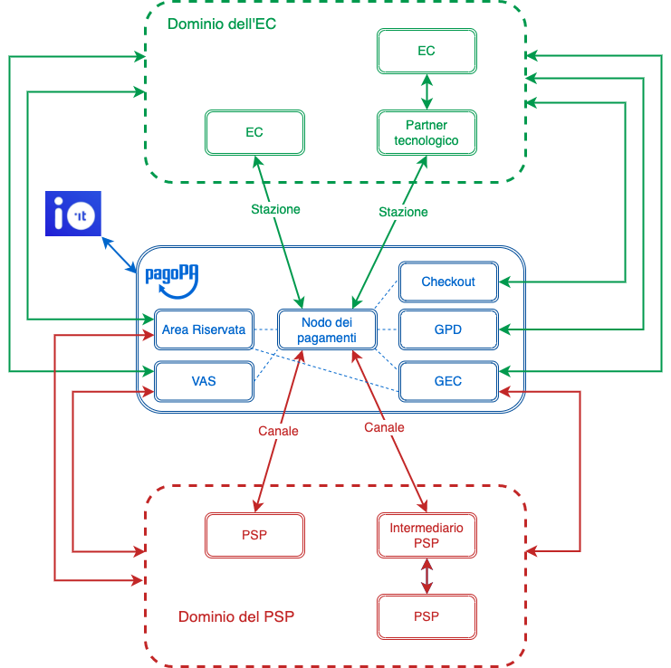

# Component overview

This page describes the purpose of each component of the pagoPA platform, without entering into details about the modules or the provides included in the domain of the creditor or the payment service provider. 

<figure><figcaption>
Macro components of the pagoPA platform
</figcaption></figure>

## Payment node

It is the main macro-component that serves the purpose of coordinating the execution of the service requests by managing the entire workflow in the different use cases foreseen for the payment of notices and in all the possible options for integration of the creditors.

The _payment node_ interfaces both with the applications of the creditors to which the service requests are addressed, as well as with the PSPs that enable the payment on the various channels.

It includes various software components, among which the main ones are those that permit:

* the storage and management of the “payment requests” for tracing the transactions and managing the exceptions;
* error management, based on what is defined in [Error management](https://app.gitbook.com/o/KXYtsf32WSKm6ga638R3/s/mU2qgiLV1G3m9z1VjAOc/ "mention");
* monitoring of the service levels of each involved entity, as defined in [quality-indicators-for-registered-entities](../../appendices/quality-indicators-for-registered-entities/ "mention");
* the management of the "stand In" function in the case the creditor is unavailable or does not respond;

## Debt position management (GPD) 

The component permits integration with the payment node via API Rest by the creditors for all the asynchronous functions described in detail in [debt-positions](../../appendices/debt-positions/ "mention"). 

## Advanced commission management (GEC) 

The component permits integration with the payment node to enable the functions described in detail in [advanced-commission-management.md](../../appendices/advanced-commission-management.md "mention").

## Checkout

The pagoPA component [checkout.md](../../use-cases/payment-from-PagoPA-touchpoint/checkout.md "mention") is a web-app for desktop and mobile devices that makes it possible to make payments on the pagoPA platform using the data contained in the payment notice, without any registration by the users.

The Checkout component also provides the end user with support functions by introducing various measures that simply the _user experience_, also when paying with mobile devices.

## IO

permits easy interaction with various local and national public administrations by collecting all their services, communications, payments and documents in a single app, in a secure and always available manner.

The app makes it possible to pay directly from the message or paper notice, which reduces the collection times and costs for the institution.

## Reserved area

A B2B portal that, accessed with SPID (Public Digital Identity System) or CIE (Electronic Identity Card) credentials, will be the primary interface channel for the PSPs, creditors and any of their technological partners/integrators and all the products of the company, including the pagoPA platform.  
The portal was created to offer the various involves entities a single location for the activation and integration of any of PagoPA's products in order to simply the procedures for registering with the individual platforms and, then, for configuring and managing the relative services autonomously.

The institution can indicate the administrative and technical contacts (internal) or the technological partners (external) who are authorized for the integration of a certain product and change these authorizations at any moment. In the same way, the authorized technical figures can access the portal to perform the integration operations necessary only for the institutes from which they have received authorization and only for the products for which they have been authorized.

The introduction of the new B2B portal will represent a single back office and allows the institutions to autonomously manage - from their own reserved area - all the products in a simple, coherent and standardized manner, which reduces the integration and configuration effort, which is performed today via email and manual processes. 

Registration and signing contracts and agreements will be automated. 

The new B2B portal will be accessed via SPID (Public Digital Identity System) or CIE (Electronic Identity Card) and each administrative contact can delegate a function subset to the various user profiles. 

For example:

* Functions for the PSPs: 
  * Configuration of the Information Data Catalog 
  * Management of keys and certificates for access to the primitives 
  * Download of invoicing reports 
* Functions for the creditors: 
  * Station registration 
  * IBAN registration 
  * Management of keys and certificates for access to the primitives 
  * Download of invoicing reports for premium functions 
  * Service catalog configurations for spontaneous payments

## Value-added services (VAS)

The _VAS_ component presents a series of APIs targeted both to the creditor as well as to the PSPs.

## Stations and channels 

The registered entities, creditors and PSPs connect to the platform, using _stations_ and _channels_ respectively, which represent the technical platforms of the partners and intermediaries connected using the methods described in the [connectivity.md](../../appendices/connectivity.md "mention") section.