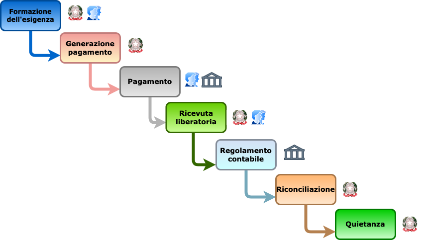

# Life cycle of a payment

A payment made using the pagoPA platform is a complex operation, comprised of various phases that generally follow a pre-defined “Life cycle” that is conditioned by administrative processes that require rules to be observed so they can be performed correctly. The “Life cycle can be represented by the flow contained in the following figure.

