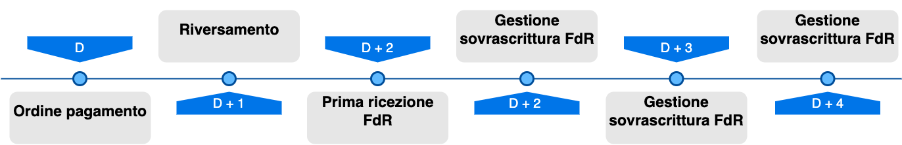

# Reporting and cashflow

Every PSP registered with the platform uses the _**reporting flow**_ to report on D+2 the details regarding the repayments made on D+1 through the accounts where the payment was credited that took place on credit accounts on business day D, as defined in the guidelines of the pagoPA platform, specifically in the [SACI](https://app.gitbook.com/o/KXYtsf32WSKm6ga638R3/s/E6d6iTzjBzUfzNoZjadZ/) (Implementing specifications of the payment identifier codes).

The PSP send each individual reporting flow to the pagoPA platform via the primitive [nodoInviaFlussoRendicontazione](../../appendices/primitive.md#nodoinviaflussorendicontazione); to receive the reporting flows from the creditor, the primitives to use are the [nodoChiediElencoFlussiRendicontazione](../../appendices/primitive.md#nodochiedielencoflussirendicontazione), to have the list of the available flows, and the [nodoChiediFlussoRendicontazione](../../appendices/primitive.md#nodochiediflussorendicontazione) to download a specific flow.

For the sake of simplification, the following applies for the following diagrams:

* PSP side → for sending a single flow
* Creditor side → for the recovery of multiple flows.

This selection results from the nature of the functionality on the creditor’s side that requires:

1. Recovery of the “list of flows”
2. Recovery of the single flow (previously mentioned in the list)

For the PSPs, there is a single method for sending the reporting flows to the pagoPA platform:

* SOAP (Web Service)

There are instead 2 possible configurations (mutually exclusive) for the creditor related to the receipt of the reporting flows:

* SOAP (Web Service)
* SFTP (Secure File Transfer Protocol)

.png)

.png)

As concerns the [nodoChiediElencoFlussiRendicontazione](../../appendices/primitive.md#nodochiedielencoflussirendicontazione), the platform responds independently of the creditor’s configuration (SOAP or SFTP), in both cases in fact the platform responds with a reporting flow list. The use of the primitive in the case of an SFTP configuration is optional and a possible reason for its use is for statistical purposes.

As concerns the [nodoChiediFlussoRendicontazione](../../appendices/primitive.md#nodochiediflussorendicontazione), the platform responds differently based on the creditor's configuration:

* reception via _web service_ **SOAP** → XML file: reporting flow in base64 binary
* reception via _server_ **SFTP** → unlike the standard primitive, no XML file is returned as output

In the case of SFTP configuration, the call in question is optional, in fact the file is not deposited at the moment of the creditor's request with the primitive, but takes place as soon as the flow is available to the node.

An example of an xml file of the reporting flow contained in the _xmlRendicontazione_ tag in base64 format.

```xml
<FlussoRiversamento xmlns="http://www.digitpa.gov.it/schemas/2011/Pagamenti/">
    <versioneOggetto>1.0</versioneOggetto>
    <identificativoFlusso>2021-11-21ABI00000-AABB648200001295</identificativoFlusso>
    <dataOraFlusso>2021-11-22T00:37:32</dataOraFlusso>
    <identificativoUnivocoRegolamento>Bank transfer SEPA-00000-AABB0</identificativoUnivocoRegolamento>
    <dataRegolamento>2021-11-21</dataRegolamento>
    <istitutoMittente>
        <identificativoUnivocoMittente>
            <tipoIdentificativoUnivoco>B</tipoIdentificativoUnivoco>
            <codiceIdentificativoUnivoco>ABI00000</codiceIdentificativoUnivoco>
        </identificativoUnivocoMittente>
        <denominazioneMittente>BANCO DI XXXXXXXX SPA</denominazioneMittente>
    </istitutoMittente>
    <istitutoRicevente>
        <identificativoUnivocoRicevente>
            <tipoIdentificativoUnivoco>G</tipoIdentificativoUnivoco>
            <codiceIdentificativoUnivoco>77777777777</codiceIdentificativoUnivoco>
        </identificativoUnivocoRicevente>
        <denominazioneRicevente>XXXXXXXXXXX</denominazioneRicevente>
    </istitutoRicevente>
    <numeroTotalePagamenti>1</numeroTotalePagamenti>
    <importoTotalePagamenti>1234.56</importoTotalePagamenti>
    <datiSingoliPagamenti>
        <identificativoUnivocoVersamento>12210209926737900</identificativoUnivocoVersamento>
        <identificativoUnivocoRiscossione>2130101502302932577</identificativoUnivocoRiscossione>
        <indiceDatiSingoloPagamento>1</indiceDatiSingoloPagamento>
        <singoloImportoPagato>1234.56</singoloImportoPagato>
        <codiceEsitoSingoloPagamento>0</codiceEsitoSingoloPagamento>
        <dataEsitoSingoloPagamento>2021-11-21</dataEsitoSingoloPagamento>
    </datiSingoliPagamenti>
</FlussoRiversamento>
```

## Managing the overwriting of report flows <a href="#title-text" id="title-text"></a>

A PSP has the possibility of sending multiple flows to the same creditor via the primitive [nodoInviaFlussoRendicontazione](../../appendices/primitive.md#nodoinviaflussorendicontazione) with the same _identificativoFlusso_ but with a different _dataOraFlusso_. This option allows the PSP to **overwrite** a flow that was already sent if the flow that was already sent needs corrections. 

Remember also that the _identificativoFlusso_ must be univocal during the year of reference of the payment transactions to which the flow refers, and as a result the same _identificativoFlusso_ can be used more than once during the same year only if sending an overwriting flow.

**Example:**

* **incorrect** _identificativoFlusso_ flow **\=** abc, _dataOraFlusso_ **=** 2019-01-01T10:00:00
* **correct** _identificativoFlusso_ flow **\=** abc, _dataOraFlusso_ **=** 2019-01-01T14:00:00

Once a PSP has sent a flow with a certain _identificativoFlusso_, to overwrite it they must sent a flow with the same _identificativoFlusso_ but with a _dataOraFlusso_ that is **higher** than the one previously sent.

The overwriting flow is considered valid if sent by and no later than 24 hours from the fourth business day after receiving the payment order(D+4).

### Behavior of the payment node <a href="#comportamento-del-nodo-dei-pagamenti" id="comportamento-del-nodo-dei-pagamenti"></a>

The following two examples show the behaviors of the payment node if two flows are transmitted in succession:

* Example 1
  * **Transmission 1**: _identificativoFlusso_ **=** abc, _dataOraFlusso_ **=** 2019-01-01T**10**:00:00
  * **Transmission 2**: _identificativoFlusso_ **=** abc, _dataOraFlusso_ **=** 2019-01-01T**14**:00:00

The node accepts the reporting flow of the second transmission.

* Example 2
  * **Transmission 1**: _identificativoFlusso_ **=** abc, _dataOraFlusso_ **=** 2019-01-01T**10**:00:00,
  * **Transmission 2**: _identificativoFlusso_ **=** abc, _dataOraFlusso_ **=** 2019-01-01T**07**:00:00

The node will reject the reporting flow of the second transmission (the same would occur also if the second date/time were identical to the first one).

## Request for the reporting flows by the creditor <a href="#richiesta-flussi-di-rendicontazione-da-parte-dellcreditor" id="richiesta-flussi-di-rendicontazione-da-parte-dellcreditor"></a>

### List of flows <a href="#elenco-flussi" id="elenco-flussi"></a>

When the creditor requests the list of flows ([nodoChiediElencoFlussiRendicontazione](../../appendices/primitive.md#nodochiedielencoflussirendicontazione)) the payment node must respond, for a certain _identificativoFlusso_, with the most recent flow available, in reference to the previous example 1, and assuming that the request takes place after receiving the second flow from the node:

* _identificativoFlusso_ **=** abc, _dataOraFlusso_ **=** 2019-01-01T**14**:00:00

The list of flows is returned to each request, according to the following logic based on optional input parameters that can be entered in the _request_:

* _idDominio_
  * if specified → the platform returns the list of the specified creditor;
  * if not specified → the platform returns the list of all creditors of the technological intermediary or partner through which the request passed;
* _identificativoPSP_
  * if specified → the platform returns the list of the specified PSP;
  * if not specified → the platform returns the lists of all PSPs.

The node currently does not keep track of the flows already downloaded by the creditor, and for this reason all the flows available on the platform are returned. The creditor is responsible for understanding which flows must be requested and which have already been processed, keeping in mind that a PSP can overwrite a flow according to the logic specified above.

For correct management, the creditor must check and, if necessary, manage the content associated with each individual _identificativoFlusso_ that was sent up to the fourth working day (D+4) following the receipt of the payment order.



As it is not possible for the creditor to filter the returned elements by time or quantity, a platform property has been defined that permits limiting the time interval on which the response to the call is based, the property is the same for the entire platform and is currently set to 30 days.

### Single flow <a href="#singolo-flusso" id="singolo-flusso"></a>

The creditor, therefore, requests the single flow ([nodoChiediFlussoRendicontazione](../../appendices/primitive.md#nodoinviaflussorendicontazione)) providing only the _identificativoFlusso_ as input and not the _dataOraFlusso_ (in reference to the request example shown above _identificativoFlusso_ **=** abc)  
The node must respond in compliance with what is declared in the previous primitive ([nodoChiediElencoFlussiRendicontazione](../../appendices/primitive.md#nodochiedielencoflussirendicontazione)) and therefore provide the most recent flow for that _identificativoFlusso_, in reference to the previous example:

* _identificativoFlusso_ = abc, _dataOraFlusso_ = 2019-01-01T**14**:00:00

## New reporting flow primitives <a href="#richiesta-flussi-di-rendicontazione-da-parte-dellcreditor" id="richiesta-flussi-di-rendicontazione-da-parte-dellcreditor"></a>

PagoPA will provide the creditors/PSPs with new [primitives](../../appendices/primitive.md#nuova-gestione-flussi-di-rendicontazione) for managing the download/upload of the reporting flows. 

The purpose of introducing the new services is to optimize the current logic flow by optimally managing all the management phases of reporting flows, even large ones.

The creditors and PSPs can adjust the calls to the primitives made available by the pagoPA platform to be able to manage the reporting flows in an efficient manner.

To be able to use the new APIs, it will be necessary to subscribe to the new product that makes the primitives listed below available. For more information on how to request a subscription to a new product, refer to the guide provided by the following link [connectivity.md](../../appendices/connectivity.md "mention").

Two new products are made available:

* **"FDR - Reporting Flow [ORG]"** - API for the creditors
* **"FDR - Reporting Flow [PSP]"** - API for the PSPs

The new processes is illustrated below:

<figure><figcaption></figcaption></figure>

The new process involves the introduction of three new functions, which are described in the following paragraphs.

Examples of the calls can be referenced in the section Primitives - New reporting flow primitives.

### Transmission of the flow from the PSP <a href="#singolo-flusso" id="singolo-flusso"></a>

The new method for transmitting the flows introduced the possibility of splitting up a large sized flow into many small packages.

The PSPs who want to upload a reporting flow perform an initial call with the _signature_: 

`POST`` `**`/psps/{pspId}/fdrs/{fdr}`**

At the end of the call, the payment node is ready to receive all the packages that will make up the entire flow.

The addition of packages takes place via the client call with the _signature_: 

`PUT`` `**`/psps/{pspId}/fdrs/{fdr}/payments/add`**

The call can be repeated until the last package making up the reporting flow is transmitted. 

The call with the _signature_ can be used:

`PUT`` `**`/psps/{pspId}/fdrs/{fdr}`** 

To cancel an incorrectly loaded package.

When all of the packages have been loaded, the flow can be published via the call with _signature_:

`POST`` `**`/psps/{pspId}/fdrs/{fdr}/publish`**

Or the inserted packages can be eliminated via the call with _signature_:

`DELETE`**`/psps/{pspId}/fdrs/{fdr}`**

### Flow list request by the creditor <a href="#singolo-flusso" id="singolo-flusso"></a>

The creditor who wants to download the list of reporting flows that have not yet been downloaded can do so with the _signature_:

`GET`` `**`/organizations/{organizationId}/fdrs`**

The primitive returns the flows according to the logic described in paragraph [Flow list](reporting-and-cashflow.md#elenco-flussi)**.**

### Flow request by the creditor <a href="#singolo-flusso" id="singolo-flusso"></a>

The creditor who wants to request a flow contained in the flow list can use the call with _signature_:

`GET`**`/organizations/{organizationId}/fdrs/{fdr}/revisions/{revision}/psps/{pspId}`**

If the size of the requested flow is large, it can be downloaded with the _signature_:

`GET`**`/organizations/{organizationId}/fdrs/{fdr}/revisions/{revision}/psps/{pspId}/payments`** 

which recovers all the paged payments.