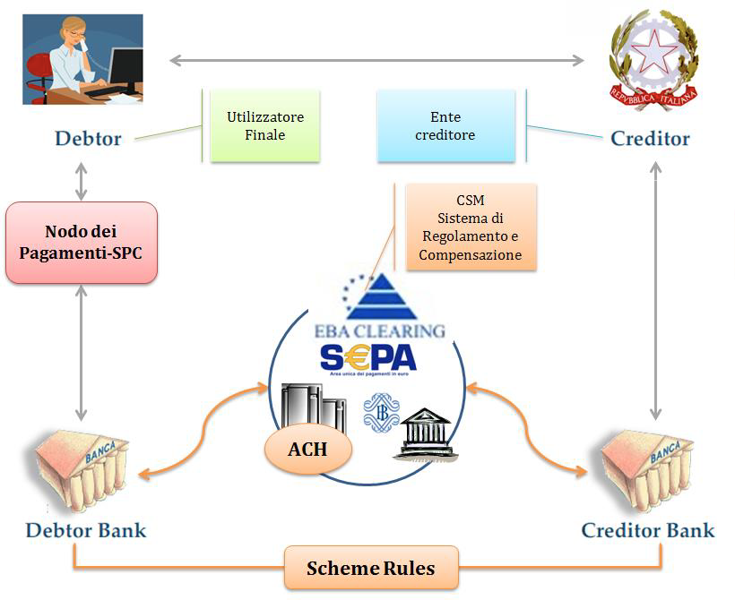

# Roles

The operating model of the pagoPA platform refers to the principles of the Four Corners model defined by the European Payment Council:

| End user **(Debtor)**| The private citizen, professional, company who makes electronic payments in favor of the public administration, state-owned companies and public service operators. The identity of the end user can be determined electronically (usually SPID (Public Digital Identity System)) to access the digital services of the creditor. Within the scope of the payment process, the role of the debtor entity is defined as the entity with a debt in favor of the creditor, or an entity to makes a payment on their own initiative to obtain a service or a certification. In the relationship with the creditor, it can be assumed that the end user is the debtor entity. Finally, the paying entity is defined as the entity that accesses the digital services of the PSP and makes the payment in favor of the creditor.|
|----------|----------|
| **Creditor**| The entity from which the end user requests the service and who results as being the “creditor” for the amounts due from the end user for various reasons. The creditor that identifies the paying entity and the reason for the payment, offers the service via the SPC payment node which is accesses directly or via a public or private entity as a technological intermediary with respect to the creditor.|
| Payment Service Provider **(Debtor and Creditor Bank)**| It is the entity, authorized by current applicable regulations, that makes electronic requests for payment and returns the electronic receipt of payment/collection. The PSP offers its payment services by making physical and telematic payment channels available directly or via third parties (intermediaries) that the end user can use to perform the transaction. In this context, the PSP can also perform “collection” functions on behalf of the institution based on agreements made with it and make the repayment of the collected amounts to the treasury account the creditor holds at the PSP.|

The transactions initiated via the pagoPA platform take place via the regulation and compensation system (CSM) using the SEPA rules.

The pagoPA platform requires that the activities connected to making the payments are performed by the creditors either directly or via other entities (public and/or private).

For this reason, a distinction should be made between a technological intermediary and a technological partner:

* A technological intermediary is an entity that offers, after registering with the pagoPA platform, services to others for the connection and exchange of flows with the pagoPA platform, in full compliance with the [guidelines](https://www.gazzettaufficiale.it/eli/id/2018/07/03/18A04494/sg) and the relative technical standards;
* technological partner is a business entity that cannot register with the pagoPA platform, and that the creditors use as an instrument for performing the technical activities related to the supply of IT services, which are not necessarily definable, for interfacing with the pagoPA platform, without prejudice to the creditor’s liability toward PagoPa S.p.A.

The pagoPA platform requires that activities connected to making payments are performed by the PSP either directly or via other entities, which the PSPs use as an instrument for performing the technical activities related to the supply of IT services for interfacing with the pagoPA platform, without prejudice to the PSP’s liability toward PagoPa S.p.A.

## Role and responsibilities of the PSP 

The PSP is the entity enabled by current applicable regulations to make electric payment requests.

The PSP is required to perform the payment operation requested by the end user according to the methods and times specified by Leg. Decree dated 27 January 2010, no. 11 and the relative implementing provisions issued by the Banca d’Italia.

The PSP is also legally responsible for:

* the quality, correctness and completeness of the data they transmit;
* the correct update of the data in their IT system;
* the security in their domain;
* compliance with what is indicated in [quality-indicators-for-registered-entities](../../appendices/quality-indicators-for-registered-entities/ "mention");

Regardless of the identification of the payer performed by the creditor, also by means of their intermediate/technology partner, the PSP remains responsible for the identification of the paying entity (holder of the current account of debit), as their customer.

## Role and responsibilities of the creditor 

Within the context of pagoPA, the category of the creditors includes public administrations, state-owned companies, as defined in the adopted legislative decree implemented in article 18 of law no. 124 of 2015, excluding listed companies, and public service operators.

The creditor is also legally responsible for:

* the quality, correctness and completeness of the data they transmit; of the data they transmit, including the IBAN of the account to be credited;
* the correct update of the data in their IT system;
* the security in their domain;
* compliance with what is indicated in [quality-indicators-for-registered-entities](../../appendices/quality-indicators-for-registered-entities/ "mention");

The creditor is also responsible for any incorrect and/or omitted indication/publication of the data communicated to the end user for the performance of the payments, including failure to update the amount.

If the creditor identifies the paying entity, they will be responsible for the correctness and authenticity of the payer’s identification data to ensure the proper outcome of the payment.

For the purposes of providing a payment receipt, the creditor is responsible for ensuring that the data contained in the electronic receipt is compliant with the data in the payment request.

## Role and responsibilities of PagoPA S.p.A. 

PagoPA S.p.A.'s mission is the widespread diffusion of a digital payment and service system in the country through the management of the pagoPA platform for digital payments to the public administration.

The pagoPA platform, a product of PagoPA S.p.A., takes on a important functional role within the process of making a payment to a creditor:

* for the activation of automatisms for aligning the amount that is due;
* to enable the payment of the debt position (and guarantee its settlement) without there being a direct relationship between the PSP and the creditor;
* for the guarantee given to the service provider of the completion of the payment.

These functions make the receipt issued by PagoPA S.p.A. and sent to the creditor a confirmation to the citizen that the payment was final, and represent for the creditor the commitment by the PSP to credit the amounts, authorizing the provision of the service and also permitting the activation of digitalized administrative processes.

The PSPs and creditors authorize PagoPA S.p.A and/or its assignees to monitor the provision of the offered services subject to these implementing specifications, as well as the publication of the data resulting from the monitoring.

In consideration of every possible service in subsidiarity that PagoPA S.p.A. can carry out, it can be qualified as a technological partner for each registered creditor.

This qualification corresponds to the effective provision of services in subsidiarity upon occurrence of one or both of the following conditions:

* the existence of a primary and/or secondary regulatory provision that identifies PagoPA S.p.A. as a technological partner;
* the fulfillment by the creditor of any requirements for the performance of services in subsidiarity.

The creditor however retains the right to chose to not use the services of PagoPA S.p.A in subsidiarity, using the same collection services of its own intermediary and/or technological partner.

## Role and responsibilities of intermediaries and technological partners 

The creditor’s intermediary is an entity that allows the creditor to access the payment node. The creditors can in fact offer the service and access the payment-SPC node not only in a completely autonomous manner, but also through a technological intermediary or a technological partner.

A technological intermediary is an entity registered with the payment-SPC node as a creditor (for example: region), which therefore has accepted and is obligated to respect the guidelines and the relative attachments and that is also responsible for the technical activities for interfacing with the payments-SPC node.

On the other hand, the technological partner is only a supplier of the creditor used as an instrument for performing the technical activities for interfacing with the SPC node, without prejudice to the creditor’s responsibility. As such, the technological partners are excluded from registering with the payments-SPC node.

Also the PSPs, like the creditors, can use intermediates to connect to the SPC node or to offer their own payment services; these entities can be other PSPs or financial circuits or consortiums.

As for the creditor’s intermediaries with respect to the creditor, the PSP intermediaries are entities that provide their services to the PSP.

## Observance of the payment workflow 

Every entity registered with the pagoPA system is required to scrupulously observe the payment workflows described in this document.

Any interception, by means of the analysis of the payment traffic or the use of monitoring instruments, of the customization and/or adaptation of the workflows can lead to the exclusion of the entity from the payment platform.