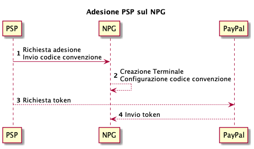
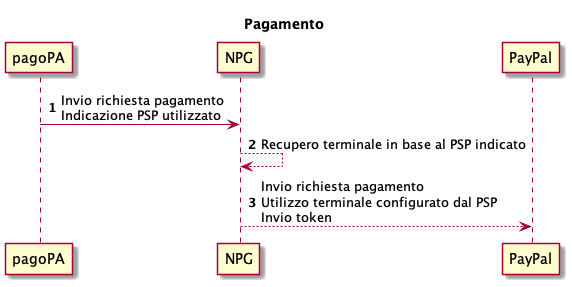

# Integration for a PayPal payment instrument

## Registration 

If a registered PSP wants to be certified on the Payment Gateway (NPG) of PagoPA S.p.A., enabling the PayPal® payment method, they must follow these steps:

1. send a request to register with the Payment Gateway containing the agreement code provided by PayPal®;
2. The terminal is configured on the Payment Gateway, enabling the payment methods with the agreement code indicated by the registered PSP;
3. to complete the authorization, the registered PSP must use the Payment Gateway wizard to access the PayPal dominion with its business users to generate the relative token;
4. the generated token is configured on the terminal set in point 2.

Please keep in mind that PagoPA S.p.A. does not enter into agreements with PayPal®, therefore it is the responsibility of the registered PSP to contact PayPal® if they want to offer this payment instrument on _NPG._

<figure><figcaption></figcaption></figure>

## Payment 

When paying a notice number, the terminal related to the registered PSP selected by the citizen is used for the communication between the payment gateway and PayPal®.

The call to PayPal® also sends the token generated by the registered PSP during the registration phase.

<figure><figcaption></figcaption></figure>

## Cancellation 

When canceling a payment, the same terminal related to the PSP PayPal® selected during the payment phase is used.

The call to payment instrument also sends the token generated by the PSP during the registration phase.

<figure><figcaption></figcaption></figure>

