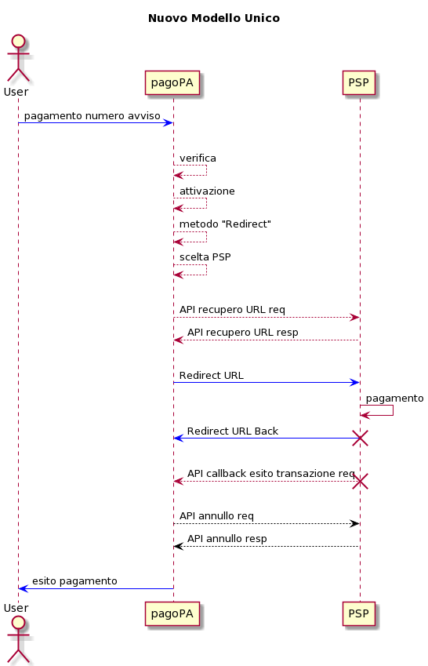
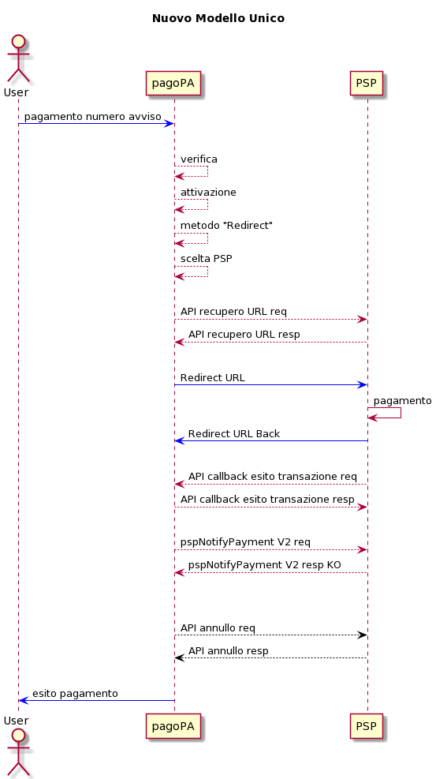

# Integration for a payment instrument via redirect

The payment method with _redirect_ to solutions supplied by the individual PSPs or third parties with which they have agreements, that were introduced to facilitate payments on current accounts and similar for citizens and businesses, was created according to the following guidelines:

* _principle of neutrality_: the pagoPA platform **must** make the same interfaces and technological integrations available to all PSPs with any personalization; therefore it is requested of all PSPs that have custom solutions to adapt to the new method, which is the only one available for the mandatory single payment model on the pagoPA platform; 
* _PSD2 compliance_: currently the PSP that makes the payment instrument available (directly or via a third party) remains responsible for ensuring compliance with the current regulations on security, authentication (SCA) and banking best practices;
* _clear rules described in the SANP_: PagoPA S.p.A. has decided to list which payment methods permit transmission in _redirect_ mode according to the principles that must be clear and described in the SANP (implementation specifications of the payment node).

**NB:** the payment methods, also if for payments made from a current account (e.g. mybank, BancomatPay, ...), that are natively integrated with the pagoPA payment gateway cannot be integrated in _redirect_ mode.

A precondition of the PSP to be able to enable all the available payment instruments, including _redirect_, is the integration of the payment node according to the specifications of the single mode and definition of the information data catalog via the pagoPA backoffice, which is available in the reserved area.

The PSP must make the following interfaces available to the pagoPA platform:

* [_API recovery URL_](integration-for-a-payment-instrument-via-redirect.md#api-recupero-url): exposed on the public network by the PSP and invoked by the pagoPA platform to recover the URL that the user’s browser will use to land in _redirect_ mode, sending information in advance to the PSP about the payment that will be made;
* [_redirect_](integration-for-a-payment-instrument-via-redirect.md#redirect): web page optimized for mobile devices where the user will land in _redirect_ mode, which makes the payment authentication and authorization functions available. Following any payment outcome or cancellation by the user, this must trigger the outcome callback and the _redirect_ to the pagoPA platform at the _urlback_ indicated in the [#api-recupero-url](integration-for-a-payment-instrument-via-redirect.md#api-recupero-url "mention") with the relative outcome;
* [_Transaction outcome callback API_](integration-for-a-payment-instrument-via-redirect.md#api-callback-esito-transazione): API exposed by pagoPA and invoked by the PSP following any payment result of cancellation by the user that permits the correct closure of the transaction in progress that, being a _redirect_ via the user’s browser, by definition is not a secure address;
* [_Cancellation API_](integration-for-a-payment-instrument-via-redirect.md#api-annullo): API exposed by the PSP and invoked by pagoPA to request the cancellation of a payment whose outcome never arrived at the platform or in those residual cases where the payment was not finalized due to technical problems.

The connectivity follows the standard rules of the pagoPA platform, which can be consulted on [connectivity.md](../../appendices/connectivity.md "mention").

 Fields marked with﹡are mandatory 

## URL recovery API

 [https://raw.githubusercontent.com/pagopa/pagopa-api/SANP3.7.0/openapi/redirect.yaml](https://raw.githubusercontent.com/pagopa/pagopa-api/SANP3.7.0/openapi/redirect.yaml) 

## Redirect

By means of the GET to the url supplied by the PSP in the response to the call [#api-recupero-url](integration-for-a-payment-instrument-via-redirect.md#api-recupero-url "mention"), the user is redirected from the pagoPA platform to the FE of the PSP to authorize the payment.

For correct management, the PSP must use the information related to the payment sent from the pagoPA platform in the call [#api-recupero-url](integration-for-a-payment-instrument-via-redirect.md#api-recupero-url "mention"). 

### **Outcome**

The payment workflow includes the following steps based on the payment outcome:

* _redirect to the pagoPA page_: once the payment is complete, the user will be redirected directly to pagoPA, to the address indicated in the _urlBack_ parameter of the[#api-recupero-url](integration-for-a-payment-instrument-via-redirect.md#api-recupero-url "mention")_;_
* _server to server notice_: a POST notice is sent to [#api-callback-esito-transazione](integration-for-a-payment-instrument-via-redirect.md#api-callback-esito-transazione "mention") to the address communicated during setup by PagoPA S.p.A.; to obtain the confirmation of reception of the notice, the message returned by the call must be an _HTTP 200_, otherwise it must be reproposed with a retry logic ([#processi-di-retry](../../appendices/quality-indicators-for-registered-entities/#processi-di-retry "mention")).

## Transaction outcome callback API

As described in the previous paragraph, it is the server-to-server API that the PSP must invoke in real time to notify the outcome of the payment to pagoPA.

The purpose of the API is to provide a final outcome, even if the _redirect_ from the FE of the PSP to the pagoPA platform fails.

 [https://raw.githubusercontent.com/pagopa/pagopa-api/SANP3.6.1/openapi/redirect.yaml](https://raw.githubusercontent.com/pagopa/pagopa-api/SANP3.6.1/openapi/redirect.yaml) 

## Cancellation API

This API must be exposed by all PSPs to make it possible for the pagoPA platform to cancel a payment in case of a technical error.

 It is specified again that the authorization and accounting must be managed at the same time in the same phase, as indicated in the workflow in [#integrazione-e-workflow-per-psp-strumento-di-pagamento-integrato-con-payment-gateway](offering-payment-systems-on-PagoPA-S.p.A.-touchpoints.md#integrazione-e-workflow-per-psp-strumento-di-pagamento-integrato-con-payment-gateway "mention") 

The pagoPA platform invoked this API to request the cancellation of a payment in the following cases:

1. the outcome (positive or negative) never arrived at the pagoPA platform and, as a result, at the creditor;
2. for technical problems, after the pagoPA platform received the positive outcome from the PSP, the telematic dialog between the pagoPA platform and the PSP was not possible or created a discordance with the PSP and as a result of this lack of dialog or discordance, the PSP did not acquire the data necessary for the credit to the creditor concerned with the transaction.

In the case as specified in point 1, the cancellation makes it possible to make the payment of the IUV (univocal payment identifier) subject to the cancellation available again.

In the case as specified in point 2, in addition to the effect specified above, the pagoPA platform cancels the positive outcome received from the PSP.

Each PSP must provide the url to invoke via the pagoPA backoffice for each environment (testing and production).

 [https://raw.githubusercontent.com/pagopa/pagopa-api/SANP3.6.1/openapi/redirect.yaml](https://raw.githubusercontent.com/pagopa/pagopa-api/SANP3.6.1/openapi/redirect.yaml) 

If there is no response with the outcome HTTP 200 (which has the value of a positive outcome of the response to the call), pagoPA is responsible for presenting the same call again with the _retry_ logic.

The API has the characteristic of _idempotency_ and the PSP must present the same outcome again also if it already previously processed the same request.

## Payment phase 

<figure><figcaption></figcaption></figure>

## Cancellation phase 

### Case 1 - Payment outcome not received 

The pagoPA platform performs the cancellation call with the retry logic if it does not receive the outcome (positive or negative) of the payment within the _timeout_ indicated in the response to the [#api-recupero-url](integration-for-a-payment-instrument-via-redirect.md#api-recupero-url "mention") from the PSP or the default timeout of _10 minutes_ from the invocation of the redirect toward the URL of the PSP.

<figure><figcaption></figcaption></figure>

### Case 2 - pspNotifyPayment KO 

The pagoPA platform performs the cancellation call with the retry logic when the PSP responds KO to the [#pspnotifypayment](../../appendices/primitive.md#pspnotifypayment "mention").

<figure><figcaption></figcaption></figure>

