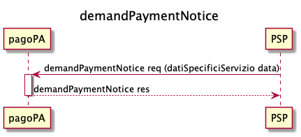
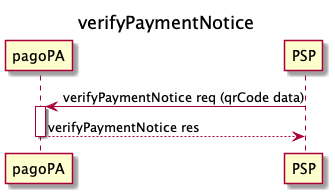
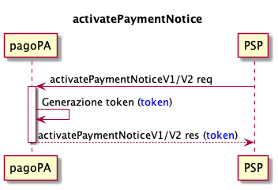
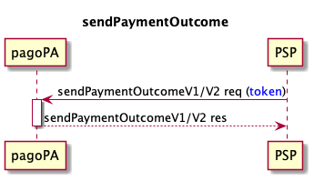

# Integration via API

 To manage the errors, refer to [Error management](https://app.gitbook.com/o/KXYtsf32WSKm6ga638R3/s/mU2qgiLV1G3m9z1VjAOc/ "mention") 

## Debt position creation request phase

The [demandPaymentNotice](../../appendices/primitive.md#demandpaymentnotice) can be used by the PSPs to send the data for the specific service entered by the user in order to receive a response with the information necessary for starting the payment process, in particular:

* number of the notice;
* the fiscal code of the creditor to use during the activation phase;
* the partial amount of each individual payment;
* the fiscal code of the beneficiary creditor for each individual payment.

 This phase is mandatory in the case of spontaneous payments activated at the PSPs.

The PSPs can recover the data of the specific service via the [service-catalog.md](../../use-cases/spontaneous-payment-via-a-PSP/service-catalog.md "mention").

## Verification phase

The [verifyPaymentNotice](../../appendices/primitive.md#verifypaymentnotice) can be used by the PSPs that start the payment using the QR code located on the analog notice or by manually entering the data; with this request the PSP requests the payment information related to a notice number, in particular:

* partial amount;
* fiscal code of the beneficiary creditor.

The verification phase is optional for the PSPs, if the Node detects that the position was already closed, it responds with KO for _PPT\_PAGAMENTO\_DUPLICATO_**.**

## Verification phase by Poste Italiane

.png)

The [verificaBollettino](../../appendices/primitive.md#verificabollettino) can be used only by the Poste Italiane PSP that starts the payment using the Data Matrix located on the analog notice, and not using the QR Code, this call requests the payment information related to a notice number, in particular:

* partial amount;
* fiscal code of the beneficiary creditor;
* the _allCCP_ parameter indicates to the Poste Italiane whether or not the payment option can be associated to all postal current accounts
  * _allCCP = true_: the option can be associated with all postal current accounts;
  * _allCCP = false_: the option cannot be associated with all postal current accounts.

The verification phase is optional for the PSPs, if the Node detects that the position was already closed, it responds with KO for _PPT\_PAGAMENTO\_DUPLICATO_**.**

## Activation phase

With [activatePaymentNotice](../../appendices/primitive.md#activatepaymentnotice) the PSP requests the node to activate the payment at the creditor.

By means of this phase, the PSP is able to open a payment session that blocks other payment attempts for the same notice. With this call, the PSP acquires the payment amount and the data necessary for the repayment of the amount, and in particular for each payment:

* partial amount;
* fiscal code of the beneficiary creditor;
* IBAN to use for the repayment.

The activation phase is mandatory for the PSPs.

The node checks the status of the position:

* if another payment session is in progress, the node responds with the faultCode _PPT\_PAGAMENTO\_IN\_CORSO_**;**
* if it was already paid, the node responds with the faultCode _PPT\_PAGAMENTO\_DUPLICATO_.

The PSP can start a retry process if a response is not received from the node. For this purpose, an [idempotency](best-practice.md#title-text-2) key can be used for this call.

## Payment forwarding phase

.png)

The details of the payments made using the PagoPA S.p.A. touchpoints are forwarded to the PSP via the [pspNotifyPayment](../../appendices/primitive.md#pspnotifypayment).

In this phase, information is sent that is necessary to be able to proceed with sending the payment outcome and any subsequent repayment, in particular:

* the _paymentTokens_ included in the payment transaction;
* the identifiers of the transaction provided by the PSP during the payment phase;
* for each payment:
  * partial amount;
  * fiscal code of the beneficiary creditor;
  * IBAN to use for the repayment.

If the PSP sends a KO in the response, the payment process ends and a cancellation must be performed, if the PSP still sends a [sendPaymentOutcome](../../appendices/primitive.md#sendpaymentoutcome) with an OK _outcome_, this outcome would be rejected by the node.

If the PSP sends an OK in the response, it must send an OK _outcome_ in the [sendPaymentOutcome](../../appendices/primitive.md#sendpaymentoutcome), if a KO is sent, the node responds with a faultBean:

* faultCode _PPT\_SEMANTICA_
* faultString _semantic error_
* description _discordant outcome_

To be able to use the _metadata_ in a correct and standardized manner, a [metadata dictionary](https://app.gitbook.com/o/KXYtsf32WSKm6ga638R3/s/u6YdY319vyFX9MIvnKBa/ "mention") has been prepared that contains a section dedicated to information about the payment channel present in _additionalPaymentInformations_ of [pspNotifyPayment vers. 2](../../appendices/primitive.md#versione-2-4).

## Payment outcome sending phase

The PSP is required to provide the payment outcome **within 2sec** with the [sendPaymentOutcome](../../appendices/primitive.md#sendpaymentoutcome), both if the payment was successful (outcome = OK), as well if the payment was not successful (outcome = KO), the effect of sending the payment outcome is to “release” the debt position on the platform:

* outcome = OK → debt position “closed”;
* outcome = KO→ debt position “open” again.

To make it easier to integrate the various collection systems, the payment session has a limited duration ([#title-text](best-practice.md#title-text "mention")), after this time has elapsed the payment is considered as not having occurred.

Please note that the PSP is responsible for doing what is possible to notify the platform of the payment result before the _token_ expires. There are benefits both for the final user and for the creditor:

* in case of a negative outcome, the end user can immediately start a new payment session;
* in case of a positive result this eliminates the possibilities of a double payment.

Therefore if the outcome is not delivered, the PSP is therefore obligated to start a [retry process](../../appendices/quality-indicators-for-registered-entities/#processi-di-retry). For this reason keep in mind that an [idempotency](best-practice.md#title-text-2) key can be used for this call.

If there are formal or semantic errors, the node will respect respectively with the faultCodes _PPT\_SINTASSI\_EXTRAXSD_ and _PPT\_SEMANTICA_, indicating the reason for the error in the fault description and the PSP is responsible for correcting the error and starting the retry process.

The node could respond with the faultCode _PPT\_SEMANTICA_ also in situations in which, for technical reasons, the payment status is discordant due to the wait, and in this case the PSP is responsible for starting the retry process.

Once the call is received, the node checks if the token received in _request_ exists, if it is not found the node will respond with the faultCode _PPT\_TOKEN\_SCONOSCIUTO_.

If an idempotency key is not used and an outcome is already present for the payment, the node will respond with the faultCode _PPT\_ESITO\_GIA\_ACQUISITO_ and the data previously sent in JSON format will be entered in the faultBean _description_.

If the position was already paid, the node returns the faultCode \_PPT\_PAGAMENTO\_DUPLICATO, if instead it does not find any activated payment position, the node returns the faultCode _PPT\_PAGAMENTO\_SCONOSCIUTO_.

The node checks the status of the payment to understand whether or not the token is still valid, and if it has expired the node responds with the faultCode _PPT\_TOKEN\_SCADUTO_.

After sending a payment outcome, the PSP cannot change it, both if the payment was successful (outcome = OK), or if the payment was not successful (outcome = KO).

Sending a [sendPaymentOutcome](../../appendices/primitive.md#sendpaymentoutcome) with a positive outcome (outcome = OK) is a commitment of the PSP to remit the payment amount to the creditor, net of any exceptions with which the node can respond.

At the end of the transaction, and in line with current regulations, the PSP delivers a payment certification that must contain (in addition to what is required by the regulations) the payment session identifier obtained during the payment transactions (_paymentToken_).