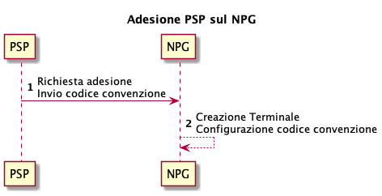

# Standard integration for payment instruments

The content of this chapter applies to the following payment instruments:

* ApplePay®
* BancomatPay®
* GooglePay®
* MyBank®

Please note that PagoPA S.p.A. does not enter into agreements with 

* ApplePay®
* BancomatPay®
* GooglePay®
* MyBank®

and therefore it is the responsibility of the registered PSP to contact them if they want to offer their payment instruments on _NPG._

## Registration 

If a registered PSP wants to be activated on the Payment Gateway (NPG) of PagoPA S.p.A. they must follow these steps:

1. Send a registration request to the Payment Gateway, indicating
   * the payment methods to enable;
   * the agreement codes for each payment method;
2. The Payment Gateway configures the terminal by enabling the payment methods with the agreement codes indicated by the registered PSP.

<figure><figcaption></figcaption></figure>

## Payment 

When paying a notice number, the terminal related to the registered PSP selected by the citizen is used for the communication between the payment gateway and the payment instrument.

Based on the agreement code indicated by the registered PSP, it is possible to perform only the enabled payments.

<figure><figcaption></figcaption></figure>

## Cancellation 

When canceling a payment, the same terminal related to the registered PSP selected during the payment phase is used.

<figure><figcaption></figcaption></figure>

